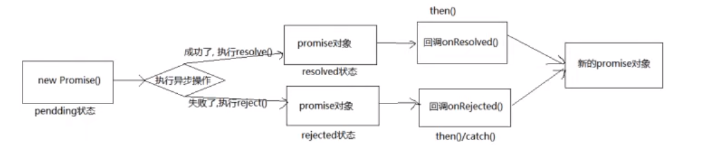
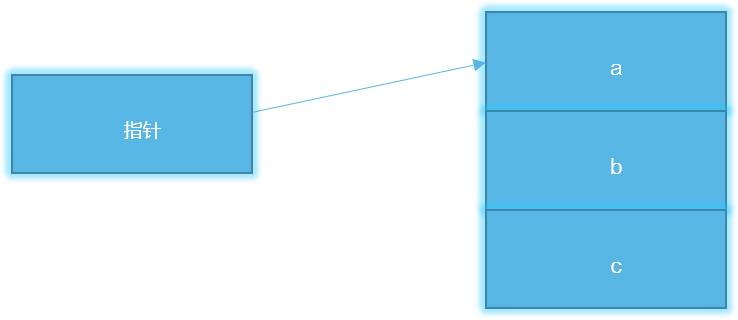

# ECMASCript

## ECMAScript简介

### 概念

我们俗称的ECMAScript(简称ES),指的就是ECMAScript 6.0(ES6)，是 JavaScript 语言的下一代标准，在 2015 年 6 月正式发布。它的目标，是使得 JavaScript 语言可以用来编写复杂的大型应用程序，成为企业级开发语言。

**ECMAScript与JavaScript的关系是**

前者是后者的规则，后者是前者的一种实现。

### 版本发展史

| **年份**  | **版本**                |
| ------- | --------------------- |
| 1997    | ECMAScript 1.0        |
| 1998    | ECMAScript 2.0        |
| 1999    | ECMAScript 3.0        |
| 2009/12 | ECMAScript 5.0        |
| 2015/06 | ECMAScript 2015(ES6)  |
| 2016/06 | ECMAScript 2016(ES7)  |
| 2017/06 | ECMAScript 2017(ES8)  |
| 2018/06 | ECMAScript 2018(ES9)  |
| 2019/06 | ECMAScript 2019(ES10) |
| 2020/06 | ECMAScript 2020(ES11) |
| 2021/06 | ECMAScript 2021(ES12) |
| 2022/06 | ECMAScript 2022(ES13) |

## 变量与常量的声明

### let

声明变量的关键字。

#### 语法：

```
let 变量名[=赋值]
```

#### 特点

(1) 块级作用域。

```
{
	let b=30;
	console.log(b);//30
}
console.log(b);//b is not defined
```

(2) 不存在变量提升：暂时性死区(Temporal Dead Zone，TDZ)：本质，只要一进入当前作用域，所要使用的变量就已经存在了，但是不可获取，只有等到声明变量的那一行代码出现，才可以获取和使用该变量。

```
{
	console.log("b的死区开始");
	console.log(b);//Cannot access 'b' before initialization
	console.log("b的死区结束");
	let b=30;
}
```

(3) 同一作用域，不能重复声明同一变量。

```
{
    let b=20;
    let b=30;//Identifier 'b' has already been declared
    console.log(b);
}  
```

### const

声明常量，ES6中默认公约使用大写形式定义常量名。

#### 语法：

```
const 变量名=赋值；
```

#### 特点：

(1) 块级作用域。

(2) 不存在变量提升：暂时性死区(Temporal Dead Zone，TDZ)：本质，只要一进入当前作用域，所要使用的变量就已经存在了，但是不可获取，只有等到声明变量的那一行代码出现，才可以获取和使用该变量。

(3) 同一作用域，不能重复声明同一变量。

(4)声明变量的同时需要立即初始化。

```
const a=20;
```

(5) 当数据类型为数值、字符串、布尔值、类型时，其值是不可改变的，但是为对象或数组的时候，其值是可以改变，因为声明的变量相当于指向的那个内存地址。

```
const b=30;
b=50;//Assignment to constant variable
console.log(b); 
const user={username:”哈哈”};
user.username=“喜喜”；
```

### 应用场景

#### 循环输出

```
for(var i=0;i<5;i++){}
console.log(i);//5
for(let i=0;i<5;i++){}
console.log(i);//i is not defined
```

#### 按钮事件

```
<button>按钮1</button>
<button>按钮2</button>
<button>按钮3</button>
<script>
    let btns=document.getElementsByTagName("button");
    for(let i=0;i<btns.length;i++){
        btns[i].onclick=function(){
            console.log(i+1);
        }
    }
</script>
```

## Symbol数据类型

**JavaScript基本数据类型**

undefined、null、布尔值（Boolean）、字符串（String）、数值（Number）。

### 概念：

Symbol是第六种基本数据类型，使用Symbol函数来生成一个symbol数据，每一个Symbol是都是独一无二的。

### 语法：

```
let 变量=Symbol(["注解"]);
```

### 应用场景

#### 私有属性和方法

```
function Person(){
            let a=Symbol();
            let b=Symbol();
            this[a]=20;
            this.name="rypy";
            this.aa=function(){
                this[b]();
                console.log("aaaa,"+this[a]);
            }
            this[b]=function(){
                console.log("我是私有方法");
            }
}
let p=new Person();
console.log(p.name);
p.aa();
```

## 数据结构

### set数据结构

自带去重功能(基本数据类型)。类数组,可以存储任意数据类型。

#### 语法

```
new Set(数组/类数组)
```

**案例：**

```
let arr=[1,2,4,2,3,5,7,8,4,3,65,8,9];
```

#### 常用方法

**add**

set数据结构中添加元素数据，返回set数据结构本身

**语法：**

```
引用.add(value) 
```

**案例：**

```
s.add("aaaa");
s.add({username:"aa"});
s.add(true);
s.add(function(){console.log("ssss");})
s.add(function aa(){console.log("ssssaaa");});
console.log(s);
```

**delete**

删除set数据结构中的某个元素数据，返回布尔类型，表示删除是否成功，仅支持基本数据类型。

**语法：**

```
引用.delete(value)
```

**案例：**

```
s.delete("aaaa");
s.delete(function aa(){console.log("ssssaaa");});
s.delete({username:"aa"});
```

**has**

判断某个元素数据是否存在于set数据结构中，返回布尔类型，表示数据结构中是否含有该元素，仅支持基本数据类型。

**语法：**

```
引用.has(value)
```

**案例：**

```
console.log(s.has(true));
console.log(s.has({username:"aa"}));
```

**clear**

清空set数据结构中的数据，无返回值。

**语法：**

```
s.clear();
```

**forEach**

循环遍历Set数据结构

**语法：**

```
引用.forEach(function(index,key){})
```

**案例：**

```
s.forEach(function(item){
    if(typeof item==="function"){
    	item();
    }else{
    	console.log(item);
    }
});
```

**keys**

采用默认下标模式生成键名，将元素的值作为键值，返回键值对可遍历对象。

**语法：**

```
引用.keys()
```

**案例：**

```
console.log(s.keys());
```

**values**

采用默认下标模式生成键名，将元素的值作为键值，返回键值对可遍历对象。

**语法：**

```
引用.values()
```

**案例：**

```
console.log(s.values()); 
```

**entries**

采用元素的值作为键名和键值，返回键值对可遍历对象。

**语法：**

```
引用.entries()
```

**案例：**

```
console.log(s.entries());
```

#### 常用属性

**size**

获取set数据结构的长度

**语法：**

```
console.log(s.size);
```

### Map数据结构

类对象，键名和键值可以是任意类型，且键名不重复的键值对集合体。

#### 语法

```
new Map([[key,value],[key,value]]);
```

**案例:**

```
let m=new Map([["username","admin"],[function a(){console.log("ssssss");},3],[true,function b(){}]]);
```

#### 常用方法

**set**

向map数据结构中添加键值对数据

**语法：**

```
引用.set(key, value) 
```

**案例：**

```
m.set("aaaa","ssssss");
m.set(true,{username:"aaaaa"});
m.set(123,"ddddd");
m.set(undefined,function aa(){console.log("ddddd");});
m.set(function (){console.log("ddddd");},"xaaaaa");
console.log(m);
```

**get**

获取map数据结构中参数键名的数据，只支持键名为基本数据类型。

**语法：**

```
引用.get(key)
```

**案例：**

```
console.log(m.get(undefined));  
m.get(undefined)();
console.log(m.get(function (){console.log("ddddd");}));
```

**delete**

删除map数据结构中的参数键名的数据，只支持键名为基本数据类型。

**语法：**

```
m.delete(undefined);
```

**案例：**

```
        m.delete("username");
        m.delete(function a(){});
        m.delete(true);
```

**has**

判断参数键名是否存在于map数据结构中,返回布尔类型，只支持基本数据类型。

**语法：**

```
引用.has(key)
```

**案例：**

```
console.log(m.has(undefined));    
console.log(m.has(function (){console.log("ddddd");})); 
```

**clear**

清空map数据结构中的数据

**语法：**

```
m.clear();
```

**forEach**

循环遍历Map数据结构

**语法：**

```
引用.forEach(function(value,key){})
```

**案例：**

```
        m.forEach(function(value,key){
            if(typeof key==="function"){
                key()
            }else{
                console.log(key);
            }
        });
```

**keys**

将Map数据结构中的键名转换为可遍历的类对象。

**语法：**

```
引用.keys()
```

**案例：**

```
console.log(m.keys());
```

**values**

将Map数据结构中的键值转换为可遍历的类对象。

**语法：**

```
引用.values()
```

**案例：**

```
console.log(m.values());
```

**entries**

将Map数据结构转换为可遍历的类对象(类似二维数组的类对象) 。

**语法：**

```
引用.entries()
```

**案例：**

```
        for(let item of m.entries()){
            console.log(item);
        }  
        console.log(m.entries());
```

#### 常用属性

**size**

获取Map数据结构的长度

**语法：**

```
引用.size
```

**案例：**

```
console.log(m.size);
```

## 常用运算符

### ...运算符

...运算符，分为两类，rest 剩余参数运算符、spread 扩展运算符。

#### rest剩余参数运算符

用于获取函数的多余或所有参数,将以“，”隔开的参数转换为数组。通常使用在形参中，将剩余实参序列转换为数组。

**语法：**

```
function fun([a,b,]...values) {} 
```

**案例：**

```
function f(b,...a){
	console.log(a);
}
f(1,2,4,6,7);
```

注：必须出现在形参的最后

#### spread扩展运算符：

用于打散数据，将一个数组/对象，转为用“，”的参数序列，可以理解为rest 参数运算符逆运算，通常使用在实参的传递中，用来打散数据。

**语法：**

```
(1) ...[ ]  
(2)...{} 
```

**案例：**

```
function f(a,b,c,d,r){
    console.log(a);
    console.log(r);
}    
let arr=[1,2,5,7,8,9,0,3,5];
f(...arr);
```

#### 作用：

1、展开数组/对象,复制数组/对象，对于基本数据类型深拷贝。

```
let arr=[1,2,5,7,8,9,0,3,5];
let newArr=[...arr];
arr[5]=30;
console.log(newArr);
let user={username:"admin",pwd:124};
let newUser={...user};
user.pwd="aaaaaaaa";
console.log(newUser);
```

2、合并数组/对象，注：键名相同的值，会被覆盖。

```
let user1={username:"admin",pwd:124};
let user2={username:"aaaaa"};
let user={...user1,...user2};
console.log(user);
```

3、将伪数组（类数组）转换为真正的数组

```
    <button>1</button>
    <button>2</button>
    <button>3</button>
    <script>
        let btns=document.getElementsByTagName("button");
        console.log([...btns]);
   </script>     
```

4、将数组转换为特殊对象，键名是原数组的下标，键值是原数组的对象。

```
        let arr=[1,2,4,5,7,8];
        console.log({...arr}['1']);
```

注：扩展运算符对数组和对象操作时，对数值是深拷贝，如果里面有嵌套对象和数组，其存储的为地址，会改变原内容。

### 可选操作符

可选操作符，当不确定数据是否含有键名对应值的时候，可以采用可选操作符，进行输出，，好处不会对不存在键名报错，会将不存在键名的值以undefined的形式输出。

**语法：**

```
引用?.属性名/数组下标/函数/下标
```

**案例：**

```
let user={age:20,name:"sss",sex:{man:1},getName:function (){return "rypy"}};
//console.log(user.interest.read);//报错Cannot read properties of undefined
console.log(user?.interest?.read);
console.log(user.sex.man);
console.log(user.getNamea?.());
```

### 空值合并运算符

空值合并运算符，用来解决变量不为undefiend和null，与逻辑运算符相比好处在于其如果为真则返回变量的值。

**语法：**

```
引用??为真返回值
```

**案例：**

```
let a="rypy";
console.log(a??"未定义");
```

## 字符串扩展

### 模板字符串

#### 语法：

```
`字符串1 ${输出表达式} 字符串2`
```

#### 输出表达式：

1.支持变量的输出

2.支持对象属性的输出

3.支持JavaScript表达式（三目运算符）

4.支持函数的调用

#### 案例

```
        let str=`我是
                憨憨
                `;
        let age=16;
        let user={username:"admin"};
        function f(){
            return "我是函数返回值";
        }   
        console.log(str);
        document.getElementById("div1").innerHTML=`<h1 style="color:red;">我的年龄:${age}</h1>,用户名：${user.username}
        ，属于${age>18?"成年":"未成年"}人,
        ${f()}`;   
```

### 新增方法

```
let str="我是字符串哈哈！";
```

#### startsWith

判断字符串是否以参数字符串开始，返回值是布尔类型。

**语法：**

```
字符串.startsWith(参数字符)
```

**案例：**

```
console.log(str.startsWith("我是"));
```

#### endsWith

判断字符串是否以参数字符串结束，返回值是布尔类型。

**语法：**

```
字符串.endsWith(参数字符)
```

**案例：**

```
console.log(str.endsWith("哈！"));
```

#### repeat

重复拼接字符串num次数，返回值是新的字符串。

**语法：**

```
字符串.repeat(num)
```

**案例：**

```
console.log(str.repeat(10));
```

#### padStart

将字符串前置补全，参数1是新字符串的长度，参数2是补全字符串

**语法：**

```
字符串.padStart( 目标长度，填充的字符 )
```

**案例：**

```
console.log(str.padStart(24,"abc"));
```

#### padEnd

将字符串后置补全，参数1是新字符串的长度，参数2是补全字符串

**语法：**

```
字符串.padEnd( 目标长度，填充的字符 )
```

**案例：**

```
console.log(str.padEnd(9,"abc"));
```

#### replaceAll

查找并全部替换，参数1是需要替换的字符串，参数2是新字符串。

**语法：**

```
字符串. replaceAll( 目标字符，替换字符)
```

**案例：**

```
console.log(str.replaceAll("哈","喜"));
```

## 数组的扩展

#### 新增方法

#### of

创建一个数组，解决new Array的缺陷，即将类数组序列转化为真正的数组

**语法：**

```
Array.of(元素序列)
```

**案例：**

```
console.log(Array.of(1,3));
```

#### from

将类数组转换为真正的数组，返回值是一个新数组。

**语法：**

```
Array.from(类数组)
```

**案例：**

```
    <button>按钮1</button>
    <button>按钮2</button>
    <button>按钮3</button>
    <script>
    	let btns=document.getElementsByTagName("button");
        console.log(btns);//类似数组（伪数组）
        console.log(Array.from(btns));
    </script>   
```

#### filter

循环遍历数组，根据回调函数中返回值的布尔类型，过滤当前数组元素，并生成新的数组。

**语法：**

```
引用. filter(function(item,index){})        
```

**案例：**

```
        let arr=[1,2,4,6,8,0,9];
        console.log(arr.filter(function(item){
            return item>=6;
        }));
```

#### find

查找数组中，第一个符合返回值条件的元素，并停止循环。

**语法：**

```
引用.find(function(item,index){})
```

**案例：**

```
        let arr=[1,2,4,6,8,0,9];
        console.log(arr.find(function(item){
            return item>=7;
        }));
```

#### includes

查询数组中是否含有参数元素，返回值是布尔类型。

\*\*注：\*\*此方法只支持基本数据类型

**语法：**

```
引用. includes(查找内容)
```

**案例：**

```
        let arr=[1,2,4,6,8,0,9,{username:"admin"}];
        console.log(arr.includes(4));
```

#### flat

将多维数组降维，返回值是一个一维数组。

**语法：**

```
引用. flat([depth])
```

注：depth取值是数字，降低几个维度，默认值是1， Infinity直接降维1维。

**案例：**

```
        let arr=[1,2,3,[3,4,56,[2,4,6,8],4,6,4],4,7,9];//三维数组/多维数组
        console.log(arr.flat(Infinity));  
```

## 对象的扩展

对象（object）是 JavaScript 最重要的数据类型。ES6 对其进行了重大升级，包括（数据类型本身的升级和Object对象的方法）。

### 类型本身特性

#### 属性简写

**简写规则**

1.键名的“”可以省略。

```
let user={username:"amdin"};
```

2.当变量名和键名相同时，属性值可以省略。

**语法：**

```
{ 变量名1,变量名2 }
```

**案例：**

```
let username = ‘rypy’;
let age=20;
let person = {username,age};
```

#### 函数/方法简写

对象中可以直接定义普通函数，一定程度降低了代码量，简写形式的函数中的this和function声明函数的this指向是相同的。

**语法：**

```
{  函数名/方法名(){} }
```

**案例：**

```
const o = {
	fn() {return “Hello!”;}
};
```

#### 属性名表达式

对象中的键名和方法名(函数名)，可以使用表达式进行灵活定义，这更有利于灵活运算，即中括号的用法(中括号中写表达式)。

**语法：**

```
let 变量名=变量值;
{[变量名/表达式]:对象变量值,[变量名/表达式](){}}
```

**调用：**

```
(1)对象.变量值
(2)对象[变量名]
```

**案例：**

```
let b = 'num'
let obj = {
    a:123,//
    [b]:234,//中括号可以存储一些简单表达式（ 如变量，字符串、字符串拼接 ）
    ['hello']:'world',
    [a+b](){return ‘hi’;}
}
obj.num;
obj[b];
obj.123num();
```

### 新增方法

#### assign

将所有参数source的键值对，合并给参数target， 并生成新的对象，新对象与参数target一致。

**规则：**

当键名相同的时候，会进行同名覆盖操作。

基本数据类型深拷贝，复合数据类型浅拷贝。

**语法：**

```
Object.assign( target,source1,source2,... )
```

**案例：**

```
let user1={username:"admin",age:123};
let user2={pwd:"123456",username:"admin2"};
let user3={isadmin:1,interest:["read","write"]};
let user=Object.assign(user1,user2,user3);
user2.username="admin3";
user3.interest[1]="running";
console.log(user);
console.log(user1);
```

#### keys

将对象中的键名，以一维数组的形式返回，，返回值是数组类型。

**语法：**

```
Object.keys(对象引用)  
```

**案例：**

```
        let user={username:"admin",pwd:"123456",isadmin:1};
        console.log(Object.keys(user));
```

#### values

将对象中的键值，以一维数组的形式返回，返回值是数组类型。

**语法：**

```
Object.values(对象引用)
```

**案例：**

```
let user={username:"admin",pwd:"123456",isadmin:1};
console.log(Object.values(user));
```

#### entries

将对象中的键值对，以二维数组的形式返回， 键值对是一个一维数组，返回值是二维数组。

**语法：**

```
Object.entries(对象引用)
```

**案例：**

```
        let user={username:"admin",pwd:"123456",isadmin:1};
        console.log(Object.entries(user));
```

#### fromEntries

将数组格式的键值对/Map数据结构转换为对象，返回值是个对象，本质是entries的逆运算。

**语法：**

```
Object. fromEntries( [[key,value], [key,value]] )
```

**案例：**

```
    let arr=[["name","admin"],["pwd","123"]];
    console.log(Object.fromEntries(arr));
```

### JSON对象

#### stringify

将对象/数组转换为JSON格式的字符串。

**语法：**

```
JSON.stringify(对象引用/数组引用)
```

**案例：**

```
        let user={username:"admin",pwd:"123456",isadmin:1};
        console.log(typeof JSON.stringify(user));
```

#### parse

将JSON格式的字符串转换为对象/数组。

**语法：**

```
JSON.parse(字符串引用)
```

**案例：**

```
        let str=`{"username":"admin1","pwd":123456789}`;
        console.log(JSON.parse(str));
```

#### 应用场景

**数组/对象的深拷贝**

```
        let arr=[1,2,4,5,7,9,0,[3,4,56,7,9,0]];
        let newArr=JSON.parse(JSON.stringify(arr));
        arr[4]=30;
        arr[7][2]=5;
        console.log(arr);
        console.log(newArr);
```

## 遍历/迭代语法扩展

### for…in

循环遍历对象可枚举属性，即键名(key)，注：只遍历可枚举属性。

#### 语法

```
for(let index in obj){
          //obj[index]	
}
```

#### 案例

```
let arr=[1,2,34,5,7,8];
for(let index in arr){
    console.log(arr[index]);
}
```

### for \[await]…of

循环遍历对象需要迭代的数据，即键值(value)，可遍历任意可迭代对象，用于解决 for..in 和 forEach() 无法遍历某些对象问题。

#### 语法

```
for(let item of obj){
          //item	
}
for await(let item of asyncObj){
 //item
}
```

#### 支持遍历的数据类型

(1)Array

(2)arguments

(3)Set数据结构

(4)Map数据结构

(5)String

(6)NodeList对象

(7)HTMLCollection 对象

(8)TypedArray

\*\*注：\*\*for...of不能直接遍历对象，可通过对象的扩展方法遍历对象。

#### 案例

```
let str=`我是憨憨！`;
for(let item of str){
    console.log(item);
}
```

## 解构赋值

### 概念

ES6 允许按照一定模式（即规则），从数组和对象中提取值，对变量进行赋值，这被称为解构赋值（Destructuring）。解构赋值是对赋值运算符的扩展。

### 数组的解构

#### 语法

```
let [变量名,变量名,变量名,变量名]=[值,值,值,值];
```

#### 规则

先找形式\[],在找"，"，进行一对一匹配赋值。

#### 解构的形式

**完全解构**

```
let [a,b,c,d]=[1,2,3,5];
```

**不完全解构**

**值比变量多**

```
let [a,b]=[1,2,3,5,6];
```

**变量比值多**

```
let [a,b,c]=[1,2];
```

**缺省方式**

```
let [,,a,]=[1,2,3,5,6];
```

**嵌套解构**

```
let [,,[,[a]]]=[,,[,[1]]];
```

#### 默认值

**1、默认值**

```
let [a,b=2,c,d];
```

**2、默认值+解构**

```
let [a=1,b]=[3,4];
```

**3、默认值+解构中的undefined**

```
let [a=1,b]=[undefined,undefined];
```

**4、默认值+解构中的null**

```
let [a=1,b]=[null,null];
```

#### 应用场景

**数组值的交换**

```
let a = 1;
let b = 2;
[a,b] = [b,a];
```

### 对象的解构

#### 语法

**语法1**

```
let {键名:变量名,键名:变量名,键名:变量名}={键名:值,键名:值,键名:值};
```

**语法2**

```
let {变量名,变量名,变量名}={键名:值,键名:值,键名:值};
```

**注：**

1、对象的解构属性名不要顺序。

2、键名只是用来传递值，传递成功即销毁。

#### 规则

先找形式{},再找键名，进行同键名匹配。

#### 解构形式

**完全解构**

```
let {username,pwd}={username:"admin",pwd:"123456"};
```

**不完全解构**

**值比变量多**

```
let {username}={username:"admin",pwd:"123456"};
```

**变量比值多**

```
let {username,ins}={username:"admin",pwd:"123456"};
```

**复合型解构**

```
let {ins:{c:[,,,arr]}}={username:"admin",ins:{"a":"read","b":"write","c":[1,2,4,5,67]}};
```

#### 默认值

**1、默认值**

```
let {username="admin"};
```

**2、默认值+解构**

```
let {username="admin"}={username:"admin1"};
```

**3、默认值+解构中的undefined**

```
let {username="admin"}={username:undefined};
```

**4、默认值+解构中的null**

```
let {username="admin"}={username:null};
```

#### 应用场景

1、JSON格式数据的解构

2、对象的解构赋值，使用在形参的默认值

```
function f(){
	return {username:"admin",pwd:"123456"};
}
let {pwd}=f();
```

3、对象的解构赋值，使用在函数返回值的解构

```
function f({username,pwd}){
	console.log(username);
};
f({username:"admin"});
```

## 函数的扩展

### 函数定义

函数就是将一段具有独立功能的代码块整合到一个整体并命名，在需要的位置调用这个名称即可完成对应的需求，从而更有效的实现代码重用。

### 函数分类

普通函数和匿名函数。

### 函数的默认值：

**语法：**

```
funciton 函数名(变量=默认值,变量=默认值){}
```

\*\*注：\*\*函数默认值如果需要生效必须在调用的时候，设置实参为undefined

案例：

```
function setUser(username=“rypy”,pwd=“123456”){
	console.log(username,pwd);
}
setUser();
setUser(“admin”,”123”)
```

### 回调函数概念

一种特殊形式的匿名函数，即以参数的形式，将一个函数传递给另一个函数。

### 箭头函数

#### 箭头函数概念

ES6 允许使用“箭头”（=>）定义函数。简化回调函数和匿名函数的写法。

\*\*注：\*\*箭头函数必须先执行后调。

#### 箭头函数语法

**匿名函数简化**

```
let 函数名=()=>{};
```

**回调函数简化**

```
函数名(()=>{})
```

#### 箭头函数的参数

**(1)无参数**

```
let a=()=>{console.log("aaaa");};
```

**(2)一个参数**

变量名=参数=>{函数体}，即，当箭头函数的形参有且只有一个的时候，()可以省略。

```
let c=m=>{console.log(m);};
```

**(3)多个参数**

变量名=(参数1，参数2)=>{函数体}

```
let b=(m,n)=>{console.log(m+n);};
```

**(4)剩余参数**

```
let f= (...a)=>{
    console.log(a);
}
```

\*\*注：\*\*不能使用arguments

#### 箭头函数的返回值

**1、完整写法的返回值形式**

```
let e=(m)=>{
    return m
};
```

**2、一行代码**

当箭头函数的代码体有且只有一条语句的时候，{}可以省略。

```
let d=m=>console.log(m);
```

**3、return关键词**

只有一行代码的返回值， return可以省略

```
let e=m=>m;
```

**4、返回对象**

```
let g=()=>({username:"admin",pwd:"123456"});
```

#### 箭头函数使用注意事项：

箭头函数不作为构造函数使用：

```
let h=()=>{};
let hh=new h();
```

#### 箭头函数中的this指向

箭头函数中，this不会指向当前环境，而是指向定义时所在的环境。

**特例语法**

(1)箭头函数直接调用打印this

```
        let a=function(){
            console.log(this);//Window
        }
        a();
        let b=()=>{
            console.log(this);//Window
        }
        b();
```

(2)绑定给事件的this

```
	<button id="btn1">按钮1</button>
    <button id="btn2">按钮2</button>
    <script>
        document.getElementById("btn1").onclick=function(){
            console.log(this);//button
        }
        document.getElementById("btn2").onclick=()=>{
            console.log(this);//Window
        }
    </script>
```

(3)使用call尝试改变箭头函数的this指向

```
        let c=function(){
            console.log(this);//document
        }
        c.call(document);

        let d=()=>{
            console.log(this);//windows
        }
        d.call(document);
```

(4)在构造函数中包一个箭头函数尝试打印this指向

```
function P(){
            this.aa=function(){
                console.log(this);
                // return function(){
                //     console.log(this);//
                // }
            }
            this.bb=()=>{
                console.log(this);
            }
            this.cc=function(){
                return function(){
                    console.log(this);
                }
            }
            this.dd=function(){
                return ()=>{
                    console.log(this);
                }
            }
            this.ee=()=>{
                return function(){
                    console.log(this);
                }
            }
            this.ff=()=>{
                return ()=>{
                    console.log(this);
                }
            }
        }
        let p=new P();
        p.aa();//P
        p.bb();//P
        p.cc()();//Window 
        p.dd()();//P
        p.ee()();//Window
        p.ff()();//P
```

## 新增语法块

#### try...catch...finally块

捕获并处理可预知类错误/异常的代码块关键词。

**语法：**

```
try{}catch[(err)]{}[finally{}]
```

**案例：**

```
    try{
        console.log(age);
        let age=20;
    }catch(err){
        console.log(err.message);
    }finally{
        console.log("我的块是永久执行");
    }
    console.log("dddd");
```

## Promise与异步

### 同步与异步

#### 同步

主任务在执行多任务队列时，由上到下，由左到右依次执行。且下一个任务需要等待上一个任务执行结束后得到执行结果，再继续执行，即阻塞模式。

**案例**

index.html

```
        console.log("aa");
        console.log("bb");
        alert("ccc");
        console.log("dd");
```

#### 异步

主任务在执行多任务队列时，不需要等待上一个任务的执行结果，就可以执行下一个任务，当上一个任务执行完成后，会以状态、通知和回调来通知调用者。即非阻塞模式。

**案例**

定时器

```
        console.log("aa");
        setTimeout(()=>{
            console.log("cc");
        },3000);
        console.log("bb");
```

### 回调地狱概念

在使用JavaScript时，为了实现某些逻辑经常会写出层层嵌套的回调函数，如果嵌套过多，会极大影响代码可读性和逻辑，这种情况被称为回调地狱（或回调）。

**回调地狱案例**

```
$.get("http://101.43.144.229:3331/getfirstType",(data)=>{
	$.post("http://101.43.144.229:3331/type/getsecondTypeByFirsttype",{firstId:data.typelist[2].category_id},(secondData)=>{
		$.post("http://101.43.144.229:3331/type/getThirdTypeBySecondtype",{secondId:secondData.typelist[1].category_id},(thirdData)=>{
			$.post("http://101.43.144.229:3331/type/getGoodsbyThirdtype",{thirdId:thirdData.typelist[3].category_id},(goodlist)=>{
			console.log(goodlist);
            });
         });
    });
});
```

**优化回调函数目的**:异步代码同步化操作。

### promise对象

Promise对象，异步编程的一种解决方案。也称之为一个容器，里面保存着某个未来才会结束的事件（异步操作）的结果。在语法上，其从它可以获取异步操作的消息。

#### 语法

**语法1**

```
new Promise( (resolve,reject)=>{
        resolve()/reject();
} );
```

**语法2**

```
Promise.resolve/reject();
```

**案例**

```
new Promise((resolve,reject)=>{
    /**
     * 异步操作的代码
    */
});
```

#### 状态

pending（进行中）、fulfilled（已成功）和 rejected（已失败）。

#### 特点

1）对象的状态不受外界影响。 2）一旦状态改变，就不会再变，即Promise的状态不可逆。

#### Promise对象基本流程



#### 常用方法

**Promise.resolve()**

设置成功结果，可以将Promise对象的状态切换为成功状态。

```
let p1=Promise.resolve("我是成功1");
```

**Promise.reject()**

设置失败结果，可以将Promise对象的状态切换为失败状态。

```
let p3=Promise.reject("我是失败1");
```

**Promise.then(参数1callback，参数2callback)**

then方法接受两个回调函数作为参数。

第一个回调函数是Promise对象的状态变为resolved时调用，获取成功状态的值。

第二个回调函数是Promise对象的状态变为rejected时调用,获取失败状态的值/代码运行时错误/获取自定义错误（注：不推荐使用此方法获取）。其中，第二个回调函数可以省略。

**语法**

```
promise对象.then( (结果)=>{
   //代码块
}， [(失败)=>{
   //代码块
}]);
```

**案例**

```
p.then(data=>{
    console.log(data);
},err=>{
    console.log(err.message);//Cannot access 'a' before initialization
});
```

**Promise.catch()**

获取失败状态的值/代码运行时错误/获取自定义错误（推荐使用）

**语法**

```
promise对象.catch( (异常)=>{
   //代码块
});
```

**案例**

```
p.catch(err=>{
    console.log(err);
});
```

**Promise.finally(callback)**

永久执行的方法，不管Promise对象是成功，还是失败，都执行。

**案例：**

```
p.then(data=>{
    console.log(data);
}).catch(err=>{
    console.log(err);
}).finally(()=>{
    console.log("永久执行");
});
```

**Promise.all(\[p1,p2,p3,....pn])**

同时执行多个 Promise 实例，并生成一个新的 Promise 实例。

**语法**

```
Promise.all( [ pro1,pro2,... ] );
```

**注** 1）参数实例中必须全部都是fulfilled时，Promise.all()的状态才是fulfilled，否则状态就是rejected； 2）参数实例中如果使用catch捕获的错误或者异常，则不会触发Promise.all()的catch方法。

**案例**

```
let p1=Promise.resolve("我是成功1");
let p2=Promise.resolve("我是成功2");
// let p3=Promise.reject("我是失败1");
let p4=new Promise((resolve,reject)=>{
    setTimeout(reject,3000,"我是失败2");
});
let p5=new Promise((resolve,reject)=>{
    setTimeout(reject,1000,"我是失败3");
});
Promise.all([p1,p2,p4,p5]).then(data=>{
    console.log(data);
}).catch(err=>{
    console.log(err);
});
```

#### 链式操作

then的回调函数中还可以有返回值，可以是promise对象（也可以是其它数据），都可以使用链式操作再进行调用下一个then函数进行接收结果。

**案例**

```
let p=new Promise(resolve=>{
    resolve("我是初始化");
});
let p1=p.then(data=>{
    //console.log(data);
    return data+"ssss";
}).then(data1=>{
    console.log(data1);
});
```

\*\*注：\*\*jQuery对象就是一个典型的链式操作对象。

#### 回调地狱的优化

```
        $.get("http://101.43.144.229:3331/getfirstType").then(data=>{
            return $.post("http://101.43.144.229:3331/type/getsecondTypeByFirsttype",{firstId:data.typelist[2].category_id});
        }).then(secondData=>{
            return $.post("http://101.43.144.229:3331/type/getThirdTypeBySecondtype",{secondId:secondData.typelist[1].category_id});
        }).then(thirdData=>{
            return $.post("http://101.43.144.229:3331/type/getGoodsbyThirdtype",{thirdId:thirdData.typelist[3].category_id});
        }).then(goodlist=>{
            console.log(goodlist);
        });
```

## async函数

ES2017 标准将原有的async 函数，进行了升级，它是一个关键字，被async修饰的函数称为async函数。 async修饰的函数，默认会将返回值封装为一个Promise对象。

### 语法

```
async function name( ){
	let res1 = await 异步1
	let res2 = await 异步2
}
```

**注:**

async函数只能获取成功状态的值。

await关键词，会等待其后面修饰的所有异步操作结束后，再执行后面的代码。

async可以单独出现，但await必须要在async函数中使用否则报错（注：在ES模块化中await顶层运算符可以单独使用）。

### 案例

```
function f(ms){
    return new Promise(resolve=>{
        setTimeout(resolve,ms,`我是异步${ms}`);
    });
}
async function ff(){
    let aa=await f(3000);
    console.log(aa);
    let bb=await f(5000);
    console.log(bb);
}
ff();
```

## class类

### 面向对象概述：

面向对象是一种以对象为中心的编程思想。面向对象是相对于面向过程来讲的，面向对象把相关的数据和方法组织为一个整体来看待。

### 面向过程和面向对象：

面向过程和面向对象，都是一种编程思想。两者解决问题的思维方式不同。

#### 面向过程：

面向过程思想强调的是步骤，当碰见问题时，思考的是“我该怎么做”，分析出解决问题所需要的步骤，一步步的去实现。

#### 面向对象：

面向对象思想强调的是结果，当碰见问题，思考的是“我该让谁来做”。这个“谁”就是对象。找合适的对象做合适的事情。而对象如何去做(采用什么样的步骤)就不需关心，最终把问题解决掉即可

### 面向对象编程：

面向对象编程其本质是以，建立模型体现出来的抽象思维过程和面向对象的一些方法。模型是用来反映现实世界中事物特征。方法就是模型所需要的行为动作。 在面向对象编程中，最常见的表现就是基于类(Class)来表现的，每一个对象实例都有具体的类，即对象的类型。

\*\*面向对象特点：\*\*封装，继承，多态，抽象。

### 类和对象：

在面向对象编程过程中，有两个重要组成部分：类 和 对象。 类和对象的关系：用类去创建一个对象。

#### 类的概念：

类是对一系列具有相同特征和行为的事物的统称，是一个抽象的概念，不是真实存在的事物。类是由特征和行为组成的。特征即是属性、行为即是方法。

#### 对象的概念：

对象是类创建出来的真实存在的事物。

注：开发中，先有类，再有对象。

#### 类的定义

定义类名要满足标识符命名规则，同时遵循大驼峰命名习惯。

**语法**

```
class 类名{}
```

**实例化**

创建类的对象引用。

```
let 变量名=new 类名() / new 类名
```

#### 类的方法

**构造方法(constructor)**

构造方法/构造函数/构造器，初始化对象。在创建一个对象时默认被调用，不需要手动调用，同时可以定义形参。

**语法**

```
class 类名{
	constructor([参数]){}
}
```

**调用**

```
let 变量(类对象引用)=new 类名();//实例化自动调用
```

**成员方法**

成员方法，通过类的实例化对象引用来调用，每个实例化对象引用的成员方法是相对独立，互不影响的。

**语法**

```
class 类名{
	方法名([参数]){}
}
```

**调用**

类本身调用成员方法

```
this.方法名();
```

类实例调用成员方法

```
类对象引用.方法名();
```

**静态方法**

静态方法，通过类本身来调用，即绑定在class.propName上。

**语法**

```
class 类名{
	static 方法名([参数]){}
}
```

**调用**

类的实例和类中成员方法的调用

```
类名.方法名();
```

类静态方法的调用

```
this.方法名();
```

**案例**

```
class Friut{
    //构造方法
    constructor(a){
        console.log("构造方法"+a);
    }
    //成员方法
    eating(){
        console.log("成员方法");
    }
    //静态方法
    static pi(){
        console.log("静态方法");
    }
}
let fr=new Friut("sss");//实例化
fr.eating();
Friut.pi();
```

#### 类的属性

**成员属性**

成员属性，通过类的实例化对象引用来调用，每个实例化对象引用的成员方法是相对独立，互不影响的。

**语法**

```
class 类名{
	变量名[=值];
	constructor(){
		this.变量名[=值];
	}
	方法名(){
		this.变量名[=值];
	}
}
```

**调用**

类本身调用成员属性

```
this.变量名;
```

类实例调用成员属性

```
类对象引用.属性名;
```

**静态属性**

静态属性，通过类本身来调用，即绑定在class.propName上。

**语法**

```
class 类名{
	static 变量名[=值];
	constructor(){
		类名.变量名[=值];
	}
	方法名(){
		类名.变量名[=值];
	}
	static 方法名([参数]){
		this.变量名[=值];
		类名.变量名[=值];
	}
}
```

**调用**

类的实例和类中成员方法的调用

```
类名.变量名;
```

类静态方法的调用

```
this.变量名;
```

**案例**

```
class Fruit{
    swite="我很甜";
    static sf="我有水分";
    constructor(vc,hu){
        //this.vc=vc;
        //Fruit.hu=hu;
    }
    eating(){
        //this.vc="我很甜";
        //Fruit.hu="我是胡";
    }
    static pi(){
        this.vc="我是vc";
        Fruit.hu="我是胡";
    }
}
let fr=new Fruit("我有vc","我是胡");
fr.eating();
Fruit.pi();
console.log(fr.swite);
console.log(Fruit.sf);
console.log(Fruit.vc);
console.log(Fruit.hu);
```

#### 类的属性和方法的使用

**构造方法和成员方法**

**调用成员方法/成员属性**

```
this.方法名()/属性名
```

**调用静态方法/静态属性**

```
类名.方法名()/属性名
```

**静态方法**

**调用静态方法/属性**

```
this.方法名()/属性名  / 类名.方法名()/属性名
```

\*\*注：\*\*静态方法中只能使用静态方法和静态属性。

#### 案例

```
class Fruit{
    swite="我很甜";
    static sf="我有水分";
    constructor(){
        //this.eating();
        //Fruit.pi();
        //console.log("我是水果"+this.swite+Fruit.sf);
    }
    eating(){
        //let f=new Fruit;
        //Fruit.pi();
        //this.eating1();
        console.log("我能吃"+this.swite+Fruit.sf);
    }
    static eating1(){
        console.log("我能吃1");
    }
    static pi(){
        //let f=new Fruit;
        //this.eating1();
        Fruit.eating1();
        console.log("我有皮"+this.sf+Fruit.sf);
    }
}
//let fr=new Fruit;
//fr.eating();
Fruit.pi();
```

#### 静态属性和静态方法的应用场景

如果某个属性/方法, 可以被公共使用, 修饰为静态

### 类的继承：

面向对象的继承指的是多个类之间的所属关系，即子类默认继承父类所有的特性，体现了对属性和方法的复用性的提升。继承中的父类和子类：被继承的类称为父类，而继承父类的类称为子类。

ES中的继承是完全继承，但可以多态。

#### 继承的优点：

(1)提高了代码的复用性。 (2)减少了代码量。

**语法**

```
class 父类{}
class 子类 extends 父类 {}
```

**调用**

构造方法中调用父类的构造方法

```
super();
```

注：如果子类中有constructor构造函数，那么必须在构造函数的第1行执行super()

成员方法中调用父类的成员方法

```
super.方法名()
```

成员方法中调用父类的静态属性/方法

```
类名.属性名/类名.方法名()
```

注：类的继承中如果子类多态父类的成员属性，则父类的成员属性会被覆盖。

静态方法中调用父类的静态属性/方法

```
super.方法名()
类名.属性名/类名.方法名()
```

注：静态方法中只能调用父类的静态属性和静态方法，不能调用成员属性和方法。

**案例**

```
class Fruit{
    swite="甜";
    static sf="水";
    constructor(){
        this.a="aa";
        console.log("构造方法");
    }
    eating(){
        console.log("成员方法"+this.swite);
        return this.a;
    }
    static pi(){
        console.log("皮");
    }
}
class Apple extends Fruit{
    swite="zt";
    static sf="zff";
    constructor(){
        super();
        console.log("我是子类构造");
    }
    eating(){
        super.eating();
        Fruit.pi();
        console.log("cz"+Fruit.sf);
    }
    static pi(){
        super.pi();
        console.log("pp");
    }
}
let ap=new Apple();
ap.eating();
console.log(ap.swite);
Apple.pi();
```

## ES6模块化

在es6中模块功能主要由两个命令构成：export和import。export命令用于规定模块的对外接口，import命令用于输入其他模块提供的功能。

### 模块化步骤

(1)使用规范暴露数据

(2)使用规范引入模块

(3)设置script标签的属性 type="module"

### 模块化关键词

#### export(抛出)

**单数据抛出(默认抛出)**

只暴露单一数据，且在引入的时候无需{}

**语法**

```
export default 数据
```

**案例**

```
export default {pwd,getUsername};
```

**多数据抛出**

暴露多个数据，支持暴露变量、函数和类，名称和暴露的名称一致

**语法**

```
export let 变量名=值;
export function 方法名(){}
export {变量名,方法名}
export {变量名 as 别名,变量名 as 别名}
```

**案例**

```
export let username="adming";//直接抛出变量
export function f() {//直接抛出函数
    return "ssssss";
}
//上面的代码相当于抛出了一个对象 {username,f}
let pwd=123456;
function getUsername(){
    return "admin12";
}
export{//隐式抛出
    pwd as pp,
    getUsername
}    
```

#### import(引入)

导入export关键次抛出的数据接口。

**单一抛出数据**

**语法**

```
import  变量  文件相对路径(带文件后缀名)
```

**案例**

```
import a from "./2.js";
console.log(a.pwd);
```

**多数据抛出**

**语法**

```
import { 变量 } 文件相对路径(带文件后缀名)
import { 变量 as  新变量名 } 文件相对路径(带文件后缀名)
```

**案例**

```
import {username as uname,f,pp,getUsername} from "./2.js";//直接抛出采用解构模式引入。 
let username="adminddd";
console.log(username,uname,f(),pp,getUsername());
```

\*\*注：\*\*import命令输入的变量都是只读的，不允许在加载模块的脚本里面，更改其的值。但支持按需加载

#### 浏览器引入

**语法**

```
<script src="文件相对路径(带文件后缀名)" type="module"></script>
```

## iterator迭代器

### ES6中的四种数据结构：

数组（Array）、对象（Object），Map、Set

### 概念

iterator是 ES6 引入的一种新的遍历机制，它提供了一个统一的接口，它的作用是使各种数据结构可被便捷的访问，它是通过Symbol.iterator 的方法来实现。

### iterator迭代过程：

1、通过 Symbol.iterator 创建一个迭代器，指向当前数据结构的起始位置 2、通过 next 方法进行向下迭代指向下一个位置， next 方法会返回当前位置的对象，对象包含了 value 和 done 两个属性， value 是当前属性的值， done 用于判断是否遍历结束，当done的值为true时代表结束

#### 遍历过程流程图：



#### iterator遍历器使用案例

```
数组原型上的Symbol.iterator
let arr=[1,2,3,4,5,6];
let it=arr[Symbol.iterator]();
console.log(it.next()) // { value: "1", done: false }
for(let item of it){
    console.log(item);
}
console.log(it.next()) // { value: undefined, done: true }

为对象部署Symbol.iterator
let obj = {username:'rypy',age:20};
obj[Symbol.iterator] = ()=>{
    let data = Object.values( obj )
    let index = 0
    return {
        next:()=>{
            return { value:data[index++],done: index > data.length ? true : false } }
    }
}
// let nextObj = obj[Symbol.iterator]()
// console.log( nextObj.next() )
// console.log( nextObj.next() )
// console.log( nextObj.next() )
for(let item of obj){
    console.log(item);
}
```

#### 对象绑定遍历器属性

```
let obj = {id: '123',name: '张三', age: 18, gender: '男', hobbie: '睡觉'}       
obj[Symbol.iterator] = function () {
            let keyArr = Object.keys(obj)
            let index = 0
            return {
                next() {
                    return index < keyArr.length ? {
                        value: {
                            key: keyArr[index],
                            val: obj[keyArr[index++]]
                        }
                   } : {
                        done: true
                    }
                }
            }
        }        
for (let key of obj) {
           console.log(key)        
}
```

## ES新特性

#### ES6的新特性

class类，module模块化，箭头函数，函数参数默认值，promise对象，模板字符串，变量的解构赋值，对象的简写，let和const关键词

#### ES7的新特性

数组includes()方法

#### ES8的新特性

async/await、字符串的padStart()和字符串的padEnd()， Object.values， Object.entries

#### ES9的新特性

...运算符,for await of,Promise对象增加了finally函数

#### ES10的新特性

数组的flat()、sort()方法，对象的fromEntries方法，trimStart，trimEnd

#### ES11的新特性

globalThis，可选操作符，空值合并运算符，import支持按需加载

#### ES12的新特性

字符串的 replaceAll（），顶层await运算符
