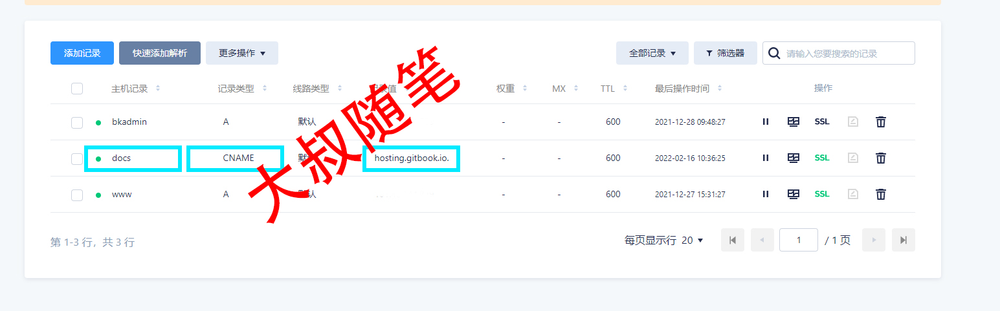
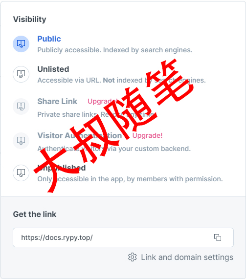
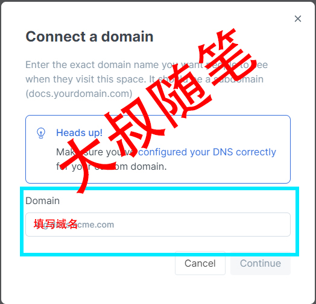
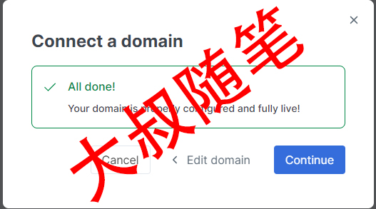

# 自有域名设置

## 设置步骤

### 1、申请注册域名

相关申请注册管理一站式机构，阿里云、华为云、腾讯云、百度云、万网，DNSPod、CheapName、亚马逊、GoDaddy等，要注意国内网站申请域名需要备案，国外不需要备案，申请5-10分钟即可使用，但需要设置服务器为国内DNSPod。

### 2、添加DNS解析

**解析记录信息配置如下**

主机记录：子域名名字（自定义）

记录类型：CNAME(此处一定选择正确，否则会导致解析失败，CNAME根据域名解析)

记录值：指向域名

**案例：**



### 3、设置GitBook端域名跳转

点击Public按钮，找到Get the link选项卡，点击Link and domain settings设置域名跳转。

**案例：**







## 常见问题

1、如果在GitHubDesktop软件，代码提交过程中，遇到如下问题：

```
fatal: unable to access 'https://github.com/XXX/XXX.git/': OpenSSL SSL_read: Connection was reset, errno 10054
```

**解决办法**

当前本地工程打开git bash here 运行如下代码：

```
git config --global http.sslVerify "false"
```

**错误原因**

服务器的SSL证书没有经过第三方签属导致报错，解除SSL验证即可。
