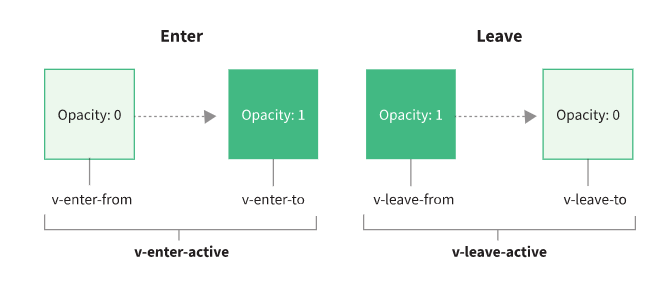
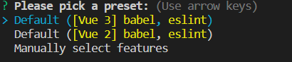
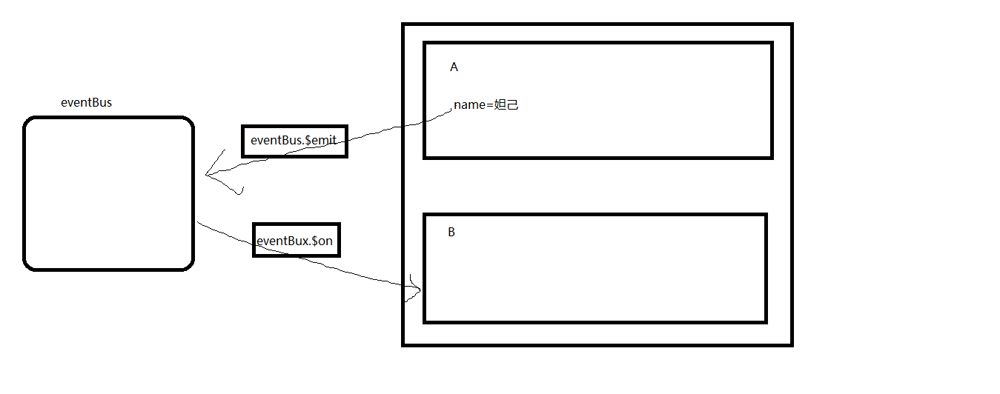

# Vue2.0基础

## VUE简介

英文官网：[https://v2.vuejs.org/](https://v2.vuejs.org/)

中文官网：[https://v2.cn.vuejs.org/](https://v2.cn.vuejs.org/)

### 作者

尤雨溪

### 概念

Vue (读音 /vjuː/，类似于 view) 是一套用于构建用户界面的渐进式（易=>难）JavaScript 框架。Vue 的核心库只关注视图层，便于与第三方库或既有项目整合。

渐进式框架：页面渲染、表单处理提交功能=>代码组件化=>前端路由、状态集中管理=>前端项目高度工程化。

VUE库=>vue.js

VUE框架=>VUE全家桶（vue-cli脚手架/vite脚手架、vue-router路由、vuex状态管理）。

VUE2.0采用Options API的函数式API。

### 优缺点

#### 优点

```
1.轻量级的数据框架
2.双向数据绑定
3.提供了指令
4.组件化开发
5.客户端路由
6.状态管理
7.渐进式框架
```

#### 缺点

```
1.Vue底层基于Object.defineProperty实现响应式，即vue使用了IE8无法模拟的ECMAScript5.0特性,这个api属性本身不支持IE8及以下浏览器，导致Vue不支持IE8及以下浏览器版本。
2.Vue打造的是SPA模式，所以不利于搜索引擎优化(SEO)；
3.由于VUE客户端渲染(CSR)的先天不足，导致首屏加载时间长，且可能出现闪屏现象。
```

### VUE核心

数据驱动和组件化系统。

### 采用VUE原因

简化数据渲染的代码量，让数据和页面布局更高效的结合。让前端开发，高内聚低耦合。

## VUE使用

### VUE安装

#### 引入方式

**CDN（指定路径）**

**开发版本**

```
<script src="https://cdn.jsdelivr.net/npm/vue@2.7.0/dist/vue.js"></script>
```

**产品版本**

```
<script src="https://cdn.jsdelivr.net/npm/vue@2.7.0/dist/vue.min.js"></script>
```

**npm社区**

```
2.7.0:     npm i vue@v2-latest
2.6.14:   npm i vue@legacy
```

**脚手架**

```
npm i -g @vue/cli
vue create vuedome
```

### VUE使用步骤

1、引入vue.js库

2、创建渲染区域

3、创建vue实例，进行数据绑定

**案例**

```
    <div id="app">
        <p>用户名:{{username}}</p>
        <button @click="changeuserName">改变值</button>
    </div>
    <script src="https://cdn.jsdelivr.net/npm/vue@2.7.0/dist/vue.min.js"></script>
    <script>
        new Vue({
            el:"#app",
            data:{
                username:"admin"
            },
            methods: {
                changeuserName(){
                    this.username="admin123123";
                }
            }
        });
    </script>
```

### VUE的实例

#### 创建实例语法

```
    new Vue({
    	el//设置挂载点
    	data//定义实例的属性
    	methods//定义实例的方法
    });
```

#### 实例的常用属性

**EL**

挂载点，挂载Vue渲染区域，挂载点可以支持ID选择器，类选择器，标签选择器（必须是body内部的标签），推荐使用ID选择器。

**注意事项**

1、只能绑定当前页面上的第一个对应有效节点。

2、只有挂载点之内VUE语法，会按照vue语法来解析。

3、不要将vue挂载到html或body上。

4、推荐使用ID选择符作为挂载点，因为具有唯一性。

**data**

定义实例的属性，JSON格式的数据形式，可以跟输出标签进行绑定，方便页面输出。

**methods**

定义实例的方法，JSON格式的数据形式，可以跟输出标签进行绑定，方便页面输出。

**案例**

```
    <div id="app">
        {{username}}
    </div>
    <p class="a">
        {{username}}
        {{getStr()}}
    </p>
    <span class="b">
        {{username}}
    </span>
    <script src="https://cdn.jsdelivr.net/npm/vue@2.7.0/dist/vue.min.js"></script>
    <script>
        //标签的ID，结合Vue实例的el属性，用来声明VUE渲染区域
        new Vue({
            el:"#app",//挂载点，挂载Vue渲染区域，挂载点可以支持ID选择器，类选择器，标签选择器（必须是body内部的标签），推荐使用ID选择器
            data:{//定义Vue实例的数据
                username:"admin",
                pwd:"123456",
                user:{
                    username:"admin111",
                    pwd:"123123"
                }
            },
            methods: {//定义Vue实例的方法
                //对象中方法的简写
                a(){},//推荐
                b:function(){},
                c:()=>{}//推荐
            }
        })
        new Vue({
            el:".a",
            data:{
                username:"aaaaaaa"
            },
            methods:{
                getStr(){
                    return "我是方法";
                }
            }
        })
    </script>
```

### 插值表达式（\{{\}}模板语法）

#### 基本语法

```
{{ES表达式}}
```

#### 使用规则

1、每个模板标签只能写一句ES语法

2、模板支持输出变量/对象属性、方法调用、ES表达式(三目)、简单运算、字符串拼接

3、只能使用在非表单元素中，表单元素需要使用指令。

4、不能转义HTML标签。

5、会存在闪屏问题

#### 案例

```
    <div id="app">
        <p>{{username}}</p>
        <p>{{user.username}}</p>
        <p>{{isadmin===1?"管理员":"普通用户"}}</p>
        <p>{{age+"1"}}</p>
        <p>{{getStr()+"aaaa"}}</p>
        <p>{{str}}</p>
    </div>
    <script src="https://cdn.jsdelivr.net/npm/vue@2.7.0/dist/vue.min.js"></script>
    <script>
        new Vue({
            el:"#app",
            data:{
                username:"admin",
                isadmin:1,
                age:18,
                user:{
                    username:"11111"
                },
                str:"<p>aaaaaa</p>"
            },
            methods:{
                getStr(){
                    return "haha"
                }
            }
        })  
    </script>
```

## VUE常用指令

### 指令定义

指令（Directives）是带有v-前缀的特殊属性，指令属性的预期值是单一JavaScript表达式（v-for除外）。

指令的职责是当其表达式的值改变时相应地将某些行为应用到DOM上。

常用的指令包括数据绑定指令，非表单绑定，v-text更新元素的textContent，v-html更新元素的innerHTML，表单绑定，v-model在表单上创建双向数据绑定，属性绑定指令v-bind，事件绑定指令v-on，循环指令v-for多次渲染元素或模板块等。

注：在Vue框架中，指令是很重要的功能，是必不可少的。

### 数据绑定指令

前后端数据交互目前采用最多的交互技术是JSON技术，即JSON格式的数据交互。

#### 非表单元素绑定

**v-text**

支持输出变量/对象属性、方法调用、ES表达式(三目)、简单运算、字符串拼接，不支持HTML标签转义，没有闪屏问题。

```
<标签 v-text="变量名"></标签>
```

**案例**

```
    <div id="app">
        <div v-text="username"></div>
        <p v-text="username"></p>
        <p v-text="age+1"></p>
        <p v-text="str+'11'"></p>
        <p v-text="getStr()+'222'"></p>
    </div>
    <script src="https://cdn.jsdelivr.net/npm/vue@2.7.0/dist/vue.min.js"></script>
    <script>
        new Vue({
            el:"#app",
            data:{
                username:"admin",
                age:19,
                str:`<b>sssssss</b>`
            },
            methods:{
                getStr(){
                    return "aaaaa";
                }
            }
        })
    </script>
```

**v-html**

支持输出变量/对象属性、方法调用、ES表达式(三目)、简单运算、字符串拼接，支持HTML标签转义，没有闪屏问题。

```
<标签 v-html="变量名"></标签> 
```

**案例**

```
    <div id="app">
        <p v-html="username"></p>
        <p v-html="user.username"></p>
        <p v-html="age+1"></p>
        <p v-html="str"></p>
        <p v-html="getStr()"></p>
        <p v-html="isadmin===0?'dddd':'aaaaa'"></p>
    </div>
    <script src="https://cdn.jsdelivr.net/npm/vue@2.7.0/dist/vue.min.js"></script>
    <script>
        new Vue({
            el:"#app",
            data:{
                username:"admin",
                user:{
                    username:"ddddd"
                },
                age:21,
                str:`<h1>sssssss</h1>`,
                isadmin:0
            },methods:{
                getStr(){
                    return "cccc";
                }
            }
        })
    </script>
```

#### 表单元素绑定

**v-model**

用作将表单的值与变量进行双向绑定，支持变量/对象的属性和函数的调用。

**基本语法**

```
<表单标签 v-mode="变量/对象属性/函数调用"></表单标签>
```

**案例**

```
    <div id="app">
        <input type="text" v-model="username">
        <input type="text" v-model="getStr()">
        <p>{{username}}</p>
    </div>
    <script src="https://cdn.jsdelivr.net/npm/vue@2.7.0/dist/vue.min.js"></script>
    <script>
        new Vue({
            el:"#app",
            data:{
                username:"admin",
                age:20,
                isadmin:0
            },
            methods: {
                getStr(){
                    return "aaaa";
                }
            }
        })
```

**指令修饰符**

1、number修饰符

通常文本类型的输入框返回字符类型，如果需要将其自动转换为number类型可以指令修饰符

```
<表单标签 v-mode.number=""></表单标签>
```

**案例**

```
        <input type="text" v-model.number="age">
        <p>{{typeof age}}</p>
        <p>{{age}}</p>
```

2、lazy修饰符

一般表单输入框会自动更新虚拟DOM的值，如果停止该操作可以采用lazy修饰符，这样，可以把处理数据放置在事件中处理， 当失去光标/按回车换行键后才修改模型中的数据。

```
<表单标签 v-mode.lazy=""></表单标签>
```

**案例**

```
        <input type="text" v-model.lazy="username">
        <p>{{username}}</p>
```

3、trim修饰符

去除空格修饰符，自动过滤用户输入的空格，注：如果字符串本身含有空格，并不会被去掉

```
<表单标签 v-mode.lazy=""></表单标签>
```

**案例：**

```
        <input type="text" v-model.trim="str">
        <p>{{str}}</p>
```

**一次性绑定**

将数据固定为初始值，不随Vue改变其值，而重新渲染。

```
<标签 v-once>{{变量名}}</标签>
```

**案例**

```
    <div id="app">
        <input type="text" v-model="username">
        <p v-once>{{username}}</p>
        <p v-once v-text="username"></p>
    </div>
    <script src="https://cdn.jsdelivr.net/npm/vue@2.7.0/dist/vue.min.js"></script>
    <script>
        new Vue({
            el:"#app",
            data:{
                username:"admin"
            }
        })
    </script>
```

#### 数据绑定方式的区别

1、\{{\}}，纯文本输出，使用简单，如果应用在首页会出现闪屏问题，即当js文件加载过慢时，会先被识别为文本显示，因此出现闪屏，建议不适用在首页。

2、v-text，纯文本输出，可以处理闪屏问题，因为当文件过慢时，页面时白屏显示。

3、v-html，转义HTML输出。

4、v-model，表单数据的输出（纯文本形式）。

5、v-once，初始化值会固定，不随其值改变而改变。

### 事件绑定指令

#### v-on:

事件监听指令。可以简写成@

**语法**

```
完整语法：
<标签 v-on:事件名称="执行方法[([参数])]"></标签>
简写语法：
<标签 @事件名称="执行方法[([参数])]"></标签>
当方法中有且只有一行代码，可以写在行内
<标签 @事件名称="ES代码"></标签>
```

注：定义方法的时候，同名方法会被覆盖。

**按钮事件案例**

```
    <div id="app">
        <button v-on:click="f1">按钮1</button>
        <button v-on:click="f1()">按钮2</button>
        <button v-on:click="f2('sssss')">按钮3</button>
        <select name="" id="" @change="f1">
            <option value="1">ssss</option>
            <option value="2">xxxxxx</option>
        </select>
        <input type="text" @change="f1">
    </div>
    <script src="https://cdn.jsdelivr.net/npm/vue@2.7.0/dist/vue.min.js"></script>
    <script>
        new Vue({
            el:"#app",
            data:{

            },
            methods:{
                f1(){
                    console.log("我被点击");
                },
                f2(msg){
                    console.log("ddd"+msg);
                }
            }
        })
    </script>
```

建议表单元素，除按钮以外的其它元素，采用change事件，不使用click事件。

#### 事件参数传递

**普通形式参数**

```
<button @click="fn1(10)">点击执行fn1函数</button>
<button @click="fn2(10,20,30)">点击执行fn2函数</button>
```

**默认传递事件参数**

在Vue的事件绑定指令中，无论是否传递参数默认都会将$event对象，传递事件处理函数。

**案例：**

```
    <div id="app">
        <!-- 普通参数的传递 -->
        <button @click="f1(1,2,3)">按钮1</button>
        <button @click="flag=(!flag)">按钮2</button>
        <p>{{flag}}</p>
        <button @click="alert('sssss')">按钮3</button>
        <button @click="console.warn('我是个警告！')">按钮4</button>
         <!-- 当不写()的时候，默认传递的参数就是$event对象 -->
        <button @click="f3">按钮5</button>
        <!-- 当写()的时候，默认参数就是对应值/undefined，同时$event对象也会被传递给调用函数 -->
        <button @click="f3()">按钮6</button>
        <button @click="f3('我是消息',$event)">按钮7</button>
    </div>
    <script src="https://cdn.jsdelivr.net/npm/vue@2.7.0/dist/vue.min.js"></script>
    <script>
        new Vue({
            el:"#app",
            data:{
                flag:false
            },
            methods:{
                f1(...arr){
                    console.log(arr);
                    alert("aaaaa")
                },
                f2(){
                    //console.log(this.flag);
                    //在方法中使用当前实例数据的时候，
                    this.flag=true;
                },
                f3(msg){
                    if(event){
                        alert(msg);
                    }else{
                        alert('ddd')
                    }
                    
                }   
            }
        })
    </script>
```

#### 修饰符

**回顾**

阻止复选框的选中事件。

**阻止默认事件**

```
event.preventDefault()
```

**案例**

```
    <div id="app">
        <input type="checkbox" @click="f">
        <input type="checkbox" @click="f1('ssss')">
        <button @click="f()">按钮1</button>
    </div>
    <script src="https://cdn.jsdelivr.net/npm/vue@2.7.0/dist/vue.min.js"></script>
    <script>
        new Vue({
            el:"#app",
            methods: {
                f(){
                    //阻止默认事件方法
                   event.preventDefault();             
                    alert("aaaaaa");
                },
                f1(msg){
                    event.preventDefault();
                    alert(msg);
                }
            }
        })
    </script>
```

阻止父子div的点击事件

**阻止事件传播(阻止冒泡)**

```
event.stopPropagation()
```

**案例：**

```
    <div id="app">
        <div style="height:50px; background-color: aqua;" @click="f1">
            父级
            <div style="height:15px; background-color: brown;" @click="f2">子级</div>
        </div>    
    </div>
    <script src="https://cdn.jsdelivr.net/npm/vue@2.7.0/dist/vue.min.js"></script>
    <script>
        new Vue({
            el:"#app",
            methods:{
                f1(){
                    alert("父级")
                },
                f2(){
                    event.stopPropagation()
                    alert("子级")
                }
            }
        })
    </script>
```

**常用事件修饰符**

**基本语法**

```
<标签 @事件.修饰符=""></标签>
.prevent 阻止默认事件
.stop 阻止事件传播传播(阻止冒泡)
.capture 内部元素触发事件，外部先捕获处理，再交由内部处理。
.self 触发的目标元素是自己才执行
.once 一次性事件绑定
.passive 当该属性执行函数后，永远不会调用阻止默认事件属性
```

注： .passive 和 .prevent 不能一起使用，因为 .prevent 将会被忽略。

**键盘按键修饰符**

**基本语法：**

```
<标签 @键盘事件.修饰符=""></标签>
.left 左键
.right 右键
.up 上键
.down 下键
.enter 回车
.tab 退格键
.delete (捕获“删除”和“退格”键)
.esc ESC键
.space 空格键
.字母	 英文字母
.asc码  asc码
```

**鼠标按键修饰符**

```
<标签 @鼠标事件.鼠标修饰符=""></标签>
.left 左键
.right 右键
.middle 滑轮
```

**系统修饰符**

**基本语法：**

```
<标签 @键盘事件.系统修饰符.按键修饰符=""></标签>
.ctrl
.alt
.shift
.meta Mac系统按键
```

**案例**

```
    <div id="app">
        <input type="checkbox" @click.prevent="f">
        <div style="height:50px; background-color: aqua;" @click="f1">
            父级
            <div style="height:15px; background-color: brown;" @click.stop="f2">子级</div>
        </div>
        <input type="text" @keyup.left="f3"> 
        <input type="text" @mousedown.left="f4">
        <input type="text" @keydown.alt.shift="f5" @keydown.alt.ctrl="f6">
        <input type="text" @keydown.enter="f7">
    </div>
    <script src="https://cdn.jsdelivr.net/npm/vue@2.7.0/dist/vue.min.js"></script>
    <script>
        new Vue({
            el:"#app",
            methods: {
                f(){
                    alert("我被点击");
                },
                f1(){
                    alert("父");
                },
                f2(){
                    alert("子");
                },
                f3(){
                    alert("左");
                },
                f4(){
                    alert("右");
                },
                f5(){
                    alert("alt+shift");
                },
                f6(){
                    alert("alt+ctrl")
                },
                f7(){
                    alert("回车")
                }
            }
        })
    </script>
```

### 循环指令

#### v-for

循环遍历可迭代数据

**基本语法**

```
        <标签 v-for='变量 of 循环数据'></标签>
        <标签 v-for='(变量,下标) in 循环数据'></标签>
```

**数据案例：**

```
    <div id="app">
        <table border="1">
            <tr>
                <th>用户ID</th>
                <th>用户名</th>
                <th>密码</th>
                <th>权限</th>
                <th>操作</th>
            </tr>
      <!--   <tr v-for="item of userlist">
                <td v-text="item.userid"></td>
                <td v-text="item.username"></td>
                <td v-text="item.pwd"></td>
                <td v-text="item.isadmin==='1'?'管理员':'普通用户'"></td>
                <td>
                    <button @click="">删除</button>
                </td>
            </tr>
        -->   
        <tr v-for="(item,key) in userlist">
     
            <td v-text="item.username"></td>
            <td v-text="item.pwd"></td>
            <td v-text="item.isadmin==='1'?'管理员':'普通用户'"></td>
            <td>
                {{key}}
                <button @click="">删除</button>
            </td>
        </tr>
        </table>
    </div>
    <script src="https://cdn.jsdelivr.net/npm/vue@2.7.0/dist/vue.min.js"></script>
    <script>
        new Vue({
            el:"#app",
            data:{
                userlist:[
                {"userid":8,"username":"admin9","pwd":"aaaaaa","isadmin":"0"},
                {"userid":12,"username":"admin","pwd":"123456","isadmin":"1"},
                {"userid":22,"username":"admin10","pwd":"123456","isadmin":"0"},
                {"userid":27,"username":"rypy","pwd":"1234567","isadmin":"0"},
                {"userid":28,"username":"admin1","pwd":"123456","isadmin":"1"},
                {"userid":32,"username":"admin7","pwd":"123","isadmin":"0"}
                ]
            }
        });
    </script>
```

#### key值

当 Vue 正在更新使用 v-for 渲染的元素列表时，它默认使用“就地更新”的策略。如果数据项的顺序被改变，Vue 将不会移动 DOM 元素来匹配数据项的顺序，而是就地更新每个元素，并且确保它们在每个索引位置正确渲染.这个默认的模式是高效的。为了给 Vue 一个提示，以便它能跟踪每个节点的身份，从而重用和重新排序现有元素，你需要为每项提供一个唯一 key，一般情况下我们的key值设置成id，因为id具有唯一性。

**作用：**

为了高效的更新虚拟DOM，如果使用了key就会为每个元素添加一个标识，当数据发生变化就会将变化的DOM元素进行局部更新，而不是将所有数据都更新，使用key值标识组件的唯一性，更好的区分组件，一般情况下我们使用id来设置key值，如果没有id就使用index也可以。

```html
        	<tr v-for="(item,index) in userlist" :key="index">
                <td v-text="item.userid"></td>
                <td v-text="item.username"></td>
                <td v-text="item.pwd"></td>
                <td v-text="item.isadmin==='1'?'管理员':'普通用户'"></td>
                <td>
                    <button @click="">删除</button>
                </td>
            </tr>
```

#### 双for嵌套

```
    <div id="app">
        <table border="1">
            <tr v-for="item of userlist" :key="item.userid">
                <td v-for="(value,key) in item" v-text="value"></td>
            </tr>
        </table>
    </div>  
    <script src="https://cdn.jsdelivr.net/npm/vue@2.7.0/dist/vue.min.js"></script>
    <script>
        new Vue({
            el:"#app",
            data:{
                userlist:[
                {"userid":8,"username":"admin9","pwd":"aaaaaa","isadmin":"0"},
                {"userid":12,"username":"admin","pwd":"123456","isadmin":"1"},
                {"userid":22,"username":"admin10","pwd":"123456","isadmin":"0"},
                {"userid":27,"username":"rypy","pwd":"1234567","isadmin":"0"},
                {"userid":28,"username":"admin1","pwd":"123456","isadmin":"1"},
                {"userid":32,"username":"admin7","pwd":"123","isadmin":"0"}
                ]
            }
        });
        </script>
```

### 条件指令

#### v-if、v-else-if、v-else

用来控制元素显示与隐藏

**案例**

```
    <div id="app">
        <input type="text" v-model="age">
        <p v-if="age>=18&&age<60">已成年</p>
        <p v-else-if="age>=65">老年人</p>
        <p v-else>未成年</p>
    </div>
    <script src="./vue.min.js"></script>
    <script>
        new Vue({
            el:"#app",
            data:{
                age:16
            }
        })
    </script>
```

#### v-show:

用来控制元素显示与隐藏

```
    <div id="app">
        <button @click="flag=!flag">切换</button>
        <p v-show="flag">你猜我什么时候显示</p>
    </div>
    <script src="./vue.min.js"></script>
    <script>
        new Vue({
            el:"#app",
            data:{
                flag:false
            }
        })
    </script>
```

#### v-if和v-show的区别

相同点：两者都是用来控制元素显示与隐藏的。

不同点：

v-if，真正的条件渲染，因为它会在切换过程中对条件块内的事件监听器和子组件适当地被销毁和重建，属于懒惰性加载。即满足条件重建，不满足条件销毁。

v-show，则采用样式的display:none模式，会将所有内容全部创建，通过属性对其进行显示/隐藏，适用于频繁切换场景。

#### 综合案例

**遮罩弹窗案例**

**css**

```
.wrapCon{
    width: 100vw;
    height: 100vh;
    position: fixed;
    left: 0;
    top: 0;
    background: rgba(0,0,0,0.2);
  }
  .con{
    width: 300px;
    height: 200px;
    background: white;
    border-radius: 10px;
    text-align: center;
    position: absolute;
    /* top: 0;
    left: 0;
    right: 0;
    bottom: 0;
    margin: auto; */
    top: 50%;
    left: 50%;
    transform: translate(-50%,-50%);
  }
  .con h4{
    margin: 0;
    margin-bottom: 50px;
    line-height: 50px;
  }
```

**html**

```
    <div id="app">
        <button @click="flag=!flag">删除</button>
        <div class="wrapCon" v-show="flag">
              <div class="con">
                <h4>确认删除？</h4>
                <button @click="deluser">确定</button>
                <button @click="flag=false">取消</button>
              </div>  
        </div>
    </div>
    <script src="./vue.min.js"></script>
    <script>
        new Vue({
            el:"#app",
            data:{
                flag:false
            },methods: {
              deluser(){
                    this.flag=false;
                    alert("删除成功！");
              }  
            }
        })
    </script>    
```

### 属性绑定指令

#### v-bind

将原有字符类型的固定属性值，改变为可变的属性值，可以绑定已知属性，也可以绑定自定义属性。

**语法**

```
            完整语法
            <标签 v-bind:属性名="变量/函数调用/三目运算"></标签>
            简写语法
            <标签 :属性名="变量/函数调用/三目运算"></标签>
            自定义属性
            <标签 :自定义属性名="变量/函数调用/三目运算"></标签>
```

\*\*注：\*\*自定义属性在编译的时候，不会被编译

**案例**

```
    <div id="app">
       
        <a v-bind:href="urlstr">点击我</a>
        
        
        
        <p :aa="flag">dddd</p>
        <p v-bind:bb="flag">dddd</p>
    </div>
    <script src="./vue.min.js"></script>
    <script>
        new Vue({
            el:"#app",
            data:{
                urlStr:"https://tenfei03.cfp.cn/creative/vcg/800/version23/VCG41175510742.jpg",
                flag:false
            },methods: {
                getUrl(){
                    return `https://tenfei03.cfp.cn/creative/vcg/800/version23/VCG41175510742.jpg`;
                }
            }
        })
    </script>
```

### 样式指令

#### 动态类名指令（:class）

**语法**

```
	        <标签 :class="变量名"></标签>
	        <标签 :class="函数调用"></标签>
            <标签 :class="三目运算"></标签>
            <标签 :class="{样式1:布尔类型[,样式2:布尔类型]}"></标签>
```

注：对象布尔类型模式，多样式都会生效，谁在前，谁优先。

#### 动态行间样式指令(:style)

**语法：**

```
            <标签 :style="变量"></标签>
            <标签 :style="函数调用"></标签>  
            <标签 :style="{样式名:样式值}"></标签>
            <标签 :style="[{样式名:样式值},{样式名:样式值}]"></标签>
```

**案例：**

```
    <div id="app">
        <!-- class样式指令 -->
         <div :class="a">aaaaa</div>
         <div :class="flag?a:b">bbbbbbb</div>
         <button @click="flag=!flag">切换模式</button>
         <div :class="{c2:flag,c1:!flag}">cccccccc</div>
         <div :class="getClass()">iiiiiii</div>
        <!-- style样式指令 -->
         <div :style="{color:'red'}">dddddd</div>
         <div :style="[{color:'blue'},{background:'red',color:'yellow'}]">eeeeee</div>
         <div :style="c">ffffff</div>
         <div :style="getCCC()">ggggg</div>
    </div>
    <script src="./vue.min.js"></script>
    <script>
        new Vue({
            el:"#app",
            data:{
                a:"c1",
                b:"c2",
                flag:true,
                c:{color:'red'},
                obj:{
                    color:'pink',
                    fontSize:'30px'
                }
            },methods: {
                getCCC(){
                    return [{color:'blue'},{background:'red',color:'yellow'},this.obj];
                },
                getClass(){
                    return {c3:true}
                }
            }
        })
    </script>
```

#### 样式指令应用案例

```
    <div id="app">
        <table border="1">
            <tr v-for="(item,index) in list" :key="index">
                <td :class="{c1:(index%3===0),c2:(index%3===1),c3:(index%3===2)}">{{item}}</td>
            </tr>
        </table>
    </div>
    <script src="./vue.min.js"></script>
    <script>
        new Vue({
            el:"#app",
            data:{
                list:[1,2,4,6,7],
                flag:true
            },methods: {
                getOTd(){
                    return index%2===0?{c1:true}:{c2:true}
                }
            }
        })
    </script>
```

## 解决屏幕闪动问题

```
// 方式一：使用v-html或者v-text
<td v-html="item.name"></td>

// 方式二：v-cloak
<div id="app" v-cloak></div>
<style>
	[v-cloak]{
		display:none
	}
</style>
```

## 全局函数

### $set

可以操作JSON格式的数据(数组/对象)，并重新渲染页面。

**注：**（Vue3.0已将其废弃）

**语法：**

```
this.$set(原JSON格式的数据,键名/下标,新值)
Vue实例.$set(原JSON格式的数据,键名/下标,新值)
```

**案例**

```
    <div id="app">
        <button @click="changeArr">按钮</button>
        <ul>
            <li v-for="(item,index) in arr" :key="index" v-text="item"></li>
        </ul>
    </div>
    <script src="./vue.min.js"></script>
    <script>
        const vm=new Vue({
            el:"#app",
            data:{
                arr:[1,2,4,5,7,9],
                obj:{}
            },methods: {
                changeArr(){
                    this.$set(this.arr,100,1);
                    console.log(this.arr);
                    console.log(this.obj);
                }
            }
        });
        vm.$set(vm.obj,"username","admin");
        console.log(vm.obj);
    </script>
```

## 数组自动渲染页面方法

```
push()
pop()
shift()
unshift()
splice()
sort()
reverse()
```

## VUE生命周期钩子函数

VUE在创建实例的时候，初始化期间会伴随着生命周期钩子函数的调用，研发过程中，可以根据不同阶段的钩子实现不同的功能，以达到所需效果。

VUE2.0，包含8个生命周期钩子函数，beforeCreate(组件实例刚刚被创建)、created(组件实例创建完成)、beforeMount(模板编译/挂载前)、mounted(模板编译/挂载完成)、beforeUpdate(组件更新前)、updated(组件更新完成)、beforeDestroy(组件销毁前)、destroyed(组件销毁完成)。

### 函数图解

<figure><figcaption></figcaption></figure>

### 函数的含义

```
beforeCreate() {}			// 创建之前，渲染区域并没有挂载VUE实例，实例中定义的属性，全部都是undefined
created() {}				// 创建完成，初始化data内的属性和methods内方法，但是挂载点还没有找到

beforeMount() {}			// 挂载之前，挂载点已经存在，但是VUE语法没有被解析和渲染
mounted() {}				// 挂载完成，渲染区数据/方法被解析和渲染，DOM结构已经出来了，一般在这里开启定时器(开启倒计时)，如果是ajax请求数据给Vue的实例赋值，更推荐在此区域赋值

beforeUpdate() {}			// 视图更新之前，获取渲染区节点更新前的数据
updated() {}				// 视图更新完成，获取渲染区节点更新后的数据

beforeDestroy() {}			// 销毁之前，// 一般情况下我们在这里关闭定时器，关闭倒计时
destroyed() {}				// 销毁完成，将Vue的实例与DOM节点的监听操作（终止），属性和方法依旧存在，且可以使用。
```

**案例**

代码显示挂载顺序

```
    <div id="app">
        <input type="text" v-model="pwd">
        <p id="pwdid">{{pwd}}</p>
        <button id="pwdc" @click="changPwd()">阿牛</button>
        <button id="dbtn">销毁</button>
    </div>
    <script src="./vue.min.js"></script>
    <script>
        const vm=new Vue({
           // el:"#app",
            data:{
                pwd:"123456"
            },methods: {
                changPwd(){
                    this.pwd="aaaa"
                    return "aaaaa";
                }
            },beforeCreate () {
                //创建之前,渲染区域并没有挂载VUE实例，实例中定义的属性，全部都是undefined
                // console.log(document.getElementById("app"));
                // console.log(this.$el);//undefined
                // console.log(this.$data);//undefined
                // console.log(this.pwd);//undefined
            },created () {
                //创建完成，初始化data内的属性和methods内方法
                // console.log(document.getElementById("app"));
                // console.log(this.$el);//undefined
                // console.log(this.$data);//
                // console.log(this.pwd);//123456
                // console.log(this.changPwd());//
                // console.log(vm);//没有
            },beforeMount () {
                //挂载前，挂载点已经存在，
                // console.log(document.getElementById("app"));
                // console.log(this.$el);//
                // console.log(this.$data);//
                // console.log(this.pwd);//123456
                // console.log(this.changPwd());//
            },mounted () {
                //如果是ajax请求数据给Vue的实例赋值，更推荐在此区域赋值
                //挂载后，渲染区数据/方法被渲染
                // console.log(document.getElementById("app"));
                // console.log(this.$el);//
                // console.log(this.$data);//
                // console.log(this.pwd);//123456
                // console.log(this.changPwd());//
            },beforeUpdate () {
                //获取渲染区节点更新前的数据
                console.log(document.getElementById("pwdid").innerHTML);//
            },updated () {
                //获取渲染区节点更新后的数据
                console.log(document.getElementById("pwdid").innerHTML);//
            },beforeDestroy () {
                //无任何操作。
                console.log("销毁前");
            },destroyed () {
                //将Vue的实例与DOM节点的监听操作（终止），属性和方法依旧存在，且可以使用。
            }
        })
        //销毁Vue实例的方法
        //vm.$destroy();
       vm.$mount("#app");//脚手架中的挂载方式。
        document.getElementById("dbtn").onclick=()=>{
            vm.$destroy();
        }
    </script>
```

注：此处需要采用浏览器命令行销毁组件

### 常用全局函数

```
vm.$destroy()				// 销毁
vm.$mount("挂载点")		  // 挂载
```

## template选项

渲染VUE实例的内容。

template形式分为两种，一种以标签的形式在渲染区，另一种是以键值对的形式在Vue实例中。

标签的形式在渲染区：区别原有HTML5标签，支持Vue语法，内容会被渲染。

Vue的实例：替换渲染区全部内容，注：其值必须是带有标签的字符串,支持Vue语法,不支持多节点。

注意事项：

1、tempalte属性会替换Vue挂载节点的全部内容。

2、template属性中的dom节点有且只能有一个根元素，如果有多个根元素需要使用v-if、v-else、v-else-if设置成只显示其中一个根元素。

3、template属性对应的属性值中,可以使用vue实例data、methods中定义的数据和方法。

4、template选项中的值必须是含有html节点字符串，否则不会被编译

**案例**

```
     <div id="app">
        <p>我是渲染区的内容</p>
        <!-- template在渲染区，以标签形式 支持Vue语法  -->
        <template>
            <h1>我是标签</h1>
            <h2>{{str}}</h2>
            <h3 v-text="getStr()"></h3>
            <div v-show="flag">111111</div>
            <div v-show="!flag">222222</div>
            <button @click="flag=!flag">按钮</button>
        </template>
    </div>
    <h1>ssss</h1>
    <!-- template做标签的时候，他是隐藏标签,当他在Vue渲染区的时候，它是一个template选项，其内容可以显示 -->
    <template>
        我是标签
    </template>
    <script src="./vue.min.js"></script>
    <script>
        new Vue({
            data:{
                str:"1111",
                flag:true
            }
           //template:"<h1>aaaaaa{{str}}</h1><h1>sdfsdfsdf</h1>"//template在Vue实例中，以键名形式渲染的时候，替换渲染区全部内容，注：其值必须是带有标签的字符串,支持Vue语法,不支持多节点
        //    ,template:`
        //         <div>
        //             <div v-show="flag">111111</div>
        //             <div v-show="flag">222222</div>
        //         </div>
        //    `
           ,methods: {
                getStr(){
                    return "sssss"
                }
           }
        }).$mount("#app");
    </script>
```

注：区别H5中的tempalte标签，template标签中的内容在页面中不会显示，但是会在DOM结构中存在，且VUE实例中的tempalte标签，支持Vue语法，结合tempalte标签渲染指定内容。

## render渲染函数

render 函数即渲染函数，它是个函数，render 函数的返回值是VNode（即：虚拟节点，也就是渲染的节点）

使用render函数采用js语言来构建DOM，因为vue是虚拟DOM，所以在拿到template模板时也要转译成VNode的函数，而用render函数构建DOM，vue就免去了转译的过程。

当使用render函数构建虚拟DOM时，vue提供一个函数，这个函数是就构建虚拟DOM所需要的工具。官网上给他起了个名字叫createElement。还有约定它的简写叫h。

### 基本语法

```
render:(createElement)=>{return createElement()}
render:h=>h()
```

#### createElement函数

createElement 是 render 函数的参数，它本身也是个函数，并且有三个参数。

```
createElement(参数1[,参数2[,参数3]])
```

**参数1**

是必填的，创建标签节点，支持自定义，可以是String | Object | Function

String，表示的是HTML 标签名

Object ，一个含有数据的组件选项对象

Function ，返回了一个含有标签名或者组件选项对象的async 函数

```
return cm('hr');
return cm({
	template: " <h1>aaa</h1> "
})
let domF1 = ()=> {
    return {
        template: " <p> 锄禾日当午</p> "
    }
}
return cm(domF1())
```

**参数2**

选填的，当参数是字符串的时候，会给参数1节点标签赋内容，当参数是对象的时候设置标签的属性， 常见的有class | style | attrs | domProps | on

class：控制类名

style ：样式

attrs ：用来写正常的 html 属性 id src 等等

domProps :用来写原生的dom 属性

on用来写原生方法

```
                return cm('hr', {
                    style: {
                        backgroundColor : 'red'
                    },
                });
```

**参数3**

选填的，创建子节点，代表子级虚拟节点 (VNodes)，仍然由createElement构建，可以是String或Array

```
                return cm('div', {
                    attrs: {
                        id: "content"
                    }
                }, [
                    cm('h1', '我是H1标题'),
                    cm('h6', '我是H6标题')
                ]
                )
```

注：render函数会覆盖template选项内容。

## 计算属性（computed）

一般在模板语法内使用表达式进行简单运算，当表达式过于复杂时，在模板中放入太多逻辑会让模板过重且难以维护。因此，Vue提供了计算属性computed，可以简化模板中的逻辑，方便维护，进行大量计算，且computed中所使用的变量不需要在data里面定义，就能返回需要的值。

**基本语法**

```
computed: {属性名(){return 值}}
computed: {属性名:{get(){},set(){}}
```

**案例**

```js
    <div id="app">
        <input type="text" v-model="num">
        {{jss}}
    </div>
    <script src="./vue.min.js"></script>
    <script>
        //computed属性中虽然定义的是方法，但是调用的时候必须按属性调用
        new Vue({
            data:{
                num:0
            },
            computed: {
                //定义方法
                jss(){
                    let sum=0;
                    for(let i=0;i<=this.num;i++){
                        sum+=i;
                    }
                    return sum;
                }
            }
        }).$mount("#app")
```

### 计算属性的get和set方法

计算属性中可以使用方法和属性(包含get方法和set方法)

```js
     <div id="app">
        <button @click="aa">按钮</button>
    </div>
    <script src="./vue.min.js"></script>
    <script>
        //当在计算属性中使用set和get方法的时候，将所需的内容定义为对象模式
        new Vue({
            data:{
                numv:""
            },
            computed: {
                num:{
                    get(){
                        console.log("我是get");
                        return this.numv;
                    },
                    set(val){
                        console.log("我是set"+val);
                        this.numv=val.at(-1);
                    }
                }
            },methods: {
                aa(){
                    //this.num;//调用get
                    //console.log(this.num);
                    this.num="admin";//调用set
                    console.log(this.num);
                }
            }
        }).$mount("#app");
    </script>
```

### computed和methods的区别

#### 相同点

都可以用来做逻辑计算。

#### 不同点

1、methods的调用需要加小括号，computed的调用不需要加小括号。

2、methods是每调用一次都会重新计算执行一次，而computed是基于变量的值进行缓存的，具有缓存效果，只要其依赖的数据没有发生变化，则都是第一次的缓存。比如我执行了N次computed，数据没有发生变化，底层逻辑只需要执行计算1次。

3、计算属性computed是自动触发，methods是手动触发。

#### 使用场景

事件触发，使用methods。

大量逻辑，使用computed。

### 简化循环条件嵌套资源浪费问题

当v-for和v-if嵌套使用的时候，由于v-for具有比v-if更高的优先级，代码会先使用v-for循环渲染出来所有的数据，然后再利用v-if砍掉不符合条件的数据，这样就会有一个资源浪费的问题。此时可以利用computed直接处理数据，再次进行循环处理之后的数据。

**案例**

```js
    <div id="app">
        <ul>
            <li v-for="item of list" v-text="item.title" v-if="item.title.includes('的')"></li>
        </ul>
        <ul>
            <li v-for="item of datafil" v-text="item.title" ></li>
        </ul>
    </div>
    <script src="./vue.min.js"></script>
    <script>
        new Vue({
            data:{
                list:[{id:1,title:"看得最远的地方",name:"毛不易"},
                    {id:2,title:"圆",name:"周笔畅"},
                    {id:3,title:"下一站的天后",name:"李克勤"},
                    {id:4,title:"孤勇者",name:"陈奕迅"},
                    {id:5,title:"乘风的破浪",name:"金志文"},
                    {id:6,title:"对心",name:"大张伟"},
                    {id:7,title:"想问问的你",name:"沈志凯"}]
            },computed: {
                //在实际项目中。尽量在此属性下，生成符合渲染的数据
                datafil(){
                    return this.list.filter(item=>item.title.includes('的'))
                }
            }
        }).$mount("#app");
    </script>    <div id="app">
        <ul>
            <li v-for="item of f1">
                <p>名称：{{item.title}}</p>
                <p>歌手：{{item.name}}</p>
            </li>
        </ul>
    </div>
    <script src="./vue.min.js"></script>
    <script>
        new Vue({
            el:"#app",
            data:{
                list:[
                    {id:1,title:"看得最远的地方",name:"毛不易"},
                    {id:2,title:"圆",name:"周笔畅"},
                    {id:3,title:"下一站天后",name:"李克勤"},
                    {id:4,title:"孤勇者",name:"陈奕迅"},
                    {id:5,title:"乘风破浪",name:"金志文"},
                    {id:6,title:"对心",name:"大张伟"},
                    {id:7,title:"想问问你",name:"沈志凯"}
            ]},
            computed: {
                f1(){
                    return this.list.filter((item,index)=>{
                        return index<4;
                    });
                }
            }  
        })
    </script>
```

## 侦听器（watch）

Vue提供了watch选项，用于侦听data数据/computed计算属性，属性值的改变。当需要在数据发生变化时执行异步或开销较大的操作时，这个方式是最有效的。

### 语法：

将需要监听的属性，放置再watch属性下

#### 普通侦听(浅侦听)：

侦听基本数据类型

```
watch:{
	属性名(新值,原值){}
}
```

#### 完整侦听（深度侦听）：

侦听对象类型。在深度监听中是不能获取到旧的值，只能获取到新的值，因为在vue的底层压根就没有保存旧的值。在页面中尽量不要过多的使用深度监听，因为深度监听容易造成页面的卡顿，可以拆成简单数据类型进行监听，拆成简单数据类型监还可以获取到旧的值。

```
watch:{
	属性名:{
		handler(Proxy新值){},
		deep:深度监听属性，布尔类型，默认值是false。
	}
}
```

### 案例

#### 浅侦听

```js
    <div id="app">
        <input type="text" v-model="username">
    </div>
    <script src="./vue.min.js"></script>
    <script>
        new Vue({
            data:{
                username:'admin'
            },watch: {
                //浅监听 语法
                //属性名(新值,原值){}
                username(newValue,oldValue){
                    console.log(a);
                    console.log(b);
                }
            }
        }).$mount("#app");
    </script>
```

#### 深度侦听

```js
    <div id="app">
        <input type="text" v-model="user.username">
        <input type="text" v-model="user.obj.sex">
    </div>  
    <script src="./vue.min.js"></script>
    <script>
        //深度监听  语法
        // 属性名:{handler(newValue){},deep:true}//deep属性默认是false
        //注：不建议使用深度监听，会造成页面卡顿，可以将符合数据类型转换为基本数据类型进行监听
        new Vue({
            data:{
                user:{
                    username:"admin",
                    obj:{
                        sex:"aaa"
                    }
                }
            },watch: {
                    user:{
                        handler(a){
                            console.log(a);
                       },
                       deep:true 
                    },
                    "user.username"(newV,oldV){
                        console.log(newV);
                        console.log(oldV);
                    },
                    "user.obj.sex"(a){
                        console.log(a);
                    }   
                }    
        }).$mount("#app");
    </script>
```

### 计算属性computed和watch的区别

#### 相同点:

都是以Vue的依赖追踪机制为基础的，都是希望在依赖数据发生改变的时，被依赖的数据根据预先定义好的函数，发生“自动”的变化。

#### 不同点

1、虽然计算属性在大多数情况下更合适，但有时也需要一个自定义的侦听器，当需要在数据变化时执行异步或开销较大的操作时，通过侦听器最有用。

2、当在模板内使用了复杂逻辑的表达式时，应当使用计算属性。 虽然方法也能实现同样的效果，但是因为计算属性可以基于它们的依赖进行缓存，所以选择计算属性会比方法更优。 当需要在数据变化时执行异步或开销较大的操作时，可以使用watch。

#### 使用场景

watch擅长处理的场景:一个数据影响多个数据，主要用来监听数据的变化；

computed擅长处理的场景:一个数据受多个数据影响，比如购物车。

### 综合案例

#### 搜索引擎联想

```
    <div id="app">
        搜索条件<input type="text" v-model="searchText">
        <ul>
            <li v-for="item of searchList"><a href="javascript:;" @click="tj(item)">{{item}}</a></li>
        </ul>
    </div>
    <script src="./vue.min.js"></script>
    <script src="./01_前端解决跨域/jquery.min.js"></script>
    <script>
        new Vue({
            data:{
                searchText:"",
                searchList:[]
            },watch: {
                async searchText(newV){
                    this.searchList=(await $.ajax({
                        url:"http://suggestion.baidu.com/su",
                        type:"get",
                        data:{
                            wd:newV
                        },
                        dataType:"jsonp",
                        jsonp:"cb"
                    })).s;
                }
            },methods: {
                tj(msg){
                    //window.open(`http://www.baidu.com/s?wd=${msg}`)
                    location.href=`http://www.baidu.com/s?wd=${msg}`;
                }
            }
        }).$mount("#app");
    </script>
```

## 过滤器

在VUE2.0中可以使用过滤器格式化文本格式。

### 基本语法

\| 管道符

```
{{属性值|过滤器方法A[|过滤器方法B]}}
<标签 v-bind:属性="属性值|过滤器方法A[|过滤器方法B]"></标签>
```

### 过滤器分类

#### 局部过滤器

**语法**

```
filters:{过滤器方法(参数){}}
```

**案例**

```js
    <!-- 当采用过滤器模式，则数据的输出只能是过滤器形式，不能使用表达式 -->
    <div id="app">
        <p>{{arr|arrFiler}}</p>
    </div>
    <script src="./vue.min.js"></script>
    <script>
        new Vue({
            data:{
                //arr:[1,6,3,8,0,10],
                arr:{username:"admin"}
            },
            filters: {
                //将数据在过滤器中加工
                arrFiler(index){
                    // let arr=[1,2,4,5,6];
                    // let obj={
                    //     username:"addd"
                    // }
                    // console.log(typeof index);
                    // console.log(obj instanceof Array);
                    //console.log(index instanceof Array);
                    return (index instanceof Array)?'arr是数组':'arr是对象'                 
                }
            }
        }).$mount("#app")
```

#### 全局过滤器

**语法**

```
Vue.filter("过滤器方法名",(参数)=>{});
```

**案例**

```js
    <div id='app'>
        <p>{{price | filterPrice}}</p>
      </div>
      <div id="app1">
        <p>{{price | filterPrice}}</p>
      </div>
    <script src="./vue.min.js"></script>
    <script>
        Vue.filter("filterPrice", (price) => {
            return price.toFixed(2)
        })
        new Vue({
            el: '#app',
            data: {
                price: 18.34567
            }
        })
        new Vue({
            el: '#app1',
            data: {
                price: 36
            }
        })
    </script>
```

**注：**

1、局部过滤器只能在当前vue实例中使用，而全局过滤器可以在任何一个vue实例中使用，推荐使用全局过滤器。

2、全局过滤器一定要写在实例化前面，否则不会报错，但会影响功能。

3、在VUE3.0中，不在支持过滤器，建议使用计算属性或方法代替过滤器。

#### 综合案例

**时间过滤器**

```js
    <div id="app">
        <ul>
            <li v-for="item in list" :key="item.id">
                <p>名称：{{item.title}}</p>
                <p>时间：{{item.time | filterTime}}</p>
            </li>
        </ul>
    </div>
    <script src="../vue.min.js"></script>
    <script>
        Vue.filter("filterTime", (time) => {
            return new Date(time).toLocaleString().replaceAll("/","-");
        })
        new Vue({
            data: {
                list: [{
                    id: 1,
                    title: "无线电信号车护航2022高考：发现作弊信号立即追查来源",
                    time: 1411119605113
                }, {
                    id: 2,
                    title: "北京封管控区高考考场：警方设三个工作小组 力保考点安全",
                    time: 1666580433866
                }, {
                    id: 3,
                    title: "多视角看俄军“冰雹”火箭炮打击乌军阵地：40管火箭炮开火",
                    time: 1999990300943
                }, {
                    id: 4,
                    title: "郑州通报女大学生因120延误救治去世事件:调度员被开除",
                    time: 1287010301023
                }, {
                    id: 5,
                    title: "千万黄金贱卖，牵出4.7亿经济大案",
                    time: 1063580180243
                }]
            }
        }).$mount("#app")
```

## 综合案例

### 搜索引擎联想功能实现

#### 定义数据

```
data: {
   searchText:"",
   searchList:[],
   searchWord:"",
   liIndex:-1
}	
```

#### 渲染搜索框和内容

```
        搜索条件<input type="text" v-model="searchText" @keydown.up="up()"  @keydown.down="down()" @keydown.enter="tj(searchWord)">
        <ul>
            <li v-for="(item,index) in searchList"><a href="javascript:;" @click="tj(item)"  :class="{aa:liIndex===index}"  @keydown.enter="tj(item)">{{item}}</a></li>
        </ul>
```

#### 监听搜索词并发送搜索请求

```
                async searchText(newV){
                    this.searchList=(await $.ajax({
                        url:"http://suggestion.baidu.com/su",
                        type:"get",
                        data:{
                            wd:newV
                        },
                        dataType:"jsonp",
                        jsonp:"cb"
                    })).s;
                }
```

#### 添加响应事件方法

```
               tj(msg){
                    if(msg===""){
                        location.href=`http://www.baidu.com/s?wd=${this.searchText}`;
                    }else{
                        location.href=`http://www.baidu.com/s?wd=${msg}`;
                    }
                    //window.open(`http://www.baidu.com/s?wd=${msg}`)
                    //location.href=`http://www.baidu.com/s?wd=${msg}`;
                },
                down(){
                    if(this.liIndex===this.searchList.length){
                        this.liIndex=-1;
                    }else{
                        this.liIndex=this.liIndex+1;
                    }
                    //this.searchText=this.searchList[this.liIndex]
                    this.searchWord=this.searchList[this.liIndex];
                },
                up(){
                    if(this.liIndex===0||this.liIndex===-1){
                        this.liIndex=this.searchList.length;
                    }else{
                        this.liIndex=this.liIndex-1;
                    }
                    this.searchWord=this.searchList[this.liIndex];
                }
```

### 购物车功能实现

#### 增加功能

```
            add(index){
              this.arr[index].num ++
              this.arr[index].num = Math.min(this.arr[index].num,5)
            }
```

#### 减少功能

```
                BitBtn(index,index1){
                    this.cartShoplist[index].list[index1].num=Math.max(1,this.cartShoplist[index].list[index1].num-1)
                }
```

#### 删除功能

```
            del(index){
              this.arr.splice(index,1)
            }
```

#### 全选功能

```
            checkA(){
              this.arr.map(item=>{
                return item.isTrue = this.checkAll
              })
            }
```

#### 计算方法

```
            priceAll(){
              let sum = 0
              this.arr.forEach(item=>{
                if(item.isTrue){
                  sum += item.price * item.num
                }
              })
              return sum
            }
```

#### 侦听复选框事件

```
            watch: {
            	"arr.isTrue"(){
            		this.checkAll = this.arr.every(item => {
                    	return item.isTrue;
                    });
            	}
            }
```

## 过渡动画

Vue提供了两个组件，处理过渡动画，分别是

和。

组件，使用在单元素/组件的过渡动画。

### Transition组件

#### 使用场景

条件渲染(v-if)

条件显示(v-show)

动态组件

#### 过渡样式

<figure><figcaption></figcaption></figure>

```
v-enter-active，进入过渡生效时状态
v-enter-to，进入过渡结束状态
v-leave，离开过渡开始状态
v-leave-active，离开过渡生效时状态
v-leave-to，离开过渡结束状态
```

设置过渡动画，我们可以借助H5提供的transition属性，给transition标签设置name属性，然后再根据name设置两组六个属性 ，即Transition组件。

默认是v作为命名，也可以单独给组件起名字如aa

#### 语法

```
        <transition name="样式名">
            <标签 v-show="flag"></标签>
            <标签 v-if="flag"></标签>
        </transition>
```

#### 案例

```
    <div id="app">
        <button @click="flag=!flag">切换</button>
         <!--
        <transition name="">
           <p v-show="flag">你好，我是动画！</p>
        </transition>
        <transition name="aa">
            <p v-show="flag">你好，VUE！</p>
        </transition>
        -->
        <transition name="aa">
            <p v-show="flag">哈哈</p>
        </transition>
    </div>
    <script src="./vue.min.js"></script>
    <script>
        new Vue({
            data:{
                flag:false
            }
        }).$mount("#app")
    </script>
```

### TransitionGroup组件

列表过渡，指页面中多元素同时具有某个特定的过渡动画。

#### 语法

```
        <transition-group tag="父级标签" name="样式前缀">
            <子标签 v-for="" :key="">
                {{ 内容 }}
            </子标签>
        </transition-group>
```

#### 案例

```
    <div id="app">
        <button @click="addArr">添加子节点</button>
        <button @click="delArr">删除子节点</button>
        <transition-group tag="ul" name="aa">
            <li v-for="(item,index) in arrList" :key="index">{{item}}</li>
        </transition-group>
    </div>
    <script src="./vue.min.js"></script>
    <script>
        new Vue({
            data:{
                arrList:[
                    1,2,4,5,6,8,9
                ]
            },methods: {
                addArr(){
                    this.arrList.push(this.arrList.at(-1)+1);
                },
                delArr(){
                    //this.arrList.pop();//默认从数组最后一个节点删除。
                    this.arrList.shift();//默认删除第一个元素。
                }
            }
        }).$mount("#app")
    </script>
```

\*\*注：\*\*如果在DOM模板，即HTML页面需要使用标签

### 结合动画库的使用

官方推荐的动画库(Animate.css)，可以参考效果。

**官网：**

```
https://animate.style/
```

#### 安装

**npm方式**

```
npm i animate.css
```

**CDN方式**

```
https://cdnjs.cloudflare.com/ajax/libs/animate.css/4.1.1/animate.min.css
```

#### 使用

```
    <div id="app">
        <button @click="flag=!flag">切换</button>
        <transition enter-active-class="animate__animated animate__fadeInDown" leave-active-class="animate__animated animate__rotateOut">
            <p v-show="flag">喜喜哈哈</p>
        </transition>    
    </div>
    <script src="./vue.min.js"></script>
    <script>
        new Vue({
            data:{
                flag:false
            }
        }).$mount("#app")
    </script>
```

一般情况下，我们只设置进入的动画，不设置离开的动画。

## Vue项目构建和打包

Vue CLI 是一个基于 Vue.js 进行快速开发的完整系统。

### 使用环境搭建

1、安装NodeJS运行环境

2、安装webpack插件

```
npm i webpack -g
```

3、安装VUE脚手架@vue/cli

```
npm i @vue/cli -g
```

4、检查安装环境是否成功

```
vue -V
```

### 构建项目

#### 命令方式构建

1、执行创建命令

```
vue create [options] 项目名称(不能有大写字母)
```

注：创建过程中可能会提示npm镜像很慢，建议修改淘宝镜像接口，（Y/N）都可

2、选择`Default ([Vue 2] babel, eslint)`，构建基于Vue2.0的项目

3、使用进入文件夹命令

```
cd demo
```

4、启动Vue项目

```
npm run serve
```

5、浏览器打开项目首页，访问首页路由 http://localhost:8080/或者 http://IP地址:8080/

**创建命令的options参数**

```
  -p, --preset <presetName>       忽略提示符并使用已保存的或远程的预设选项
  -d, --default                   忽略提示符并使用默认预设选项
  -i, --inlinePreset <json>       忽略提示符并使用内联的 JSON 字符串预设选项
  -m, --packageManager <command>  在安装依赖时使用指定的 npm 客户端
  -r, --registry <url>            在安装依赖时使用指定的 npm registry
  -g, --git [message]             强制 / 跳过 git 初始化，并可选的指定初始化提交信息
  -n, --no-git                    跳过 git 初始化
  -f, --force                     覆写目标目录可能存在的配置
  --merge                         如果目标目录存在覆盖目标目录
  -c, --clone                     使用 git clone 获取远程预设选项
  -x, --proxy <proxyUrl>          使用指定的代理创建项目
  -b, --bare                      创建项目时省略默认组件中的新手指导信息
  --skipGetStarted                跳过显示开始说明
  -h, --help                      输出使用帮助信息
```

**案例**

如不初始化git和不创建组件

```
vue create -n -b 项目名称
```

#### 图形化构建

1、执行图形化界面命令

```
vue ui
```

2、浏览器自动打开，进入可视化创建页面

2.1 点击创建按钮

2.2 选择项目路径地址（此过程可新建文件夹）

2.3 点击在此创建新项目按钮

2.4 输入项目名称

2.5 选择包的管理器

2.6 配置配置项（根据需求选择）

2.7 点击下一步

2.8 选择`Default ([Vue 2] babel, eslint)`

2.9 点击创建项目

### 项目文件目录

```
.git					// git仓库的一些必要信息文件
-node_modules			// 项目依赖包
-public					// 公开的资源文件，打包之后不会被压缩的文件
	favicon.ico         // vuex小图标
	index.html			// 项目首页静态文件
-src
	-assets				// 静态资源文件夹
		logo.png		// VUE图片 
	-components			// 子组件文件夹
		HelloWorld.vue  // 子组件	
	App.vue				// 根组件
	main.js				// 入口文件	
.gitignore				// 忽略文件，忽略上传到给git的文件
babel.config.js			// es6——>es5配置文件，有一些低版本浏览器不支持es6语法
jsconfig.json			// 配置当前目录下的js代码的个性化支持，是tsconfig.json的子集，即tsconfig.json的子集
package-lock.json		// 锁定依赖包的版本号和信息
package.json			// 项目信息及依赖包版本
README.md				// 说明文件
vue.config.js			// 书写基于webpack的一些处理(从简单到详细)
```

### 菜单选项说明

<figure><figcaption></figcaption></figure>

Default (\[Vue 3] babel, eslint) 默认Vue3配置

Default (\[Vue 2] babel, eslint) 默认Vue2配置

Manually select features 手动配置

#### 手动配置项

```
 (*) Babel     ///转码器，可以将ES6代码转为ES5代码，从而在现有环境执行。
 ( ) TypeScript  // TypeScript是一个JavaScript（后缀.js）的超集（后缀.ts）包含并扩展了 JavaScript 的语法，需要被编译输出为 JavaScript在浏览器运行。
 ( ) Progressive Web App (PWA) Support // 渐进式Web应用程序
 ( ) Router  // vue-router（vue路由）
 ( ) Vuex    // vuex（vue的状态管理模式）
 ( ) CSS Pre-processors   // CSS 预处理器（如：less、sass）
 (*) Linter / Formatter   // 代码风格检查和格式化（如：ESlint）
 ( ) Unit Testing         // 单元测试（unit tests）
 ( ) E2E Testing         // e2e（end to end） 测试 
```

### 打包项目

构建的项目使用命令进行打包

```
npm run build
```

### 清除文件

清空构建项目中的非必要文件

1、删除logo文件，src/assets文件夹，同时删除APP.vue第3行代码

2、删除APP.vue的style标签

3、删除组件HelloWorld，同时删除APP.vue中的组件相关代码

4、删除Vue警告提示代码

```
Vue.config.productionTip = false
```

## 组件(Component)

### 概念：

组件(Component)，即将页面同类型，类似功能的节点元素进行封装服用。所有的VUE组件都是一个VUE实例。

组件系统是 Vue 的另一个重要概念，因为它是一种抽象，允许使用小型、独立和通常可复用的组件构建大型应用。组件就是可以复用的vue实例，它们与 new Vue接收相同的选项，例如 data、computed、watch、methods 以及生命周期钩子等。仅有的例外是像 el 这样根实例特有的选项。

### 组件的分类

根组件(App.vue)和子组件（自定义组件）

### 组件化好处：

提高代码复用性，减少代码量。

### 组件的注册

#### 组件名规则

1、不要使用已存在标签命名（小写和大写）eg：div、span、b、i、h2

2、当遇到大写字母就改成-小写，俗称烤串写法 eg：webBanner——

3、如果首字母就是大写，那么直接改成小写，不用加- eg：WebBanner——

4、推荐组件名中至少包含一个大写字母 eg：vList、webNav、webBanner

**案例**

```
    <div id="app">
        <abc></abc>
        <ab-cd></ab-cd>
    </div>
    <script src="../vue.min.js"></script>
    <script>
        new Vue({
            data:{
                username:"admin"
            },
            components: {
                abc:{
                    template:`<h1>我是组件的中输出</h1>`
                },
                abCd:{
                    template:`<p>sdfsdfsd</p>`
                }
            }
        }).$mount("#app");
    </script>
```

### 组件的注册

#### 全局组件

**语法**

```
        VUE实例.component("组件名",{
            template:组件模板
        });
```

**案例**

```
    <div id="app">
        <com1></com1>
    </div>
    <div id="app2">
        <com1></com1>
    </div>
    <script src="./vue.min.js"></script>
    <script>
        //组件根据作用域分为全局组件和局部组件
        //全局组件语法
       //Vue.component('组件名',{template:"组件内容（必须含有标签）"});
       Vue.component('com1',{template:"<div>我是全局组件</div>"});
        new Vue({}).$mount("#app")
        new Vue({}).$mount("#app2")
    </script>
```

#### 局部组件

**语法**

```
new Vue({
	components:{
		组件属性配置
	}
});
```

**案例**

```
       <div id="app">
        <com2></com2>
    </div>
    <div id="app2">
        <com2></com2>
    </div>
    <script src="./vue.min.js"></script>
    <script>
       //局部组件语法
       //components: {"组件名":{template:"组件内容（必须含有标签）"}}
        new Vue({
            components: {
                "com2":{
                    template:"<p>我是局部的组件</p>"
                }
            }
        }).$mount("#app")
        new Vue({}).$mount("#app2")
    </script>
```

#### 全局组件和局部组件区别

局部组件只能在当前vue实例中使用，而全局组件可以在任何一个vue实例中使用。我们一般情况下使用局部组件居多。

### 组件的选项

一个组件的选项可以包括data、template、methods、watch、computed、filters、components。

#### template选项

组件中的template与实例的template类似。

1、template只能有一个根节点，即其子节点只能有一个标签，但子节点的子节点可以书写多个标签。 2、template选项每次书写相对麻烦，可以借助H5中提供的template标签来书写组件的内容，并将ID绑定给template选项，template仅仅是一个占位符，不会展示在页面中

**案例**

```
    <div id="app">
        <com1></com1>
    </div>
    <template id="comt">
        <div>
            <div>我是</div>
        </div>
    </template>
    <script src="./vue.min.js"></script>
    <script>
        new Vue({
            components: {
                "com1":{
                    template:"#comt"
                }
            }
        }).$mount("#app");
    </script>
```

#### 组件中的data选项

由于组件是可以复用的vue实例，且要保证数据互相隔离，所以组件中的data要定义成函数形式返回出一个对象。因为定义成函数形式，每次调用都会开辟一个新的空间，形成了展示的效果一样，所以数据互不相影响。

```js
     <div id="app">
       <!-- {{username}}-->
        <com1></com1>
    </div>
    <template id="comt">
        <div>
            <p @click="changeText">
                我是template内容{{username}}
            </p>
        </div>  
    </template>
    <script src="./vue.min.js"></script>
    <script>
        new Vue({
            components: {
                "com1":{
                    data(){
                        return {username:"admin"}
                    },
                    template:"#comt",
                    methods: {
                        changeText(){
                            this.username="aaaaa";
                        }
                    }
                }
            }
        }).$mount("#app");
    </script>
```

**注**

​ 1、子组件只能使用其自己的data、methods、watch、computed等等，不能使用其父组件的。

​ 2、父组件只能使用其自己的data、methods、watch、computed等等，不能使用其子组件的。

#### 组件其它选项案例

```
<html lang="en">
<head>
    <meta charset="UTF-8">
    <meta http-equiv="X-UA-Compatible" content="IE=edge">
    <meta name="viewport" content="width=device-width, initial-scale=1.0">
    <title>Document</title>
</head>
<body>
    <div id="app">
        <com1></com1>
    </div>
    <template id="comt">
        <div>
            <p @click="changeText">
                我是template内容{{username}}
            </p>
        </div> 
    </template>
    <script src="./vue.min.js"></script>
    <script>
        new Vue({
            components: {
                "com1":{
                    data(){
                        return {username:"admin"}
                    },
                    template:"#comt",
                    methods: {
                        changeText(){
                            this.username="aaaaa";
                        }
                    }
                }
            }
        }).$mount("#app");
    </script>
```

### 脚手架中使用组件

#### 使用脚手架命令创建项目

```
vue create -n -b 项目名称
```

#### 全局组件

1、在src文件夹下创建components文件夹

2、创建一个组件文件 组件名.vue ，书写组件代码包括template模板、ES代码，style样式

```
<template>
<div>
   全局组件
</div>
</template>
```

3、在main.js中注册全局组件

```
import cCom from "./componets/04_脚手架中使用组件/cCom.vue";
Vue.component("cCom",cCom);
```

4、在需要使用组件的组件中调用即可

```
 <c-com></c-com>
```

#### 局部组件

1、在src文件夹下创建components文件夹

2、创建一个组件文件 组件名.vue ，书写组件代码包括template模板、ES代码，style样式

```
<template>
    <div>
        局部组件
    </div>
</template>
```

3、在需要使用的组件中引入组件，并script标签中的默认抛出模块中注册组件

```
import vCom from "./vCom.vue";
export default {
    components:{
        vCom
    }
}
```

4、在父组件的渲染区template标签调用子组件

```
<v-com></v-com>
```

注：新版脚手架中的组件文件，不能用单词，建议使用多次和大写字母

### 案例

实现后台管理系统的布局

#### 根组件代码

```
<template>
  <div id="app">
    <v-page></v-page>
  </div>
</template>
<script>
import vPage from "./componets/05_后台管理系统布局的实现/vPage.vue";
export default {
  components:{
    vPage
  }
}
</script>
```

#### 页面组件

```
<template>
    <div class="box">
        <v-left></v-left>
        <v-right></v-right>
    </div>
</template>
<script>
import vLeft from "./vLeft.vue";
import vRight from "./vRight.vue";
export default {
    components:{
        vLeft,
        vRight
    }
}
</script>
<style>
.box{
    width: 1000px;
    border: 1px solid red;
    display: flex;
}
</style>
```

#### 左组件

```
<template>
    <div class="left">左侧</div>
</template>
<script>
export default {}
</script>
<style>
.left{
    width:200px;
}
</style>
```

#### 右组件

```
<template>
    <div>
        <v-header></v-header>
        <v-center></v-center>
        <v-footer></v-footer>
    </div>
</template>
<script>
import vHeader from "./vHeader.vue";
import vFooter from "./vFooter.vue";
import vCenter from "./vCenter.vue";
export default {
    components:{
        vHeader,
        vFooter,
        vCenter
    }
}
</script>
```

#### 头部组件

```
<template>
    <div class="header">头部</div>
</template>
<script>
export default {}
</script>
<style>
.header{
    height: 80px;
}
</style>
```

#### 尾部组件

```
<template>
    <div class="footer">底部</div>
</template>
<script>
export default {}
</script>
<style>
.footer{
    height: 80px;
}
</style>
```

#### 中间组件

```
<template>
    <div class="center">中间</div>
</template>
<script>
export default {}
</script>
<style>
.center{
    height: 500px;
}
</style>
```

### 组件的自定义事件

在Vue的组件中，组件间调用的时候可以自定义事件，在触发处，使用emit方法，进行触发。

#### 基本语法

**定义**

```
<组件名 @自定义事件名="处理方法(参数)"></组件名>
```

**触发**

```
this.$emit("事件名","参数");
```

**案例**

**组件1**

```
<template>
    <div>
        <!--<v-com @pComShow="flag=!flag"></v-com>-->
        <v-com @inputT="text='子组件触发'"></v-com>
        <p>{{text}}</p>
        <div v-show="flag">
            我是显示还是不显示
        </div>
    </div>
</template>
<script>
import vCom from "./vCom.vue";
export default {
    data(){
        return {
            flag:false,
            text:""
            }
    },
    components:{
        vCom
    }
}
</script>
```

**组件2**

```
<template>
<div>
    <button @click="showParenydiv">按钮</button>    
    <input type="text" @change="changeTT">
</div>
</template>
<script>
export default {
    methods:{
        showParenydiv(){
            //子组件触发事件
            this.$emit("pComShow");
        },
        changeTT(){
            this.$emit('inputT')
        }
    }
}
</script>
```

### 父子组件的概念

VUE中除了有可以定义组件外，还支持在组件中定义组件，这样组件与组件之间就存在了父子关系，也就是父组件与子组件。

#### 父子组件的生命周期钩子函数执行过程

**加载渲染过程**

父 beforeCreate -> 父 created -> 父 beforeMount -> 子 beforeCreate -> 子 created -> 子 beforeMount -> 子 mounted -> 父 mounted

**子组件更新过程**

父 beforeUpdate -> 子 beforeUpdate -> 子 updated -> 父updated

**父组件更新过程**

父 beforeUpdate -> 父 updated

**销毁过程**

父 beforeDestroy -> 子 beforeDestroy -> 子 destroyed -> 父 destroyed

**案例**

**子组件**

```
<template>
    <div>我是子组件</div>
</template>
<script>
export default {
      beforeCreate() {
    console.log("子创建前");
  },
  created() {
    console.log("子创建完成");
  },
  beforeMount() {
    console.log("子挂载前");
  },
  mounted() {
    console.log("子挂载完成");
  },
  beforeUpdate() {
    console.log("子修改前");
  },
  updated() {
    console.log("子修改完成");
  },
  beforeDestroy() {
    console.log("子销毁前");
  },
  destroyed() {
    console.log("子销毁完成");
  },
}
</script>
```

**父组件**

```
<template>
 <div>
    我是父组件
    <v-com></v-com>
</div>

</template>
<script>
import vCom from "./vCom.vue";
export default {
    components:{
        vCom
    },
  beforeCreate() {
    console.log("父创建前");
  },
  created() {
    console.log("父创建完成");
  },
  beforeMount() {
    console.log("父挂载前");
  },
  mounted() {
    console.log("父挂载完成");
  },
  beforeUpdate() {
    console.log("父修改前");
  },
  updated() {
    console.log("父修改完成");
  },
  beforeDestroy() {
    console.log("父销毁前");
  },
  destroyed() {
    console.log("父销毁完成");
  }
};
</script>
```

### 组件间的通信

Vue中组件间的通信方式有很多种，选择适合项目组件的方式最重要。

Vue中组件间的常用的通信方式分为三类父传子，子传父，非父子三类。

#### v-bind指令+props属性方式

此方式是Vue中最常见的一种父传子的方式。

**语法：**

父组件，通过v-bind自定义属性传递

```
<子组件名 :属性名="属性值|传值变量"></子组件名>
```

子组件，通过props选项接收

```
不带校验接收
props:[..."属性名"]
带校验接受
props:{属性名:校验规则}
```

注：

1、此模式下的父传子的方式，默认是单项数据流模式，即父变，子变，且子无法改变父的值，会报错。

2、当采用赋值函数初始化，将props选项的值赋值给data函数值时，JSON格式数据类型则是子变父变，父变子变；基本数据类型则是父变子不变，子变父不变。

**案例**

父组件Father.vue

```
<template>
    <div>
        我是父组件
        基本数据类型
        <input type="text" v-model="username">
        复合数据类型
        <input type="text" v-model="obj.uname">
        <v-com :username="username" :obj="obj" :str="getStr()" :aa="flag?'abc':'cdf'" :bb="'admin'"></v-com>
    </div>
</template>
<script>
import vCom from "./vCom.vue";
export default {
    data(){
        return {
            username:"",
            obj:{
                uname:"",
            },
            flag:false
        }
    },
    methods:{
        getStr(){
            return "sssss";
        }
    },
    components:{
        vCom
    }
}
</script>
<style>
    div{
        border: 1px solid red;
    }
</style>
```

子组件Child.vue

```
<template>
    <div>
        我是子组件
        {{username}}
        对象
        {{obj}}
        <input type="text" v-model="obj1.uname">
        函数调用
        {{str}}
        三目
        {{aa}}
        {{bb}}
    </div>
</template>
<script>
export default {
    props:["username","obj","str","aa","bb"],
    data(){
        return{
            obj1:this.obj
        }
    }
}
</script>
<style>
div{
    border: 1px solid red;
}
</style>
```

**props属性校验**

props属性，本身自带校验父组件传递子组件值的校验功能，如果使用props属性校验功能，则其值必须是对象模式。

props支持的验证类型null,undefined,String,Number,Boolean,Array,Object,Date,Function,Symbol八种原生类型。此外还支持自定义构造函数类型。

props属性校验分为两种形式单类型校验和多类型校验。

注：null,undefined可以通过任意原生类型校验。

**基本类型**

```
export default {
  // 如果要使用props验证的话，那么props的类型必须要为对象类型
  props: {
  	//基础校验语法
    //propA: Number,
    propA:{
    	type:Number
    }
    // 多类型校验语法
    propB: [String, Number],
    // 必填校验语法
    propC: {
      type: String,
      required: true
    },
    //带默认值的校验语法
    propD: {
      type: Number,
      default: 100
    },
    // 对象类型/数组类型默认值的校验语法
    propE: {
      type: Object,
      //默认值必须为同一函数返回 
      default(rawProps) {
        return { message: 'hello' }
      }
    },
    // 带默认值的函数
    propF: {
      type: Function,
      default() {
        return 'Default function'
      }
    }
    //自定义校验函数
    propG: {
      validator(value) {
        return ['success', 'warning', 'danger'].includes(value)
      }
    },

  }
}
```

**自定义类型**

```
class P{
	constructor(fName,LName){
		this.fName=fName;
		this.LName=LName;
	}
}
```

```
export default {
	props: {
		user:P
	}
}
```

**props命名规则**

如果props中存在属性名大写，则在调用的时候需要采用-连词符

注：Props校验，默认只会浏览器控制警告。

**案例**

父组件

```
<template>
    <div>
        父组件
        <input type="text" v-model="str">
        <v-com :str="str" :age="age" :aa="aa" :bb="bb" :cc="cc" :dd="dd" :ff="ff" :gg="gg"></v-com>
    </div>
</template>
<script>
import vCom from "./vCom.vue";
export default {
    data(){
        return {
            str:"",
            age:30,
            aa:"null",
            bb:20,
            cc:{username:"admin"},
            dd:[1,2,4,5,6],
            ff:()=>{},
            gg:"sdfsdf"
        }
    },
    components:{
        vCom
    }
}
</script>
<style>
div{
    border: 1px solid red ;
}
</style>
```

子组件

```
<template>
    <div>
        子组件
        {{str}}
        <p>{{age}}</p>
        <p>{{aa}}</p>
        <p>{{bb}}</p>
        <p>{{cc}}</p>
        <p>{{gg}}</p>
    </div>
</template>
<script>
//props校验只是校验数据，不会影响显示，只会在浏览器控制台报错。
export default {
    props:{
        //单校验模式
        // age:{
        //     type:Number
        // },
        age:Number,
        //多校验模式
        str:[String,Number],
        //必填项
        aa:{
            type:String,
            required:true//必填项,会排查基本类型的undefined和null
        },
        //默认值
        bb:{
            type:Number,
            default:100
        },
        //校验对象类型
        cc:{
          type:Object  
        },
        //校验数组类型
        dd:{
            type:Array
        },
        //检验函数类型
        ff:{
            type:Function
        },
        //自定义校验
        gg:{
            validator(value){
                let arr=["undefined","null","",undefined,null];
                return !arr.includes(value)
            }
        }
        //props除了可以校验基本数据类型外，还支持面向对象模式的校验。
    }
}
</script>
```

#### emit方式

此方式是Vue中一种子传父的方式。通过事件触发，子组件修改父组件的值（采用自定义事件完成）

**原理：**

父组件通过自定义事件，将父组件的事件对象传递给子组件，子组件使用emit方法触发父组件中的响应事件，并通过事件将值传递到父组件，父组件通过监听事件该自定义事件是否被触发，从而完成方法的调用，并接收子组件的值，从而完成修改。

注：事件指令中，如果定义的响应函数有参数，则在调用的时候不传递参数，默认参数是undefined,此时无法通过子组件绑定值给父组件，所以需要在调用的时候传递事件参数$event。

**案例：**

**父组件**

```
<template>
  <div>
    我是父组件
    <p>{{name}}</p>
    <v-com @toP="changeName($event)"></v-com>
  </div>
</template>
<script>
import vCom from "./vCom.vue";
export default {
  data() {
    return {
        name
    };
  },
  methods: {
    changeName(msg){
        console.log(msg);
        this.name=msg
    }
  },
  components: {
    vCom
  },
  mounted() {},
};
</script>
<style>
div {
  border: 1px solid red;
}
</style>
```

**子组件**

```
<template>
  <div>
    我是子组件
    <input type="text" v-model="text"  @change="sendToP"/>
  </div>
</template>
<script>
export default {
  data() {
    return {
      text:""
    };
  },
  methods: {
    sendToP(){
        this.$emit("toP",this.text);
    }
  },
  components: {},
  mounted() {},
};
</script>
<style scoped>
</style>
```

#### 综合案例

广告弹窗案例

显示广告弹窗并在10秒后自动

**父组件**

```
<template>
  <div>
    欢迎来到我的世界。
    <v-com v-show="isshow" @closechild="isshow=false"></v-com>
  </div>
</template>
<script>
import vCom from "./vCom.vue";
export default {
  data() {
    return {
        isshow:true
    };
  },
  methods: {},
  components: {
    vCom
  },
  mounted() {},
};
</script>
<style scoped>
</style>
```

**子组件**

```
<template>
  <div>
    {{text}}
  </div>
</template>
<script>
export default {
  data() {
    return {
        text:"前端培训课程9.9"
    };
  },
  methods: {},
  components: {},
  mounted() {
    setTimeout(()=>{
        this.$emit("closechild");
    },2000);
  },
};
</script>
<style scoped>
</style>
```

#### ref关键词

ref关键词分为ref标签属性和refs对象两部分。

**ref标签属性**

ref属性用于给元素或子组件注册引用信息，此引用信息将会被注册在父组件的$refs对象上。因此可以完成父子组件的互相传值

如果在普通的DOM元素上使用，引用就指向DOM元素。

**refs对象**

接收一个内部值，并返回一个响应式且可变的refs对象，此对象仅有一组键值对，指向内部的值。

refs对象如果使用在当前页面，获取当前ref属性所在标签的Dom元素节点。

refs对象如果使用在组件中，可以完成父串子的通信，即将父组件中的值传递给子组件。也可以完成子传父，两种模式都需要事件的触发。

**ref的应用**

**父子组件传值**

绑定到子组件完成父子组件传递值。

**父组件**

```
<template>
  <div>
    父组件
      <input type="text" v-model="inputText" @change="getchild">
    <p>你好ref {{childeText}}</p>
    <button @click="getchild">按钮2</button>
    <v-com ref="bb"></v-com>
  </div>
</template>
<script>
import vCom from "./vCom.vue";
export default {
  data() {
    return {
      inputText:"",
      childeText:""
    };
  },
  methods: {
        getchild(){
          //this.$refs.bb.name=this.inputText;
          this.childeText=this.$refs.bb.str2;
        }
  },
  components: {
    vCom
  },
  mounted() {
  },
  updated(){
  }
};
</script>
<style>
div{
  border: 1px solid salmon ;
}
</style>
```

**子组件**

```
<template>
<div>
    子组件
    <p>你好子组件{{name}}</p>
    <input type="text" v-model="str2">
</div>
</template>
<script>
export default {
data() {
return {
    name:"我是属性",
    str2:""
}
},
methods: {
},
components: {},
mounted() {}
  }
</script>
<style scoped>
</style>
```

注：DOM节点是在mounted的时候创建完成，因此ref要使用在该生命周期之后。

**挂载DOM节点获取节点**

挂载到DOM节点后可以获取到该节点并进行相关操作。

**案例**

```
<template>
  <div>
    父组件
    <button @click="getref">按钮</button>
    <p ref="aaaa">你好ref</p>
  </div>
</template>
<script>
import vCom from "./vCom.vue";
export default {
  data() {
    return {};
  },
  methods: {
        getref(){
            console.log(this.$refs.aaaa.innerText);
            this.$refs.aaaa.innerText="aaaaaaaaaaaaaa"
        }
  },
  components: {
    vCom
  },
  mounted() {
  },
  updated(){
  }
};
</script>
<style>
div{
  border: 1px solid salmon ;
}
</style>
```

#### 插槽(Slots)

如果需要将父组件的某段指定内容以模板的形式，传递给子组件可以使用插槽。子组件也可以通过插槽向父组件传递值。

**匿名插槽**

匿名插槽会将父组件传递的所有内容/模板/组件都显示在插槽区。

在子组件中slot写在哪里内容就会展示在哪里，展示的顺序和在父组件中书写的顺序有关，也就是说会把父组件中的内容原封不动的展示在子组件中。

<figure><figcaption></figcaption></figure>

**语法：**

```
<slot></slot>
```

**案例：**

**父组件**

```
<template>
  <div>
    父组件
   	匿名插槽
    <input type="text" v-model="text">
    <v-com>我是父组件的调用区</v-com>
    <v-com>{{text}}</v-com>
  </div>
</template>
<script>
import vCom from "./vCom.vue";
export default {
  data() {
    return {
        text:""
    };
  },
  methods: {},
  components: {
    vCom
  },
  mounted() {},
};
</script>
<style>
div{
    border: 1px solid gold;
}
</style>
```

**子组件**

```
<template>
  <div>
    子组件
    <slot>aaa</slot>
  </div>
</template>
<script>
export default {
  data() {
    return {};
  },
  methods: {},
  components: {},
  mounted() {},
};
</script>
<style scoped>
</style>
```

注：插槽可以访问父组件中的数据，但不能访问子组件，因为内容是定义在父组件。

**命名插槽**

当一个组件内需要多个插槽的时候，如果采用匿名插槽，每个插槽的内容都是相同，无法区分，因此可以采用命名插槽。

**语法：**

```
父组件
方式一
<template v-slot:插槽名字>插槽内容</template>
简写：
<template #插槽名字>插槽内容</template>
方式二
<标签 slot="插件名字">插槽内容</标签>

子组件
<slot name="插槽名字"></slot>
```

**案例：**

**父组件**

```
<template>
  <div>
    父组件
    命名插槽
    <v-comone>
       <div slot="aa">我是标签类型的slota</div>
       <div slot="bb" style="background:red;">我是标签类型的slotb</div>
       <h1 slot="cc">hahaaac</h1>
       <template #dd>我是ttt</template>
    </v-comone>
  </div>
</template>
<script>
import vComone from "./vComone.vue";
export default {
  data() {
    return {};
  },
  methods: {},
  components: {
   vComone
  },
  mounted() {},
};
</script>
<style>
div{
    border: 1px solid gold;
}
</style>
```

**子组件**

```
<template>
<div>
    我是有名字的子组件<br>
    <slot name="dd"></slot>
    <slot name="aa"></slot>
    <slot name="cc"></slot>
    <slot name="bb"></slot>
</div>
</template>
<script>
export default {
data() {
return {}
},
methods: {},
components: {},
mounted() {}
  }
</script>
<style scoped>
</style>
```

**插槽默认值**

当父组件没有给插槽传递值的时候，插槽可以调取其默认值

**语法：**

```
<slot>默认值</slot>
```

**案例：**

**父组件**

```
<template>
  <div>
    父组件
    插槽的默认值
    <v-comtwo></v-comtwo>
  </div>
</template>
<script>
import vComtwo from "./vComtwo.vue";
export default {
  data() {
    return {};
  },
  methods: {},
  components: {
   vComtwo
  },
  mounted() {},
};
</script>
<style>
div{
    border: 1px solid gold;
}
</style>
```

**子组件**

```
<template>
<div>
    子组件
    <slot>我是默认值</slot>
</div>
</template>
<script>
export default {
data() {
return {}
},
methods: {},
components: {},
mounted() {}
  }
</script>
<style scoped>
</style>
```

**作用域插槽**

默认情况下父组件的插槽是不能访问子组件中的数据，如果需要访问子组件中的数据，则可以使用作用域插槽。注：插槽传值只能在当前插槽作用域内使用。

变量名模式是将子组件插槽传递的值封装为一个对象，使用其属性值就可以获取值。

解构赋值模式是将插槽传递的值解构赋值从而获取。

**语法**

```
父组件
	方式一
	<template v-slot:插槽名="变量名|解构赋值"></template>
  	<template v-slot[:default]="变量名|解构赋值"></template>
  	方式二
  	<template solt-scope="变量对象名|解构赋值"></template>2.6版本部分已经废弃。
子组件
<slot name="插槽名字" :属性名="值|变量" :属性名="值|变量"></slot>
```

**使用注意事项**

1、当时default的时候获取的是匿名插槽绑定的键值对。

2、default关键词只能使用一次（包括缩写形式）,当子组件中有多个匿名插槽的时候，会全部接受。

3、使用插槽模式接受变量不需要在data中定义，直接可以在输出区使用，且默认情况无法将值传出。

**案例**

**父组件**

```
<template>
  <div>
    <v-com>
        <template v-slot:a="obj">
            <div>
                {{obj}}
            </div>
            <button @click="getObj(obj.aa)">我是插槽按钮</button>
        </template>
        <!--<template v-slot:default="dobj">
            <p>
                {{dobj}}
            </p>
        </template>-->
        <template v-slot="ddobj">
            <p>
                {{ddobj.cc}}
            </p>
        </template>
        <!--作用域插槽的 传递参数的解构模式-->
        <template slot-scope="{cc,dd}">
            {{cc}} {{dd}}
        </template>
    </v-com>
    <button @click="getObj">按钮</button>
  </div>
</template>
<script>
import vCom from "./vCom.vue";
export default {
  data() {
    return {
        obj1:{}
    };
  },
  methods: {
    getObj(data){
        this.obj1=data
        console.log(this.obj1);
    }
  },
  components: {
    vCom
  },
  mounted() {},
};
</script>
<style scoped>
</style>
```

**子组件**

```
<template>
  <div>
    <slot name="a" :aa="username" :bb="usern"></slot>
    <slot :cc="age"></slot>
    <slot :dd="aa"></slot>
    <slot name="b" :ee="bb"></slot>
  </div>
</template>
<script>
export default {
  data() {
    return {
        username:"admin",
        usern:"aaaa",
        age:1,
        aa:"aaaa",
        bb:"bbbb"
    };
  },
  methods: {},
  components: {},
  mounted() {},
};
</script>
<style scoped>
</style>
```

#### 事件总线EventBus(\*)

实现兄弟组件之间传递参数。

**原理**

通过Vue原型链上的事件总线，实现事件的触发和监听，来完成数据的传递。

<figure><figcaption></figcaption></figure>

**使用步骤**

1、绑定到Vue原型,其值是Vue对象。

```
Vue.prototype.EventBus=new Vue();
```

2、触发自定义事件

注：发送数据的组件必须要触发事件，不能自动发送，因为组件的事件监听是异步，需要在开启监听后再触发。

```
        方法名(){
            this.EventBus.$emit(事件名,传递值);
        }
```

3、绑定监听事件

注：接受数据的一方必须要挂载后，监听否则无法赋值显示页面

```
mounted(){
  this.EventBus.$on(时间名,参数=>{
  	//可以获取传递的值
  })
}
```

注：Vue3.0中采用mitt或tiny-emitter，替代EventBus，但大多数情况下，不推荐使用全局事件总线的方式来实现组件通信，因为虽然实现简单，但维护事件总线会很麻烦。

**案例**

父组件

```
<template>
<div>
    <v-com1></v-com1>
    <v-com2></v-com2>
</div>
</template>
<script>

import vCom1 from "./vComone.vue";
import vCom2 from "./vComtwo.vue";
import Vue from 'vue';
Vue.prototype.EventBus=new Vue();
export default {
data() {
return {}
},
methods: {},
components: {
    vCom1,
    vCom2
},
mounted() {}
  }
</script>
<style scoped>
</style>
```

兄弟组件1

```
<template>
  <div>
    <input type="text" v-model="text" @change="changetwoC"/>
    {{twotext}}
  </div>
</template>
<script>
export default {
  data() {
    return {
        text:"",
        twotext:""
    };
  },
  methods: {
    changetwoC(){
        this.EventBus.$emit("changetwo",this.text)
    }
  },
  components: {},
  mounted() {
    this.EventBus.$on("changeone",(data)=>{
        this.twotext=data;
    })
  },
};
</script>
<style scoped>
</style>
```

兄弟组件2

```
<template>
<div>
    <input type="text" v-model="text" @change="changeOneC">
    {{onetext}}
</div>
</template>
<script>
export default {
data() {
return {
    onetext:"",
    text:""
}
},
methods: {
    changeOneC(){
        this.EventBus.$emit("changeone",this.text);
    }
},
components: {},
mounted() {
    this.EventBus.$on("changetwo",(data)=>{
        this.onetext=data;
        console.log(data);
    })
}
}
</script>
<style scoped>
</style>
```

#### 状态管理工具

Vuex是Vue2中的状态管理工具，使用这两个工具可以轻松实现组件通信。

#### 本地存储

localStorage和sessionStorage是HTML5提供的两个浏览器端存储，使用这两个工具可以轻松实现组件通信。

#### 服务器存储

cookie和session是服务器端的两个存储，使用这两个工具可以轻松实现组件通信，但要结合后端代码。

### 组件的注意事项

1、组件不能直接使用父组件中的数据，需要使用props

2、组件只能使用自己的子组件和公共组件

3、每次调用组件，都会产生一个新的Vue实例

4、v-if指令在组件上切换，会重置生命周期，v-show指令则不会。

## scoped属性

scoped设置当前样式，当前组件及其子组件有效，实现当前样式私有化，但要慎用，如果是公共组件的时候，会带来使公共组件的样式不易修改。

**案例**

**父组件**

```
<template>
<div> 
    我是父组件
    <v-com></v-com>
</div>
</template>
<script>
import vCom from "./vCom.vue";
export default {
data() {
return {}
},
methods: {},
components: {
    vCom
},
mounted() {}
  }
</script>
<style>
</style>
```

子组件

```
<template>
<div>
    我是子组件
</div>
</template>
<script>
export default {
data() {
return {}
},
methods: {},
components: {},
mounted() {}
  }
</script>
<style scoped>
div{
    padding: 10px;
    border: 1px solid greenyellow;

}
</style>
```

## 混入(Mixin)

当组件与组件间需要共享部分属性和方法的时候，可以将公共部分提取到一个单独的文件模块并使用mixins属性将其共享。

Mixin提供了一种非常灵活的方式，来分发Vue组件中的可复用功能。一个Mixin对象可以包含任意组件选项。当组件使用Mixin对象时，所有Mixin对象的选项将被“混合”进入该组件本身的选项。

### 混入使用

#### 代码区分类

**代码内使用**

```
Vue.mixin({
  data() {
    return {
      pwd: 1234567
    }
  }, methods: {
    changePPP(p) {
      this.pwd = p;
    }
  }
});
```

**模块化使用**

**模块化引入版**

```
export default {
    data(){
        return{
            username:"admin"
        }
    },
    methods: {
        getStr(){
            return "sssss";
        }
    }
}
```

在main.js中引入

```
import mins from './components/02_混入(mixin)/mins.js';
Vue.mixin(mins);
```

**全局搜索版**

```js
<!-- 在mixin.js文件中 -->
export default{
  install(Vue){//全局搜索Vue
    Vue.mixin({
      data() {
        return {
          pwd: 1234567
        }
  	 }, methods: {
        changePPP(p) {
          this.pwd = p;
        }
  	   }
    })
  }
}
```

#### 作用域分类

**局部使用**

组件代码

```
<template>
    <div>
    	<p v-text="username"></p>
    </div>
</template>
<script>
import mix from "./minx.js";
export default {
    mixins:[mix]
}
</script>
```

注意：如果mixin中的数据和当前组件中的数据重名了，则组件的变量优先级高。

**全局使用**

挂载全部对象Vue

```js
Vue.mixin({
  data(){
    return{
      age:18
    }
  },
  methods:{
    changeAge(age){
      this.age = age
    }
  }
})
```

组件

```
<p>age:{{age}}</p>
<button @click="changeAge(66)">点击变成66</button>
```

注：混入的本质就是代码的优化。

### 混入缺点：

1、公共组件，第三方组件，自定义组件，混入会产生命名冲突。

2、当公共组件重构后，旧的公共组件对应的隐式依赖，会产生运行时错误。

\*\*注：\*\*VUE3.0中虽然支持混入，只是因为向下兼容，建议相关功能使用组合式API替代。因为组合式API将共享组件定义为setup函数的返回值，而不是将组件的对象属性。

## 使用jQuery

jquery主要擅长处理操作DOM，擅长处理动画。也可发送请求获取接口数据。

### 文件模式

在index.html中，以script标签方式引入

```
<script src="./js/jquery.min.js"></script>
```

由于新版项目会默认开启 ESLint 检测，可以采用

```
// eslint-disable-next-line   忽略下一行检测
/* eslint-disable */          忽略文件中所有警告 
```

**案例**

```
async mounted() {
    let data=await $.post("http://101.43.144.229:1301/userlist",{page:1});
    console.log(data);
}
```

### 插件模式

#### 安装

```js
npm i jquery -D			// 开发环境
npm i jquery -P			// 生产环境
```

#### 引入方式

**局部引入**

当前组件中引入

```js
import $ from "jquery"
```

**全局引入**

在main.js中，以import方式引入，并绑定给Vue.prototype.$

```js
import jquery from "jquery"
Vue.prototype.$ = jquery
```

#### 案例

```
async mounted() {
	let data=await this.$.post("http://101.43.144.229:1301/userlist",{page:1});
    console.log(data);
}
```

## is属性

将一个组件或多个组件动态绑定给另一个组件，即多组件可以使用同一挂载点，实现动态切换。通常可以实现同路由不同页面/组件切换。每次都是重新加载组件。

规则：组件名匹配就显示，不匹配就不显示。

### 语法

```
<component v-bind:is="组件名"></component>
<component :is="组件名"></component>
```

### 案例

```html
<template>
<div>
    <button @click="comFlag='vComa'">切换A</button>
    <button @click="comFlag='vComb'">切换BB</button>
    <component :is="comFlag"></component>
</div>
</template>
<script>
import vComa from "./vComa.vue";
import vComb from "./vComb.vue";
export default {
data() {
return {
    comFlag:"",
    flag:false
}
},
methods: {},
components: {
    vComa,
    vComb
    },
mounted() {}
  }
</script>
<style scoped>
</style>
```

## 缓存组件(keep-alive)

是一个内置组件，使用在多组件之间动态切换时，根据特定条件缓存组件实例，保留被包含组件的状态，避免重复渲染DOM，消耗内存获取速度，通常用在组件或路由的缓存。当组件在 内被切换时，它的 mounted 和 unmounted 生命周期钩子不会被调用，取而代之的是activated(激活钩子函数)和deactivated(失活的钩子函数)，这两个生命周期。

正常情况下，我们使用组件如果组件的状态发生改变(v-if)，则其值时无法保存，如果采用缓存组件，其值可以临时保存，方便下次使用。

### 语法：

```
<keep-alive max="缓存最大实例数">缓存实例(组件/路由)</keep-alive>
```

缓存组件还提供了两个状态，用来表示激活状态(activated)和失活状态(deactivated)。

### 案例

**父组件**

```
<template>
  <div>
    <button @click="flag = !flag">按钮</button>
    <keep-alive>
        <v-com v-if="flag"></v-com>
    </keep-alive>
  </div>
</template>
<script>
import vCom from "./vCom.vue";
export default {
  data() {
    return {
      flag: false,
    };
  },
  methods: {},
  components: {
    vCom,
  },
  mounted() {},
};
</script>
<style scoped>
</style>
```

**子组件**

```html
<template>
  <div>我是子组件</div>
</template>
<script>
import $ from "jquery";
export default {
  data() {
    return {};
  },
  methods: {},
  components: {},
  beforeCreate() {
    console.log("创前");
  },
  created() {
    console.log("创完");
  },
  beforeMount() {
    console.log("挂前");
  },
  async mounted() {
    let {  datalist } = await $.post(
        "http://101.43.144.229:1301/userlist",
        { page: 1 }
        );
        console.log(datalist);
    console.log("挂完");
  },
  beforeDestroy() {
    console.log("销前");
  },
  destroyed() {
    console.log("销完");
  },
  async activated(){
    let {  datalist } = await $.post(
        "http://101.43.144.229:1301/userlist",
        { page: 1 }
        );
        console.log(datalist);
    console.log("激活");
  },
  deactivated(){
    console.log("未激活");
  }
};
</script>
<style scoped>
</style>
```

## VUE的路由

### 路由简介

路由是URL(Uniform Resource Locator)统一资源定位的符中的一部分，一个URL决定一个互联网资源。

Vue的路由是实现多视图的单页 Web 应用（single page web application，SPA）的重要组成部分，通过它可以实现单页面不同内容的展示。

可以将不同的组件绑定给不同的路由。

### 路由安装

使用VUE的路由，要结合官方推荐的vue-router库。

#### CDN方式

```
https://unpkg.com/vue-router@3.5.4/dist/vue-router.js
```

#### NPM方式

```
npm i vue-router@3.5.4
```

#### 脚手架方式

```
1、构建项目 vue create vuedemo
2、依次选择 Manually select features (自定义配置)
3、Check the features needed for your project(选择你需要安装的插件，选中"Router")，通过上下键和空格来选中
4、Choose a version of Vue.js that you want to start the project witt(要安装的vue版本，选择`2.X`)
5、Use history mode for router?(是否使用history路由模式，选择"n")
6、Pick a linter / formatter confi(eslint的配置，"选择第一个")
7、Pick additional lint features(eslint的配置，"选择第一个")
8、Where do you prefer placing config for Babel, ESLint, etc.?(依赖包配置项目放到哪里，选择"In package.json")
9、Save this as a preset for future projects?(是否以后每次都是用以上这些配置，选择"n")
```

### 路由基本使用

#### 定义语法

```
const routes=[{path:"/路由名字",component:组件名}]
```

#### 脚手架中使用步骤

登录注册首页为例。

1、下载路由vue-router库

2、在src下，创建路由文件路径 ./router/路由文件.js，默认是./router/index.js

3、设置路由出口，打开App.vue,设置路由的出口组件。

4、在index.js中配置路由信息

4.1 挂载vue-Router库到Vue全局

```
import Vue from 'vue';
import Router from "vue-router";
Vue.use(Router);
```

4.2 配置路由信息

4.2.1 创建路由及组件的关系

方式一

```
import vComa from "../components/07_路由的使用/vComa.vue";
const indexRouter={path:"/",component:vComa};
import vComb from "../components/07_路由的使用/vComb.vue";
const pageRouter={path:"/b",component:vComb};
//将路由的信息绑定到routes属性。
const router=new Router({
    routes:[indexRouter,pageRouter]
});
```

方式二

```
import vComa from "../components/07_路由的使用/vComa.vue";
import vComb from "../components/07_路由的使用/vComb.vue";
const router=new Router({
    routes:[{
        path:"/",component:vComa
    },{
        path:"/b",component:vComb
    }]
})
```

4.2.2 抛出vue-router的实例

```
export default router;
```

5、在main.js中引入路由配置文件，将抛出的实例挂载到vue实例中的router选项。

```
import router from "./router/index"
new Vue({
  router,
  render: h => h(App),
}).$mount('#app')
```

### 路由组件

#### router-view

是一个组件，路由的出口，用来显示跳转到路由后，路由对应组件的内容。

**语法**

```
<router-view></router-view>
```

#### router-link

是一个组件，用于设置一个导航链接，切换不同组件内容。 to 属性为目标地址， 即要显示的组件内容。

**基本语法**

```
  <router-link to="路由名字">当前组件显示内容</router-link>
```

\*\*注：\*\*组件不具备验证功能。组件中的to属性是必选项，不添加会报错。

**属性**

**active-class**

active-class属性当当前导航被激活的时候，会将参数样式应用。

**应用场景**

用来做选中样式的切换。

常见场景导航栏标亮

**使用步骤**

1、直接在router-link中使用

```
<router-link to="/路由" active-class="样式" exact></router-link>
```

2、直接在路由js文件的路由配置点击参数信息

```
export default new Router({
	linkExactActiveClass: '样式',
})
```

**案例**1

```
<template>
<div>
  <router-link to="/a" active-class="aa">首页</router-link>&emsp;
  <router-link to="/b" active-class="aa">b页面</router-link>&emsp;
  <router-link to="/c" active-class="aa">c页面</router-link>&emsp;
</div>
</template>
<script>
export default {
data() {
return {}
},
methods: {},
components: {},
mounted() {}
  }
</script>
<style scoped>
.aa{
    background-color: aqua;
}
</style>
```

**案例2**

路由配置文件

```
const router=new Router({
    linkActiveClass:"bb",
});    
```

组件代码

```
<template>
<div>
  <router-link to="/a">首页</router-link>&emsp;
  <router-link to="/b">b页面</router-link>&emsp;
  <router-link to="/c"> c页面</router-link>&emsp;
</div>
</template>
<script>
export default {
data() {
return {}
},
methods: {},
components: {},
mounted() {}
  }
</script>
<style scoped>
.bb{
  background-color: chartreuse;
}
</style>
```

### 路由高级使用

项目中不单单只存在一级路由，通常会遇到多层级路由。

#### 基本语法

```
const routes=[{
	path:"/一级路由名字",
	component:组件名,
	children:[{
		path:"二级路由名字",
		component:组件名,
		children:[{
			path:"三级路由名字",
			component:组件名,
		}]
	}]
}]
```

多层级路由写法依次类推。

注：N级路由的path不能使用“/”。

**案例**

```
import vComa from "../components/09_多级路由的使用/vComa.vue";
import vComb from "../components/09_多级路由的使用/vComb.vue";
import vComc from "../components/09_多级路由的使用/vComc.vue";
import vPage from "../components/09_多级路由的使用/vPage.vue";
const router=new Router({
    routes:[
        {
            path:"/p",
            component:vPage,
            children:[
                {
                    path:"a",
                    component:vComa,
                    children:[
                        {
                            path:"c",
                            component:vComc
                        }
                    ]
                },
                {
                    path:"b",
                    component:vComb
                }
            ]
        }
    ]
})
```

### 路由的拦截重定向

#### 一级路由基本语法

```
{path:"*",redirect: "/重定向路由名字"}
```

#### N级路由基本语法

```
 {path:"",redirect:"重定向路由名字"}
```

### 路由跳转

#### 路由导航

路由导航采用router-link组件来完成，但其不具备验证功能。

#### 编程式导航

编程式导航，是将跳转功能书写在方法中，此模式具备验证功能。

**基本语法**

**渲染去语法**

```
$router.方法名
```

**代码区语法**

```
this.$router.方法名
```

**常用方法**

```
push("路由地址")      // 追加路由信息，可以保留上一次路由信息
reaplce("路由地址")   // 将新路由信息替换原有，不支持退回功能
back()				// 返回上一级路由，支持层级返回,只能一层一层返回
go(数字)           // 正数前进，负数后退，数字是几，对应跳几级
```

**案例**

```
 loginOn(){
        this.$router.push("/list");
        //this.$router.replace("/list");
        //this.$router.go(负数字);
        //this.$router.back();
    }
```

### 路由传参

#### 地址栏方式传参

**问号传参**

**语法**

**发送**

```
/路由?键名=键值&键名=键值
```

**接收**

渲染区

```
$route.query
```

代码区

```
this.$route.query
```

案例

```
this.$router.push(`/list?username=${this.user.username}`);
```

**动态路由传参**

通常被用作同一组件内触发不同参数数据渲染，比起销毁再创建，复用则显得更加高效。动态路由传参，相当于增加了一个层级的路由。

**语法**

动态路由支持连字符 “-”和“.”。

**路由规则**

```
{
  path:"/路由/:变量名",
  //path:"/路由/:变量名-:变量名",
  //path:"/路由/:变量名.:变量名",
  component:组件名
}
```

**发送**

```
/路由/值
```

**接收**

渲染区

```
$route.params
```

代码区

```
this.$route.params
```

案例

```
        //this.$router.push("/lisd/admin");
        //this.$router.push("/lisd2/admin-123456");
        this.$router.push("/lisd1/aszw12@.xhyskensyxogjtjdejfjgi%");
```

#### 编程导航方式传参

**query方式**

**语法**

**发送**

```
this.$router.push({path:'/路由',query:{键名:键值}})
```

**接收**

渲染区

```
$route.query
```

代码区

```
this.$route.query
```

**案例**

```
this.$router.push({path:"/list",query:user});
```

**params方式**

**语法**

**发送**

```
this.$router.push({name:‘路由的名字',params:{键名:键值}})
```

**接收**

渲染区

```
$route.params
```

代码区

```
this.$route.params
```

注：

params方式，必须要设置路由的名字，因为时按名字匹配，支持中文匹配。

当路由中存在同名字路由的时候，谁在前匹配谁。

params方式，会将参数隐藏，相对更安全。

**案例**

```
this.$router.push({name:"/北望",params:user});
```

### 路由命名

在配置路由的时候可以给路由配置名字

#### 语法

```
{
  path:"/路由",
  component:组件名,
  name:"路由名字"
}
```

#### 页面获取语法

**渲染区**

```
$route.name
```

**代码区**

```
this.$route.name
```

### 路由元信息

可以给路由配置一些自定义的信息，需要配置在meta属性名，称之为路由元信息。

#### 语法

```
{
  path:"/路由",
  component:组件名,
  name:"路由名字"
  meta:{
    键名:键值
  }
}
```

#### 页面获取语法

**渲染区**

```
$route.meta.键名
```

**代码区**

```
this.$route.meta.键名
```

### $router与$route的区别

$router为VueRouter的实例，相当于一个全局的路由器对象，里面含有很多属性和子对象。

$route相当于当前正在跳转的路由对象。

### 命名视图区

当一个路由需要同时展示多个组件的时候，可以采用组件的name属性。

#### 语法

**路由配置规则**

```
{
  path:"/路由名",
  components:{
    default:组件名,//默认组件
    视图名:组件名   //命名视图组件
  }
}
```

**渲染区使用规则**

```
默认组件展示区
<router-view></router-view>
命名视图组件展示区
<router-view name="视图名"></router-view>
```

**案例**

```
		{
            path:"vv",
            components:{
                default:vComb,
                 aa:vComa,
                cc:vComc
            }
        }
```

### 路由懒加载

若项目中不使用路由懒加载，那么当用户进入首页的时刻，会将整个项目所需的所有组件文件都进行加载，会造成资源的浪费和首屏加载过慢，因此需要对项目进行懒加载优化，即随用随加载。

#### 原理

当进入到当前组件的时候，再进行组件加载。即按需加载

#### 懒加载方式

**Promise对象模式**

```
const 组件名 =()=> Promise.resolve(import("组件地址"))
```

**直接回调函数模式**

```
const 组件名 = ()=> import("组件地址")
```

**案例**

```
const vCom=()=>new Promise(resolve=>resolve(import("../components/06_视图的命名/vCom.vue")));
const vComa=()=>Promise.resolve(import("../components/06_视图的命名/vComa.vue"));
const vComb=()=>import("../components/06_视图的命名/vComb.vue");
const vComc=()=>{
    return import("../components/06_视图的命名/vComc.vue");
}
```

### 路由模式

vue-router库提供了两种路由模式hash和history，在创建vue-router路由实例的时候可以配置mode属性来设置路由的模式。

vue-router提供了两种路由模式hash和history

#### 配置语法

```
	const router = new Router({
		mode:"hash",
		routes
	});
```

#### hash

默认模式，带#，原理是onhashchange事件，即hash发生变化的url都会被浏览器记录下来，因此可以使用前进、后退和刷新，尽管浏览器没有请求服务器，但是页面状态和url是关联的，此模式又被称为前端路由模式，目前成为单页应用标配。hash模式的特点在于hash出现在url中，但是不会被包括在HTTP请求中，对后端没有影响，不会重新加载页面。

#### history

不带#，istory模式利用了HTML5 History Interface中新增的pushState()和replaceState()方法。这两个方法应用于浏览器的历史记录栈，提供了对历史记录进行修改的功能。只是当他们进行修改时，虽然修改了url，但浏览器不会立即向后端发送请求。注意，history模式需要后台配置支持。如果后台没有正确配置，访问时会返回404。history模式不怕前进，不怕后退，就怕刷新。

### 路由守卫钩子函数

路由守卫钩子函数，主要作用是拦截路由导航的跳转或取消。

#### 全局守卫钩子函数

守卫整个项目路由

**全局前置守卫钩子函数**

**应用场景**

登录拦截

**语法**

```
router.beforeEach((to,from,next)=>{})
router.beforeResolve((to,from,next)=>{})
```

**属性**

from,跳转前路由对象，代表当前正要离开的路由对象。

to,跳转后路由对象，代表要进入的目标。

**next(\[参数])**，放行函数

·无参数，进入下一个守卫钩子函数，如果所有钩子函数执行完成，则路由守卫的状态就是confirmed。

·参数是false，代表中断掉路由跳转，即 to 代表的路由对象不会进入，被中断，此时该表 URL 地址会被重置到from 路由对应的地址。

·参数是”/路由“或者{path:"/路由"}，中断当前跳转，跳转到参数路由。

·参数是error，跳转被终止的同时会将错误传递给 router.onError() 注册 过的回调。

\*\*注：\*\*next 方法必须要调用，否则钩子函数无法 resolved

**案例**

```
router.beforeResolve((to,from,next)=>{
    if(to.path==="/login"){
        next();
    }else if(localStorage.getItem("loginFlag")==="true"){
        next();
    }else{
        next("/login");
    }
});
```

**全局后置守卫钩子函数**

**语法**

```
router.afterEach((to,from)=>{})
```

**属性**

from,跳转前路由对象，代表当前正要离开的路由对象。

to,跳转后路由对象，代表要进入的目标。

注：不同于前置守卫，后置守卫钩子函数并没有 next 函数，也不会改变导航 本身，使用相对较少。

#### 路由级守卫钩子函数

路由独享守卫钩子函数。

**应用场景**

根据不同角色享有不同权限。

**语法**

```
{
  path:"/路由",
  component:组件名,
  beforeEnter:(to,from,next)=>{}
}
```

**属性**

from,跳转前路由对象，代表当前正要离开的路由对象。

to,跳转后路由对象，代表要进入的目标。

next(\[参数])，放行函数

#### 组件级守卫钩子函数

单个组件守卫钩子函数

**语法**

**组件进入前守卫钩子函数**

**应用场景**

根据业务逻辑跳转，不能随便在地址栏或发送请求随意跳转

```
export default {
    beforeRouteEnter(to,from,next) {},
}
```

\*\*注：\*\*不能使用this,因为还没有指向

**组件更新守卫钩子函数**

当组件没有改变，仅仅是改变了当前组件的数据，组件数据需要重新获取时使用。

**应用场景**

猜你喜欢功能，

```
export default {
    beforeRouteUpdate:(to,from,next)=>{}
}
```

**组件离开前守卫钩子函数**

```
export default {
    beforeRouteLeave(to,from,next) {}
}
```

#### 路由守卫执行顺序

全局前置守卫——>全局后置守卫——>路由独享守卫——>组件内部守卫的进入——>全局前置守卫->全局后置守卫——>组件内部守卫的离开——>全局前置守卫——>全局后置守卫

### 路由跳转组件的滚动处理

#### 语法

```
const router = new VueRouter({
  scrollBehavior(to,from,savedPosition){
  	if (savedPosition) {
		return savedPosition
	}
	return {x: 0, y: 0}
  }
});  
savedPosition锚点位置
```

## VUE路由报错

1、在理由规则中的路由重定向和next中的路由重定向有冲突，造成的原因就是咱们在构建项目的时候默认下载的是3.2.0版本的vue-router，但实际上并不是3.2.0版本，我们重新npm下载一遍就好了，具体vue-router要下载的版本参考package.json中vue-router的版本

2、next中的重定向和编程式导航有冲突。我们的解决办法就是在编程式导航后面添加第二个参数就好了。


```
this.$router.push(`/list`,()=>{});
```
