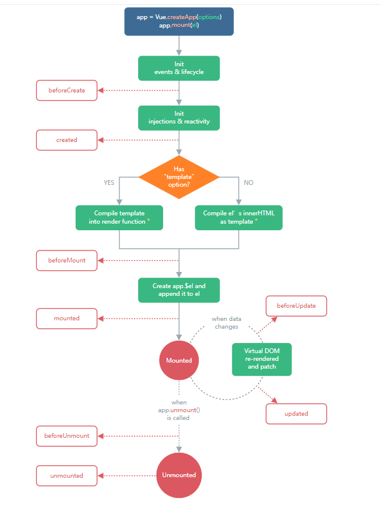

# VUE基础

## Vue简介

目前Vue官方已将网站更新为默认Vue3.0 API

**官方网址：**

英文官网：https://vuejs.org/

中文官网：https://cn.vuejs.org/

### 概念

Vue (读音 /vjuː/，类似于 view) 是一套用于构建用户界面的渐进式（易=>难）JavaScript 框架。Vue 的核心库只关注视图层，便于与第三方库或既有项目整合。

渐进式框架：页面渲染、表单处理提交功能=>代码组件化=>前端路由、状态集中管理=>前端项目高度工程化。

VUE库=>vue.js

VUE框架=>VUE全家桶（vue-cli 脚手架、vue-router路由跳转、vuex状态管理）。

**优点：**

```
轻量级的数据框架
双向数据绑定
提供了指令
组件化开发
客户端路由
状态管理
```

**缺点：**

```
Vue底层基于Object.defineProperty实现响应式，即vue使用了IE8无法模拟的ECMAScript5.0特性,这个api属性本身不支持IE8及以下浏览器，导致Vue不支持IE8及以下浏览器版本。
Vue打造的是SPA模式，所以不利于搜索引擎优化(SEO)；
于VUE客户端渲染(CSR)的先天不足，导致首屏加载时间长，且可能出现闪屏现象。
```

**核心：**

数据驱动和组件化系统。

## MVVM：

```js
M-model模型
V-view视图
VM-viewModel 视图模型
模型（model）通过了视图模型  决定了视图(view)
视图(view)  通过视图模型 修改模型 (model) 
视图模型是模型和视图之间的桥梁。
```

## SPA与MPA

### SPA：

SPA（single page application），单页面应用，是一种网络应用程序或网站的模型。通过router动态重新渲染当前页面来与用户交互，而非传统的从服务器重新加载整个新页面。这种方法避免了页面之间切换打断用户体验，使应用程序更像一个桌面应用程序。

#### 优点：

1、用户体验相对较好，页面响应速度快，内容局部重载即可，避免不必要跳转和重复渲染。

2、节省与服务器交互次数和压力，优化服务器性能。

3、前后端分离模式开发，架构清晰，职责明确（前端进行逻辑交互，后端进行数据处理）。

#### 缺点：

1、初次访问加载时间过长，需要统一加载所有静态资源文件，仅部分渲染页面可按需加载。 2、不能使用浏览器前进后退功能，所有的页面切换需要自己建立堆栈管理;

3、SEO(搜索引擎优化)，优化难度较大，因为页面内容动态渲染，部分数据优化抓取较难。

#### 路由模型

主页面不跳转，根据前端router进行局部渲染。

```
a页面 -> index.html/#/a
b页面 -> index.html/#/b
```

### MPA:

MPA（Multi Page Application），多页面应用。项目应用中存在多个页面，每个页面相互独立，页面之间跳转需要重新加载整个页面静态资源文件。

#### 优点：

页面资源独立，有利于SEO优化

#### 缺点：

网速较慢的时候，容易加载缓慢，用户体验相对较差

#### 路由模型

```
a页面—>a.html
b页面—>b.html
```

### SPA与MPA的区别

|             | 单页面（SPA）                                        | 多页面（MPA）                                                                    |
| ----------- | ----------------------------------------------- | --------------------------------------------------------------------------- |
| 结构          | 一个主入口页面+多个组件模块                                  | 多页面构成                                                                       |
| 资源文件        | 组件公用的静态资源只需要加载一次                                | 每个页面都需要加载自己的静态资源文件                                                          |
| 刷新方式        | 局部刷新或更改刷新                                       | 整页刷新                                                                        |
| url 模式      | a.com/#/pageone a.com/#/pagetwo                 | a.com/pageone.html a.com/pagetwo.html                                       |
| 用户体验        | 页面切换快，用户体验良好。当初次加载文件过多时，需要做相关的调优。               | 页面切换加载缓慢，流畅度相对较差，当网速过慢时，会出现白屏加载，用户体验比较差。                                    |
| 转场动画        | Vue 提供了 transition 的封装组件，容易实现                   | 相对较难实现                                                                      |
| 数据传递        | 单页面，使用Vuex全局变量即可                                | 需要依赖url传参，接口保存、或者服务器端存储（cookie、session) 、本地存储（localStorage、sessionStorage）等 |
| 搜索引擎优化(SEO) | 不利于SEO检索，需要单独处理，可利用服务器端渲染(SSR)优化。               | 利于SEO检索优化                                                                   |
| 适用场景        | 适用于高要求的体验度、追求界面流畅的应用，如，经常切换页面的场景和数据传递较多，多表单的场景。 | 适用于需要较高搜索引擎的应用                                                              |
| 路由模式        | 可以使用 hash ，也可以使用 history                        | 普通连接跳转                                                                      |
| 开发成本        | 开发成本较高，后期维护成本较低，常需借助专业的框架                       | 开发成本较低 ，维护成本较高，页面代码存在冗余现象                                                   |

## VUE的安装：

### 引入方式

#### CDN（指定路径）

**2.0版本**

```
<script src="https://cdn.jsdelivr.net/npm/vue@2.6.14/dist/vue.js"></script>
```

**3.0版本**

```
<script src="https://unpkg.com/vue@next"></script>
```

#### npm社区

**2.0版本**

```
npm i vue@latest
```

**3.0版本**

```
npm i vue 
```

注：vue已将NPM默认版本修改为3.0版本

#### 脚手架

**2.0版本**

```
npm i -g @vue/cli
vue create hello-vue3
```

**3.0版本**

(基于vite生成脚手架)

```
npm init vite hello-vue3 [-- --template vue]
```

## VUE的使用步骤

1、引入vue.js库

2、创建渲染区域

3、创建vue实例，进行数据绑定

**案例**

### 2.0版本

```
<script src="https://cdn.jsdelivr.net/npm/vue@2/dist/vue.js"></script>
<div id="app">
    {{name}}
</div>
<script>
    new Vue({
        el:"#app",
        data:{
            name:"rypy"
        },
        methods:{
            f(){return "我是方法"}
        }
    });
</script>
```

el：属性，挂载点，可以是ID选择符，也可以类选择符，标签选择符（body内的标签才可）。注：el只能绑定当前页面上的第一个对应有效节点。建议挂在ID选择符。

data:定义属性的方法，JSON格式的数据形式，可以跟输出标签进行绑定，方便页面输出。

methods:定义方法的方法，JSON格式的数据形式，可以跟输出标签进行绑定，方便页面输出。

### 3.0版

```
<script src="./vue.global.js"></script>
<body>
<div id="app">
    {{name}}
</div>
<script>
   Vue.createApp({
       data(){
       		return {
               name:'rypy',
               age:19,
               text:`<h1>我是标签</h1>`
           }
       },
       methods:{
           f(){
               return "我是3的方法"
           }
       }
   }).mount("#app");
</script>
```

data选项:是一个特殊函数，其返回值需要返回对象。

### \{{\}}模板语法

使用规则：

1、每个模板标签只能写一句ES语法

2、模板支持输出变量、方法调用、ES表达式(三目)

3、只能使用在非表单元素中，表单元素需要使用指令。

**案例**

```
<div id="app">
   {{name}}
    {{f()}}
    {{age>18?'已成年':'未成年'}}
</div>
```

## VUE的常用指令

### 数据绑定指令

前后端数据交互目前采用最多的交互技术是JSON技术，即JSON格式的数据交互。

#### 非表单元素绑定

**v-text**

```
<div v-text="text"></div>
```

**v-html**

```
<div v-html="text"></div>
```

#### 表单元素绑定

**案例数据**

```
Vue.createApp({
        data(){
            return {
                username:"admin",
                pwd:"12345",
                sex:1,
                age:30,
                isadmin:"1",
                ins:[1,2],
                isagree:true
            }
        },
        methods:{}
    }).mount("#app");
```

**v-model**

**基本语法**

```
<标签 v-mode=""></v-model>
```

**案例：**

```
<!--输入框-->
    姓名：<input type="text" v-model="username">
    <br>
    年龄：<input type="number" v-model="age">
    <br>
    <!--单选框-->
    性别：
    <input type="radio" v-model="sex" name="sex" value="0">男
    <input type="radio" v-model="sex" name="sex"  value="1">女
    <br>
    <!--多选框列表-->
    爱好：
    <input type="checkbox" name="ins" value="0" v-model="ins">read
    <input type="checkbox" name="ins" value="1" v-model="ins">write
    <input type="checkbox" name="ins" value="2" v-model="ins">listen
    <br>
    <!--下拉列表-->
    权限：
    <select id="isadmin" v-model="isadmin">
        <option value="0">普通用户</option>
        <option value="1">管理员</option>
    </select>
    <br>
    <input type="checkbox" v-model="isagree">同意协议
```

**指令修饰符**

1、number修饰符

通常文本类型的输入框返回字符类型，如果需要将其自动转换为number类型可以指令修饰符

```
<标签 v-mode.number=""></标签>
```

**案例**

```
    <input v-model.number="age">
    <button v-on:click="getAge()">提交</button>
```

2、lazy修饰符

一般表单输入框会自动更新虚拟DOM的值，如果停止该操作可以采用lazy修饰符，这样，可以把处理数据放置在事件中处理

```
<标签 v-mode.lazy=""></标签>
```

**案例**

```
<input v-model.lazy="age">
```

3、trim修饰符

自动过滤用户输入的首尾空白字符,默认自动过滤空白字符。

```
<标签 v-mode.lazy=""></标签>
```

**案例：**

```
<input v-model.trim="age">
```

#### 一次性绑定

将数据固定为初始值，不随Vue改变其值，而改变。

```
<div v-once>{{username}}</div>
```

#### 数据绑定方式的区别

1、\{{\}}，纯文本输出，使用简单，如果应用在首页会出现闪屏问题，即当js文件加载过慢时，会先被识别为文本显示，因此出现闪屏，建议不适用在首页。

2、v-text，纯文本输出，可以处理闪屏问题，因为当文件过慢时，页面时白屏显示。

3、v-html，转义HTML输出。

4、v-model，表单数据的输出（纯文本形式）。

5、v-once，初始化值会固定，不随其值改变而改变。

### 属性绑定指令

#### v-bind

可以绑定已知属性，也可以绑定自定义属性。

**标签规定属性**

**v-bind:src**

绑定src类型数据

```

```

**v-bind:href**

绑定href类型数据

```
<a v-bind:href="urlstr">点击我</a>
```

**标签自定义属性**

```
<div v-bind:c="name">我是自定义属性演示</div>
```

**v-bind的简写**

```
<标签 :属性名="值"></标签>
```

### 事件绑定指令

#### v-on:

事件监听指令。

**语法**

```
<标签 v-on:事件名称="方法名('参数'),[方法名('参数')]"></标签>
v-on:可以简写为@
<标签 @事件名称="方法名[('参数')]"></标签>
当方法中有且只有一句话的时候
<标签 @事件名称="ES代码"></标签>
```

注：定义方法的时候，同名方法会被覆盖。

**按钮事件案例**

```
<div id="app">
    {{name}}
    <button v-on:click="changeName()">admin1</button>
    <button v-on:click="changeName('admin2')">admin2</button>
    <button v-on:click="changeName('admin3')">admin3</button>
</div>
<script>
    Vue.createApp({
        data(){
            return{
                name:'admin'
            }
        },
        methods:{
            changeName(){
                this.name="admin1"
            },
            changeName(name){
                this.name=name
            }
        }
    }).mount("#app")
</script>
```

建议表单元素，除按钮以外的其它元素，采用change事件，不使用click事件。

#### 事件对象的传递

在做事件监听处理是，如果有且只有一个参数即event时，event参数可省，否则需要事件参数则需要传递。

**案例：**

```
<button @click="warn('这是个警告！', $event)">
    Submit
</button>
```

```
 Vue.createApp({
        data(){},
        methods:{
            warn(message, event) {
                if (event) {
                    console.log("通过！");
                }
                alert(message)
            }
        }
    }).mount("#app");
```

#### 修饰符

**回顾**

**阻止默认事件**

```
event.preventDefault()
```

阻止复选框选中

```
<input type="checkbox" @click="getAge($event)">
```

vue代码

```
Vue.createApp({
        data(){},
        methods:{
            getAge(event){
                event.preventDefault();
                console.log("我被点击了");
            }
        }
    }).mount("#app");
```

**阻止事件传播**

```
event.stopPropagation()
```

**案例：**

```
<div id="app">
    <div id="div2" @click="getAge($event,'fathewr')" :style="{background:'red'}">父级
        <p id="p2" @click="getAge($event,'ch')" :style="{background:'blue'}">子级</p>
    </div>
</div>
<script>
    Vue.createApp({
        data(){},
        methods:{
            getAge(event,msg){
                console.log("我被点击了"+msg);
                event.stopPropagation();
            }
        }
    }).mount("#app");
</script>
```

**常用事件修饰符**

**基本语法**

```
<标签 @事件.修饰符=""></标签>
.prevent 阻止默认事件
.stop 阻止事件传播传播
.capture 内部元素触发事件，外部先捕获处理，再交由内部处理。
.self 触发的目标元素是自己才执行
.once 一次性事件绑定
.passive 当该属性执行函数后，永远不会调用阻止默认事件属性
```

**案例：**

```
    <div id="div2" @click="getAge($event,'fathewr')" :style="{background:'red'}">父级
        <p id="p2" @click.stop="getAge($event,'ch')" :style="{background:'blue'}">子级</p>
    </div>
    <input type="checkbox" @click.prevent="getAge($event)">
    <a @click.stop.prevent="getAge($event,'back')">外连接</a>
        <div id="div2" @click.capture="getAge($event,'fathewr')" :style="{background:'red'}">父级
        <p id="p2" @click="getAge($event,'ch')" :style="{background:'blue'}">子级</p>
    </div>
```

注： .passive 和 .prevent 不能一起使用，因为 .prevent 将会被忽略。

**键盘按键修饰符**

**基本语法：**

```
<标签 @键盘事件.修饰符=""></标签>
.left 左键
.right 右键
.up 上键
.down 下键
.enter 回车
.tab 退格键
.delete (捕获“删除”和“退格”键)
.esc ESC键
.space 空格键
```

**案例**

```
<input @keyup.left="getAge">
<input @keyup.enter="getAge">
```

**鼠标按键修饰符**

```
<标签 @鼠标事件.鼠标修饰符=""></标签>
.left 左键
.right 右键
.middle 滑轮
```

**案例**

```
    <div id="div2" @mousedown.right="getAge($event,'fathewr')" :style="{background:'red'}">父级</div>
```

**系统修饰符**

**基本语法：**

```
<标签 @键盘事件.系统修饰符.按键修饰符=""></标签>
.ctrl
.alt
.shift
.meta Mac系统按键
```

**案例**

```
 <input @keyup.alt.enter="getAge">
```

**鼠标按键修饰符**

```
<标签 @鼠标事件.鼠标修饰符=""></标签>
.left 左键
.right 右键
.middle 滑轮
```

### 循环指令

**实例化时增加数据**

```
datalist:[
	{id:1,name:"精彩呈现1",img:"./img/1.jpg"},
    {id:2,name:"精彩呈现2",img:"./img/2.jpg"},
    {id:3,name:"精彩呈现3",img:"./img/3.jpg"}
]
```

#### v-for

循环数据或某个特定属性

**数据案例：**

```
    <div class="movie">
        <div class="movie-item" v-for="(item,index) in datalist">
            
            <div>{{item.name}}</div>
        </div>
    </div>
```

**特性属性案例**

计算表达式格式值为字符串

```
    <div class="movie">
        <div class="movie-item" v-for="(item,index) in datalist":class="index%2==0?'blue':'lime'">
            
            <div>{{item.name}}</div>
        </div>
    </div>
```

计算表达式格式值为布尔类型

```
    <div class="movie">
        <div class="movie-item" v-for="(item,index) in datalist"
             :class="{blue:index%3==0,lime:index%3==1,orange:index%3==2}"
        >
            
            <div>{{item.name}}</div>
        </div>
    </div>
```

### 条件指令

**数据案例：**

```
    Vue.createApp({
        data(){
            return{
                age:20
            }
        }
    }).mount("#app");
```

#### v-if：

```
    <div v-if="age>19&&age<=30">已成年</div>
    <div v-if="age>60">老年</div>
```

#### v-else:

```
    <div v-else-if="age<10">儿童</div>
    <div v-else>少年</div>
```

#### v-show:

```
<div v-show="age>18">哈哈</div>
```

#### v-if和v-show的区别

相同点：都是条件为真显示，为假隐藏

不同点：v-if的假采用懒惰性加载，v-show的假采用样式display:none模式（适用于频繁切换场景）。

### 样式指令

#### 动态类名指令（:class）

**语法**

```
<标签 :class="变量"></标签>
<标签 :class="{类名1:布尔类型,类名2:布尔类型}"></标签>
```

**案例**

**样式：**

```
        .c1{
            background-color: #0a67fb;
        }
        .c2{
            background-color: #00FF00;
        }
        .c3{
            background-color: #f6661f;
        }
```

**vue代码**

```
<div id="app">
    <div :class="f()">呵呵呵</div>
    <div :class="{c2:true,c3:false}">嘻嘻</div>
</div>
<script>
    Vue.createApp({
        data(){
            flag:false
        },
        methods: {
            f(){
                return "c1"
            }
        }
    }).mount("#app");
</script>
```

#### 动态行间样式指令(:style)

**语法：**

```
<标签 :style="{key:value}"></标签>
```

**案例：**

```
    <div :style="{'color':'red',background:'yellow'}">憨憨嘻嘻</div>
```

## 全局函数

### $set

向已有JSON格式数据中添加新的键值对，并重新渲染页面

注（Vue3.0已将其废弃）

**语法：**

```
this.$set(原数据,新键名,新键值);
Vue.set(原数据,新键名,新键值);
```

**案例**

```
    <script src="https://cdn.jsdelivr.net/npm/vue@2/dist/vue.js"></script>
    <div id="app">
        {{user.username}}
        {{user.isadmin}}
        <button @click="setIsadmin">按钮添加属性</button>
    </div>
    <script>
        new Vue({
            el:"#app",
            data:{
                user:{
                    username:"admin",
                    pwd:"123456"
                }
            },
            methods:{
                setIsadmin(){
                    //this.$set(this.user,"isadmin","0");
                    Vue.set(this.user,"isadmin","1");
                }
            }
        });
    </script>
```

#### 3.0简化方式

```
Vue.createApp({
            data(){
                return {
                    user:{
                        username:"admin",
                        pwd:"123456"
                    }
                }
            },
            methods:{
                setIsadmin(){
                    this.user.isadmin="11"
                }
            }
        }).mount("#app");
```

## 数组自动渲染页面方法

### 常见方法

```
push()
pop()
shift()
unshift()
splice()
sort()
reverse()
```

**案例**

```
<div id="app">
        <table>
            <tr v-for="item of newUserArr"  >
                <td class="b5">{{item.username}}</td>
                <td class="b5">{{item.pwd}}</td>
                <td class="b5">{{item.isadmin}}</td>
            </tr>
        </table>
        <button @click="setIsadmin">添加值</button>
</div>
 <script>
        Vue.createApp({
            data(){
                return {
                    newUserArr:[
                        {
                            username:"admin",
                            pwd:"123456"
                        }
                    ]
                }
            },
            methods:{
                setIsadmin(){
                    this.newUserArr.push({"username":"amidn"});
                    this.newUserArr[0].isadmin="1";
                }
            }
        }).mount("#app");
```

## VUE生命周期钩子函数

VUE在创建实例的时候，初始化期间会伴随着生命周期钩子函数的调用，研发过程中，可以根据不同阶段的钩子实现不同的功能，以达到所需效果。

### VUE2.0

VUE2.0，包含8个生命周期钩子函数，beforeCreate(组件实例刚刚被创建)、created(组件实例创建完成)、beforeMount(模板编译/挂载前)、mounted(模板编译/挂载完成)、beforeUpdate(组件更新前)、updated(组件更新完成)、beforeDestroy(组件销毁前)、destroyed(组件销毁完成)。

#### 函数图解


**例**

代码显示挂载顺序

```
<div id="app">
</div>
<script>
    const app=new Vue({
        el: "#app",
        data:{
          username:"admin",
          pwd:"123456",
          age:18
        },
        template:`
          <div>
          <p id="num">{{age}}</p>
            <button id="btn" @click="changeUsername">按钮</button>
          </div>
        `,
        methods:{
            changeUsername(){
                this.age=this.age+1;
            }
        },
        beforeCreate() {
            // console.group("我是创建前");
            // console.log(this.username);//undefined
            //console.groupEnd();
        },
        created() {
            console.group("创建后");
            console.log(this.username);//admin
            console.log(this.$el)//输出挂载点,undefined
            console.groupEnd();
        },
        beforeMount() {
            console.group("挂载前");
            console.log(this.username);//admin
            console.log(this.$el);//div#app
            console.log(document.getElementById("btn"));
            console.groupEnd();
        },
        mounted() {//挂载完成，将Vue动态渲染的组件或数据挂载在document。
            console.group("挂载后");
            console.log(document.getElementById("btn"));
            console.groupEnd();
        },beforeUpdate() {
            console.group("更新前");

            console.log(document.getElementById("num").innerText);
            console.groupEnd();
        },updated() {
            console.group("更新后");
            console.log(document.getElementById("num").innerText);
            console.groupEnd();
        },beforeDestroy() {
            console.group("销毁前");
            console.log(this.$el);
            console.groupEnd();
        },destroyed() {
            console.group("销毁后");
            console.log(this.$el);
            console.groupEnd();
        }
    });
```

注：此处需要采用浏览器命令行销毁组件

#### 常用方法

```
实例.$mount("#app")//挂载
实例.$destroy()//销毁
```

### VUE3.0

VUE3.0，包含8个生命周期钩子函数，beforeCreate(组件实例刚刚被创建)、created(组件实例创建完成)、beforeMount(模板编译/挂载前)、mounted(模板编译/挂载完成)、beforeUpdate(组件更新前)、updated(组件更新完成)、beforeUnmount(组件销毁前)、unmounted(组件销毁完成)。

#### 函数图解



**案例**

代码显示挂载顺序

```
<div id="app"></div>
<script>
    const  app=Vue.createApp({
        data(){
            return{
                age:18
            }
        },
        methods:{
            changeAge(){
                this.age=this.age+1;
            }
        },template:`
            <div>
              <p id="num">{{age}}</p>
              <button id="btn" @click="changeAge">按钮</button>
            </div>
        `,
        beforeCreate() {
            console.group("组件创建前");
            console.log(this.age);//undefined
            console.groupEnd();
        },created() {
            console.group("组件创建完成");
            console.log(this.age);//18
            console.groupEnd();
        },
        beforeMount() {
        console.group("挂载前");
        console.log(document.getElementById("btn"));
        console.groupEnd();
    },
    mounted() {//挂载完成，将Vue动态渲染的组件或数据挂载在document。
        console.group("挂载后");
        console.log(document.getElementById("btn"));
        console.groupEnd();
    },beforeUpdate() {
        console.group("更新前");
        console.log(document.getElementById("num").innerText);
        console.groupEnd();
    },updated() {
        console.group("更新后");
        console.log(document.getElementById("num").innerText);
        console.groupEnd();
    },beforeUnmount() {
        console.group("销毁前");
        console.log(this.$el);
        console.groupEnd();
    },unmounted() {
        console.group("销毁后");
        console.log(this.$el);
        console.groupEnd();
    }
    });
    app.mount("#app");//挂载方法，如果需要调用卸载方法，不能采用链式挂载(坑)。
    setTimeout(() => app.unmount(), 5000);//卸载方法
```

#### 常用方法

```
实例.mount("#app");
实例.unmount();
```

## template选项

渲染VUE实例的内容。

注意事项：

1、tempalte属性会替换Vue挂载节点的全部内容。

2、template属性中的dom节点有且只能有一个根元素，如果有多个根元素需要使用v-if、v-else、v-else-if设置成只显示其中一个根元素。

3、template属性对应的属性值中,可以使用vue实例data、methods中定义的数据和方法。

**案例**

```
<div id="app">
        <template>我是标签111</template>
        我是内容
    </div>
    <template id="app1">我是标签</template>
<script>
    Vue.createApp({
        data(){
            return{
                username:"admin"
            }
        },
        //template:`<div>{{username}}</div>`
        template:"#app1"
    }).mount("#app");
</script>
```

注：区别H5中的tempalte标签，template标签中的内容在页面中不会显示，但是会在DOM结构中存在，且VUE实例中的tempalte标签，不支持v-show指令，支持v-if、v-else-if、v-else、v-for这些指令,但可以结合tempalte标签渲染指定内容。

## 计算属性

当输出的数据内容需要计算的时候，为了简化输出计算，方便维护，可以采用计算属性进行数据计算，计算属性中可以使用方法和属性(包含get方法和set方法)。

**案例**

```
    <div id="app">
        权限：{{getIsAdmin}}
        年纪：{{getAge}}
        用户名：{{fullName}}
    </div>
<script>
    const app=Vue.createApp({
        data(){
            return{
                user:{
                    username: "admin",
                    pwd:123456,
                    isadmin:"1",
                    age:27
                }
            }
        },computed:{
            getIsAdmin(){
                return this.user.isadmin==="1"?"管理员":"普通用户";
            },
            getAge(){
                if(this.user.age<6){
                    return "幼儿";
                }else if(this.user.age<12){
                    return "少年";
                }else if(this.user.age<18){
                    return "青年";
                }else if(this.user.age<40){
                    return "壮年";
                }else if(this.user.age<60){
                    return "中年";
                }else {
                    return "老年";
                }
            },
            fullName:{
                get(){
                    return this.user.username+this.user.pwd;
                },
                set(value){
                    console.log(value);
                }
            }
        }
    }).mount("#app");
    app.fullName="aaaaa";
```

## 侦听器

用于侦听data数据/computed计算属性，属性值的改变。

**语法：**

将需要监听的属性，放置再watch属性下

```
普通侦听：
watch:{
	属性名(新值,原值){}
}
深度侦听：
watch:{
	属性名:{
		handler(Proxy新值){},
		deep:深度监听属性，布尔类型，默认值是false。
	}
}
```

注：简写方式可以监听基本数据类型，引用类型需要使用完整方法，开发过程中不建议使用深度监听，会造成页面卡顿。

**案例**

```
<div id="app">
        <input type="text" v-model="username"><br>
        <input type="text" v-model="user.username"><br>
        <div>{{changeUserName}}</div>
        <div>{{changeUsersName}}</div>
    </div>
    <script>
        Vue.createApp({
            data(){
                return {
                    username:"admin1",
                    user:{
                        username:"admin2"
                    }
                }
            },
            computed:{
              changeUserName(){
                  this.username="aaaaa";
                  return this.username;
              },
              changeUsersName(){
                  this.user.username="ssssss";
                  return this.user;
              }
            },
            watch:{
                //监听器的简写
                username(newValue,oldValue){
                    console.log("原值%s,新值%s",oldValue,newValue);
                },
                //监听器的复杂写法
                user:{
                    handler(newValue){
                        console.log("新值%s",newValue.username);
                    },
                    deep:false
                }
            }
        }).mount("#app");
    </script>
```

## 过渡动画

Vue提供了两个组件，处理过渡动画，分别是

和。

组件，使用在单元素/组件的过渡动画。

### Transition组件

#### 使用场景

条件渲染(v-if)

条件显示(v-show)

动态组件

#### 过渡样式

**Vue 2.0**

```
v-enter，进入过渡开始状态
v-enter-active，进入过渡生效时状态
v-enter-to，进入过渡结束状态
v-leave，离开过渡开始状态
v-leave-active，离开过渡生效时状态
v-leave-to，离开过渡结束状态
```

**Vue 3.0**

```
v-enter-from，进入过渡开始状态
v-enter-active，进入过渡生效时状态
v-enter-to，进入过渡结束状态
v-leave-from，离开过渡开始状态
v-leave-active，离开过渡生效时状态
v-leave-to，离开过渡结束状态
```

默认是v作为命名，也可以单独给组件起名字如aa

#### 案例

**Vue 2.0**

```
    <div id="app">
        <button @click="flag = !flag">淡出</button>
        <transition name="aa">
            <p v-if="flag">你好，动画！</p>
        </transition>
    </div>
    <script>
        new Vue({
            el:"#app",
            data:{
                flag:false
            }
        });
    </script>
```

**Vue3.0**

```
<div id="app">
        <button @click="flag = !flag">淡入淡出</button>
        <transition>
            <p v-if="flag">你好，动画！</p>
        </transition>
    </div>
    <script>
        Vue.createApp({
            data(){
                return{
                    flag:false
                }
            }
        }).mount("#app");
    </script>
```

**css样式**

**index.css**

```
.v-enter-active, .v-leave-active {
    transition: opacity 0.5s ease;
}
.v-enter-from,.v-enter,.v-leave-to {
    opacity: 0;
}
```

#### 实例：旋转+跑马灯

**index.html**

```
    <div id="app">
        <button @click="flag = !flag">跑马灯</button>
        <transition name="aa">
            <p v-if="flag">你好，动画！</p>
        </transition>
    </div>
    <script>
        Vue.createApp({
            data(){
                return{
                    flag:false
                }
            }
        }).mount("#app");
    </script>
```

**index.css**

```
/* 进来之前 */
.aa-enter-from{
    left: 0;
    transform: rotate(1000deg);
}
/* 进来过程 */
.aa-enter-active{
    transition: all 0.5s;
}
/* 进来完成 */
.aa-enter-to{
    left: 500px;
    transform: rotate(0deg);
}

/* 离开之前 */
.aa-leave-from{
    left: 500px;
    transform: scale(1,1);
}
/* 离开过程 */
.aa-leave-active{
    transition: all 0.5s;
}
/* 离开完成 */
.aa-leave-to{
    left: 1000px;
    transform: scale(0.1,0.1);
}
```

### TransitionGroup组件

列表过渡，指页面中多元素同时具有某个特定的过渡动画。

#### 使用场景

```
循环(v-for)
```

#### 过渡样式

Vue 2.0

```
    <div id="app">
        <button @click="insert">添加</button>
        <button @click="remove">删除</button>
        <Transition-Group name="list" tag="ul">
            <li v-for="item in items" :key="item">
                {{ item }}
            </li>
        </Transition-Group>
        <p>{{msg}}</p>
    </div>
    <script>
        new Vue({
            el:"#app",
            data:{
                items:[1,2,3,4,5],
                id:0,
                msg:""
            },
            methods: {
                insert() {
                    this.msg="";
                    const i = Math.round(Math.random() * this.items.length);
                    if(this.id===0){
                        this.id=this.items.length+1;
                    }
                    this.items.splice(i, 0, this.id++);
                },
                remove() {
                    if(this.items.length>0) {
                        let index,flag;
                        do {
                            index = Math.round(Math.random() * this.items.length);
                            flag = this.items.indexOf(index);
                        } while (flag > -1);
                        this.items.splice(index, 1);
                    }else{
                        this.msg="无内容"
                    }
                }
            }
        });
    </script>
```

Vue 3.0

```
    <div id="app">
         <button @click="insert">添加</button>
         <button @click="remove">删除</button>
         <Transition-Group  tag="ul" name="list">
             <li v-for="item in items" :key="item">
                 {{ item }}
             </li>
         </Transition-Group>
         <p>{{msg}}</p>
     </div>
     <script>
         const app=Vue.createApp({
             data(){
                 return {
                     items:[1,2,3,4,5],
                     id:0,
                     msg:""
                 }
             },
             methods: {
                 insert() {
                     this.msg="";
                     const i = Math.round(Math.random() * this.items.length);
                     if(this.id===0){
                         this.id=this.items.length+1;
                     }
                     this.items.splice(i, 0, this.id++);
                 },
                 remove() {
                     if(this.items.length>0) {
                         let index,flag;
                         do {
                             index = Math.round(Math.random() * this.items.length);
                             flag = this.items.indexOf(index);
                         } while (flag > -1);
                         this.items.splice(index, 1);
                     }else{
                         this.msg="无内容"
                     }
                 }
             }
         });
         app.mount("#app");
     </script>
```

\*\*注：\*\*如果在DOM模板，即HTML页面需要使用标签

index.css

```
.list-enter-active,
.list-leave-active {
    transition: all 0.5s ease;
}
.list-enter-from,
.list-leave-to {
    opacity: 0;
    transform: translateX(30px);
}
```

### 结合动画库的使用

官方推荐的动画库(Animate.css)

**官网：**

```
https://animate.style/
```

#### 安装

**下载**

```
npm i animate.css
```

**CDN**

```
https://cdnjs.cloudflare.com/ajax/libs/animate.css/4.1.1/animate.min.css
```

#### 使用

```
    <link rel="stylesheet" href="./css/animate.min.css">
    <script src="./vue.global.js"></script>
<div id="app">
    <button @click="flag = !flag">animate动画样式</button>
    <transition  enter-active-class="animate__animated animate__tada"
                 leave-active-class="animate__animated animate__bounceOutRight">
        <p v-if="flag">你好，动画！</p>
    </transition>
</div>
<script>
    Vue.createApp({
        data(){
            return{
                flag:false
            }
        }
    }).mount("#app");
</script>    
```

## 过滤器(\*)

在VUE2.0中可以使用过滤器格式化文本格式。

#### 常见使用场景

|，管道符

```
{{属性值|过滤器方法A[|过滤器方法B]}}
<div v-bind:id="属性值|过滤器方法A[|过滤器方法B]"></div>
```

#### 使用案例

**全局过滤器**

```
<script src="https://cdn.jsdelivr.net/npm/vue@2/dist/vue.js"></script>
<div id="app">
        <input type="text" v-model="str">
        {{str|capitalize}}
    </div>
    <script>
        Vue.filter('capitalize', (value)=>{
            return value.toString().toUpperCase();
        });
        new Vue({
            el:"#app",
            data:{
                str:""
            }
        });
    </script>
```

\*\*注：\*\*全局过滤器一定要写在实例化前面，否则会报错，但不影响功能。

**局部过滤器**

```
<div id="app">
        <input type="text" v-model="str">
        {{str|capitalize}}
    </div>
    <script>
        new Vue({
            el:"#app",
            data:{
                str:""
            },
            filters:{
                capitalize(value){
                    return value.toString().toUpperCase();
                }
            }
        });
    </script>
```

推荐使用全局过滤器

在VUE3.0中，不在支持过滤器，建议使用计算属性或方法代替过滤器。

## 脚手架

### Vite

Vite（法语意为 "快速的"，发音 /vit/，发音同 "veet"）是一种新型前端构建工具，能够显著提升前端开发体验。它主要由两部分组成：

一个开发服务器，它基于 原生 ES 模块 提供了 丰富的内建功能，如速度快到惊人的 模块热更新（HMR）。

一套构建指令，它使用 Rollup 打包你的代码，并且它是预配置的，可输出用于生产环境的高度优化过的静态资源。

注：vite的使用需要基于Node12及以上版本。

### 脚手架搭建项目过程

#### Vite搭建脚手架

**Vue3.0**

单独安装vite

```
npm i vite
```

以项目创建安装

```
npm create vite@latest my-vue-app -- --template vue
```

注：此方法会提示需要安装create-vite@latest包，选择Y即可。

项目创建好后使用提示命令运行项目

```
cd my-vue-app
npm i
npm run dev
```

#### Vue-cli搭建脚手架

安装@vue/cli

```
npm i @vue/cli
```

创建项目

```
vue create 项目名称
```

选择基于2.0/3.0的Vue项目

建好项目后其它命令

```
cd my-vue-2.0
npm run serve
```

\*\*注：\*\*此模式下生成的vue项目不支持Node17及以上版本。

### 使用可视化页面搭建

```
vue ui
```

## 组件(Component)

### 概念：

组件(Component)，即将页面同类型，类似功能的节点元素进行封装服用。所有的VUE组件都是一个VUE实例。

### 组件的分类

根组件(App.vue)和子组件（自定义组件）

### 组件化好处：

提高代码复用性，减少代码量。

### 组件的注册

**组件名规则**

1、全部小写

2、可以使用"-"连字符

#### 全局组件

**语法**

```
        VUE实例.component("组件名",{
            template:组件模板
        });
```

**案例**

```
    <div id="app">
        <mycom v-for="item of btnList" :btnText="item">
        </mycom>
    </div>
    <script>
        const app=Vue.createApp({
            data(){
                return{
                    btnList:["增加","修改","删除","确定","取消"]
                }
            }
        });
        app.component("mycom",{
            props: ['btnText'],
            template:`
                <button>{{btnText}}</button>
            `
        });
        app.mount("#app");
    </script>
```

#### 局部组件

**语法**

```
Vue.createApp({
	components:{
		组件属性配置
	}
});
```

**案例**

```
<div id="app">
    <mycom v-for="item of btnList" :btn-text="item"></mycom>
</div>
<script>
    const app=Vue.createApp({
        data(){
            return{
                btnList:["增加","修改","删除","确定","取消"]
            }
        },
        components:{
            "mycom":{
                props: ["btnText"],
                template:`
                <button>{{btnText}}</button>
                `
            }
        }
    }).mount("#app");
```

### 组件的选项

#### template选项

组件中的template与实例的template类似。

1、template只能有一个根节点。

2、可以借助templat标签重新渲染页面内容

**案例**

```
<div id="app">
    <v-Two></v-Two>
    <v-One></v-One>
</div>
<template id="two">
    <div>
        <h3>this is two </h3>
        <div>this is two content</div>
    </div>
</template>
    <script>
        Vue.createApp({
            template:"#two",
            components:{
                vOne: {
                    template: "<div><h3>this is one</h3><div>this is one content</div></div>"
                },
                vTwo:{
                    template:"#two"
                }
            }
        }).mount("#app");
    </script>
```

#### 组件中的data选项

在VUE2.0中，实例的data是一个属性，组件的data是一个函数

在VUE3.0中,实例和组件的data都是一个函数。

组件间的data是相互独立，互不影响的区域

#### 组件中的其它选项

一个组件只能使用其自身的data、methods、watch、computed filters、components。

### ref

#### 属性

ref属性用于给元素或子组件注册引用信息，此引用信息将会被注册在父组件的$refs对象上。

#### 对象

接收一个内部值，并返回一个响应式且可变的ref对象，此对象仅有一个属性value，指向内部的值。

### 组件的自定义事件

在Vue的组件中，组件间调用的时候可以自定义事件，在触发处，使用emit方法，进行触发。

#### 基本语法

##### 定义

```
<组件名 @自定义事件名="处理方法(参数)"></组件名>
```

##### 触发

```
this.$emit("事件名","参数");
```

**案例**

**组件1**

```
<template>
  {{msg}}
  <com-sechild @changeMsgSOne="changeMsgSOne($event)"></com-sechild>
</template>
<script>
import comSechild from "./ComEvent2.vue";
export default {
  name: "ComEvent",
  components:{comSechild},
  data(){
    return{
      msg:""
    }
  },
  methods:{
    changeMsgSOne({mssg}){
      this.msg=`组件1的方法，修改msg1`+mssg;
    }
  }
}
</script>
```

**组件2**

```
<template>
  <button @click="comSecondEmit">组件2按钮</button>
</template>
<script>
export default {
  name: "ComEvent2",
  data(){
    return{
      msg2:""
    }
  },
  methods:{
    comSecondEmit(){
      this.$emit("changeMsgSOne", {mssg:"2修改1"});
    }
  }
}
</script>
```

### 组件的模板引用

#### 获取子组件的DOM节点

如果需要在JavaScript代码中使用子组件，可以使用模板引用ref来获取子组件节点

**父组件**

```
<template>
  <child ref="bcolor"></child>
  <h1>父组件</h1>
  <button @click="changeColor">换色子组件</button>
</template>
<script>
import child from "./Child.vue"
export default {
  name: "Father",
  components:{
    child
  },
  methods:{
    changeColor(){
      (this.$refs.bcolor).$el.style.backgroundColor="red";
    }
  }
}
</script>
```

**子组件**

```
<template>
  <div style="background-color: #00a8ff">我是子组件</div>
</template>
<script>
export default {
  name: "Child"
}
</script>
```

注：DOM节点是在mounted的时候创建完成，因此ref要使用在该生命周期之后。

#### 父组件获取子组件实例

使用模板引用在JavaScript代码中获取子组件实例的属性/方法

**父组件**

```
<template>
  <child ref="bcolor"></child>
  {{cname}}
  <h1>父组件</h1>
  <button @click="getChildName">获取子组件属性</button>
  <button @click="changeChildName">触发子组件方法</button>
</template>
<script>
import child from "./Child.vue"
export default {
  name: "Father",
  components:{
    child
  },
  data(){
    return{
      cname:""
    }
  },
  methods:{
    changeColor(){
      (this.$refs.bcolor).$el.style.backgroundColor="red";
    },
    getChildName(){
        this.cname=this.$refs.bcolor.childName;
    },
    changeChildName(){
        this.$refs.bcolor.changeCName("admin2");
        this.getChildName()
    }
  }
}
</script>
```

**子组件**

```
<template></template>
<script>
export default {
  name: "Child",
  data(){
    return{
      childName:"admin"
    }
  },
  methods:{
    changeCName(name){
      this.childName=name;
    }
  }
}
</script>
```

### 组件间的通信

Vue中组件间的通信方式有很多种，选择适合项目组件的方式最重要。

#### v-bind指令+props属性方式

此方式是Vue中最常见的一种父传子的方式。

##### 语法：

父组件，通过v-bind自定义属性传递

```
<标签 :属性名="属性值|传值变量"></标签>
```

子组件，通过props选项接收

```
props:[..."属性名"]
```

**案例**

父组件Father.vue

```
<template>
  <div>
    <child v-for="item of btnList" :btnName="item"></child>
  </div>
</template>
<script>
import child from "./Child.vue";
export default {
  name: "Father",
  components: {
    child
  },
  data(){
    return {
      btnList:["增加","修改","删除","确定","取消"]
    }
  }
}
</script>
```

子组件Child.vue

```
<template>
  <button>{{btnName}}</button>
</template>
<script>
export default {
  name: "Child",
  props:["btnName"]
}
</script>
```

##### Props验证

props支持的验证类型包括，null,undefined,String,Number,Boolean,Array,Object,Date,Function,Symbol八种原生类型。此外还支持自定义构造函数类型。注：null,undefined可以通过任意原生类型校验。

```
export default {
  props: {
  	//基础校验语法
    propA: Number,
    // 多类型校验语法
    propB: [String, Number],
    // 必填校验语法
    propC: {
      type: String,
      required: true
    },
    //带默认值的校验语法
    propD: {
      type: Number,
      default: 100
    },
    // 对象类型/数组类型默认值的校验语法
    propE: {
      type: Object,
      //默认值必须为同一函数返回 
      default(rawProps) {
        return { message: 'hello' }
      }
    },
    //自定义校验函数
    propF: {
      validator(value) {
        return ['success', 'warning', 'danger'].includes(value)
      }
    },
    // 带默认值的函数
    propG: {
      type: Function,
      default() {
        return 'Default function'
      }
    }
  }
}
```

###### 自定义类型

```
class P{
	constructor(fName,LName){
		this.fName=fName;
		this.LName=LName;
	}
}
```

```
export default {
	props: {
		user:P
	}
}
```

###### props命名规则

如果props中存在属性名大写，则在调用的时候需要采用-连词符

注：Props校验，默认只会浏览器控制警告。

**案例**

父组件

```
<template>
  <div>
    <child v-for="item of btnList" :btn-name="item" />
    <child :num=1 />
    <child :btn-name="str" />
  </div>
</template>
<script>
import child from "./Child.vue";
export default {
  name: "Father",
  components: {
    child
  },
  data(){
    return {
      str:"btns",
      btnList:["增加","修改","删除","确定","取消"]
    }
  }
}
</script>
```

子组件

```
<template>
  <div>
    <button>{{btnName}}</button>
    <div>{{num}}</div>
  </div>
</template>
<script>
export default {
  name: "Child",
  props:{
    btnName:String,
    num:{
      type:Number,
      required:true,
      default(){
        return 3
      }
    }
  }
}
</script>
```

#### v-model指令+props属性方式

此方式也是Vue中一种父传子的方式。

##### 语法：

父组件，通过v-bind自定义属性传递

```
<标签 v-model:属性名="属性值|传值变量"></标签>
```

子组件，通过props选项接收

```
props:[..."属性名"]
```

**案例**

**父组件**

```
<template>
  <child v-model:courseList="courseList"></child>
</template>
<script>
import  child from "./Child.vue";
export default {
  name: "Father",
  components: {child},
  data(){
    return{
      courseList:["javascript","html","css","node"]
    }
  }
}
</script>
```

**子组件**

```
<template>
  <table >
    <tr v-for="item of courseList">
      <td>{{item}}</td>
    </tr>
  </table>
</template>
<script>
export default {
  name: "Child",
  props:{
    courseList:{
      type:Array,
      default: () => []
    }
  }
}
</script>
```

#### emit方式

此方式是Vue中一种子传父的方式。通过事件触发，子组件修改父组件的值（采用自定义事件完成）

###### 原理：

父组件通过自定义事件，将父组件的事件对象传递给子组件，子组件使用emit方法触发父组件中的响应事件，并通过事件将值传递到父组件，父组件通过监听事件该自定义事件是否被触发，从而完成方法的调用，并接收子组件的值，从而完成修改

###### 案例：

**父组件**

```
<template>
  <div>
    <h3>父组件</h3>
    <button v-for="item of btnList">{{item}}</button>
  </div>
  <child @changeList="changeList($event)"/>
</template>
<script>
import child from "./Child.vue";
export default {
  name: "Father",
  components: {
    child
  },
  data(){
    return {
      str:"btns",
      btnList:["增加","修改","删除","确定","取消"]
    }
  },
  methods:{
    changeList({index,value}){
      this.btnList[index]=value;
    }
  }
}
</script>
```

**子组件**

```
<template>
  <div>
    <h3>子组件</h3>
    下标：
    <input type="text" v-model="index">
    值：
    <input type="text" v-model="value">
    <button @click="changeValue()">修改</button>
  </div>
</template>
<script>
export default {
  name: "Child",
  data(){
    return{
      index:0,
      value:""
    }
  },
  methods:{
    changeValue(){
      this.$emit("changeList",{index:this.index,value:this.value});
    }
  }
}
</script>
```

#### 综合案例


**父组件**

```
<template>
  <table >
    <tr v-for="item of courseList">
      <td>{{item}}</td>
    </tr>
  </table>
  <child v-model:courseList="courseList"></child>
</template>
<script>
import  child from "./Child.vue";
export default {
  name: "Father",
  components: {child},
  data(){
    return{
      courseList:["javascript","html","css","node"]
    }
  }
}
</script>
```

**子组件**

```
<template>
  <input v-model="value" type="text" placeholder="请输入"/>
  <button @click="addCourse" type="button">添加</button>
</template>
<script>
export default {
  name: "Child",
  props:{
    courseList:{
      type:Array,
      default: () => []
    }
  },
  data(){
    return{
      value:""
    }
  },
  methods:{
    addCourse(){
      const  courselist=this.courseList;
      courselist.push(this.value);
      this.$emit("changeList",courselist);
      this.value="";
    }
  }
}
</script>
```

#### refs方式

##### this.$refs.属性名

上述组件的模板引用方式，不能使用在组合API中，如果需要使用refs方式，则需要Ref对象，才能使用

##### ref标签属性+ref对象

此方式可以将子组件的值传递给父组件。Vue3.0版本新增。

###### 语法

```
  <child-components ref="属性名"></child-components>
```

注：属性名要与子组件抛出的属性名保持一直。

**案例**

**父组件**

```
<template>
  <table >
    <tr v-for="item of childRefs?.courseList">
      <td>{{item}}</td>
    </tr>
  </table>
  <child ref="childRefs"></child>
</template>
<script setup>
import { ref } from 'vue';
import child from './Child.vue';
const childRefs = ref(null);
</script>
```

**子组件**

```
<template>
  <input v-model="value" type="text" placeholder="请输入"/>
  <button @click="addCourse" type="button">添加</button>
</template>
<script setup>
import { ref, defineExpose } from 'vue'
const courseList = ref(['JavaScript', 'HTML', 'CSS'])
const value = ref('')
const addCourse = () => {
  courseList.value.push(value.value)
  value.value = ''
}
defineExpose({ courseList })
```

#### provide/inject方式

provide和inject方式，是Vue中提供的一对API，可以实现父组件向子组件传递数据，只要事存在直系关系，无论几代，都可以实现传递值。

**案例**

**父组件**

```
<template>
  <input v-model="value" type="text" placeholder="请输入"/>
  <button @click="addCourse" type="button">添加</button>
  <child></child>
</template>
<script setup>
  import { ref,provide } from 'vue';
  import child from './Child.vue';
  const value=ref("");
  const courseList = ref(['JavaScript', 'HTML', 'CSS','Node']);
  provide("courseList",courseList.value);
  const addCourse = () => {
    courseList.value.push(value.value);
    value.value = '';
  }
</script>
```

**子组件**

```
<template>
  <table >
    <tr v-for="item of courseList">
      <td>{{item}}</td>
    </tr>
  </table>
</template>
<script setup>
import { ref,inject } from 'vue';
const courseList = inject("courseList");
</script>
```

#### 事件总线

##### EventBus(*)

###### **使用步骤**

1、绑定到Vue原型,其值是Vue对象。

```
Vue.prototype.EventBus=new Vue();
```

2、触发自定义事件

```
send(){
  this.EventBus.$emit("eventA",this.dataA)
}
```

3、绑定事件

```
mounted(){
  this.EventBus.$on("eventA",(e)=>{
    this.a=e
  })
}
```

注：Vue3.0中采用mitt或tiny-emitter，替代EventBus，但大多数情况下，不推荐使用全局事件总线的方式来实现组件通信，因为虽然实现简单，但维护事件总线会很麻烦。

#### 状态管理工具

Vuex和Pinia是Vue3中的状态管理工具，使用这两个工具可以轻松实现组件通信。

#### 本地存储

localStorage和sessionStorage是HTML5提供的两个浏览器端存储，使用这两个工具可以轻松实现组件通信。

#### 服务器存储

cookie和session是服务器端的两个存储，使用这两个工具可以轻松实现组件通信，但要结合后端代码。

### 组件的注意事项

1、组件不能直接使用父组件中的数据，需要使用props

2、组件只能使用自己的子组件和公共组件

3、每次调用组件，都会产生一个新的Vue实例

4、v-if指令在组件上切换，会重置生命周期，v-show指令则不会。
